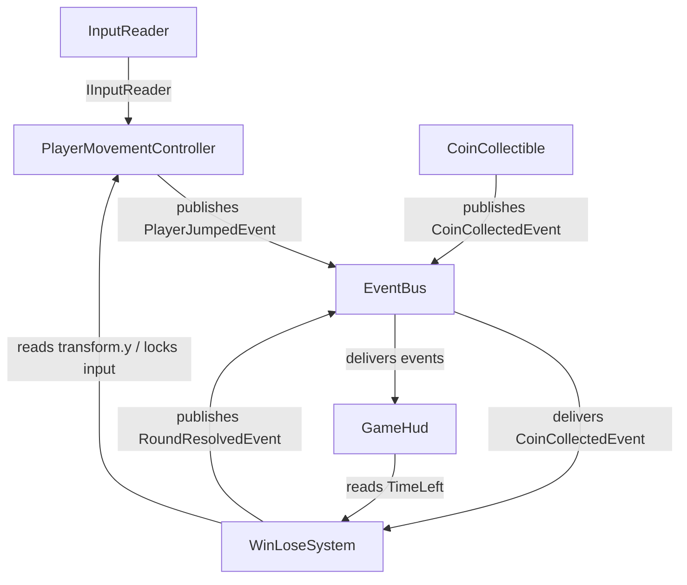

# TDD — Coin Rush 3D (Example)

> **Purpose of this TDD:** serve as the **reference example** of the tool-agnostic TDD standard (`V57/docs/tdd/TDD_Template.md`) and as input to test the SDD pipeline of `Base_Unity_V57`. Small, complete, testable — and **gate-passing**: every §0.2 item is PASS.

---

## 0.1 · Document Control

| Field | Value |
|---|---|
| **Game title** | Coin Rush 3D |
| **Studio** | V57 (example) |
| **Document** | Game Technical Design Document (TDD) |
| **Document version** | 2.0.0 |
| **Date** | 2026-07-09 |
| **Phase reached** | Production |
| **Intended use** | Production source of truth (design + engineering) |
| **Owner** | V57 example maintainer |

### Changelog

| Version | Date | Change summary | Sections touched | Author |
|---|---|---|---|---|
| 1.0.0 | 2026-05-21 | Initial example TDD (pre-standard shape) | all | V57 |
| 2.0.0 | 2026-07-09 | Migrated to the TDD standard: gate, §B-S, §C specs, input map, scene manifest, ledger | all | V57 |

## 0.2 · Completeness Gate

| # | Item | Check | Status |
|---|---|---|---|
| G-01 | §A required fields | All `[REQUIRED]` keys concrete; `save_model` / `multiplayer_model` explicit `N/A` | PASS |
| G-02 | Engine pin | `Unity 2022.3.50f1 (LTS)`; `render_pipeline: Built-in`; `dimension: 3D` | PASS |
| G-03 | Mechanic bar | 4/4 mechanics: quantified rules, I/O, deps, FSM or `N/A`, `sliceScope` declared | PASS |
| G-04 | Acceptance criteria | 4/4 mechanics have ≥ 1 AC tagged EditMode/PlayMode (19 total) | PASS |
| G-05 | §C parity | 4 §C specs ↔ 4 §B mechanics, names match 1:1 | PASS |
| G-06 | No orphans | `EventBus`, `InputReader` resolve to §B-S; all other ids resolve to §B | PASS |
| G-07 | Slice view | All 4 mechanics `sliceScope: true` (slice = full game); subset trivially closed and playable end-to-end | PASS |
| G-08 | Zero pending | No `[PENDING]` markers; §15.2 registry empty | PASS |
| G-09 | Consistency ledger | INV-01..INV-03 all PASS | PASS |
| G-10 | Persistence coverage | All mechanics declare `none`; §11.4 = session-only; `save_model: N/A` | PASS |
| G-11 | Input coverage | `Move`, `Run`, `Jump` (PlayerMovement) all in §11.3 | PASS |
| G-12 | UI coverage | `UI_GameHud` in §9.1, consumed by GameHud; no other UI refs | PASS |
| G-13 | Scene coverage | All PlayMode ACs map to `SCN_Main_Gameplay` in §13.2 | PASS |
| G-14 | Performance budgets | PC (Windows) 1080p/60 fps budget set in §11.6 | PASS |
| G-15 | Roadmap exit criteria | 4 milestones with measurable exits; slice scope = `sliceScope: true` set | PASS |

## 0.3 · Living TDD

Amendments to this example follow the standard §0.3 workflow (edit §B/§C/§D → re-verify gate → `/tdd-to-context` → `/tdd-to-spec <mechanic>` → `/spec`). Version bumps are chained (mechanic + spec + document) and logged in §0.1.

---

# 1 · High Concept

- **One-liner.** A 60-second race to grab 5 coins before the clock — or the void — wins.
- **Elevator pitch.** The player controls a white cube on a small 3D course. Collect 5 coins in 60 seconds: run, jump, don't fall. Win panel or lose panel — then go again.
- **Core fantasy.** "A short timed race where every jump counts."
- **Pillars.** Instant readability · one-more-run pacing · zero friction between rounds.

# 2 · Game Overview

| Attribute | Value |
|---|---|
| **Genre / sub-genre** | Mini-game / arcade collector |
| **Setting** | Abstract 3D playground |
| **Primary platform** | PC (Windows) |
| **Target audience** | Pipeline testers; players of 60-second arcade loops |
| **Price / model** | N/A (example project) |

- **USP.** Smallest complete, testable loop that exercises every stage of the SDD pipeline.
- **Positioning.** For V57 adopters who need a concrete reference, Coin Rush 3D is a complete TDD that a pipeline can build end-to-end.

# 3 · Core Gameplay

- **Core verbs.** run · jump · collect.
- **Core loop.** Spawn → move/run/jump → collect coin ×5 → WIN; fall or timeout → LOSE → restart.
- **Win / lose conditions.** Win = 5 coins with time left. Lose = timer hits 60 short of 5 coins, or fall below `y = -5`.

# 4 · Mechanics & Systems (strategic summary)

- **PlayerMovement** *(feature)* — WASD movement + run + jump with grounded check.
- **CoinCollectible** *(feature)* — trigger pickup that publishes a collection event.
- **WinLoseSystem** *(system)* — tracks coins and time; resolves WIN/LOSE.
- **GameHud** *(feature)* — UI Toolkit HUD: counter, timer, result panels.

# 5 · Game Modes

- **Single round** — the only mode. **ADVANCE**

# 6 · World & Level Design

- **Structure.** One flat course with elevated platforms holding some of the 5 coins.
- **Set-pieces.** Platform cluster requiring 1–2 chained jumps.
- **Progression.** None — single scene, single round.

# 7 · Narrative & Characters

- N/A (abstract minigame; no narrative data).

# 8 · Art Direction & Visual Style

- **Style.** Primitive shapes, flat colors: white player cube, yellow coins, gray ground.
- **Readability.** Coins visibly distinct at all times; HUD always legible.
- **Scope coherence.** Primitives only — zero art pipeline; achievable by one person in days.

# 9 · UI / UX

- **Principle.** Round state (coins, time, result) readable in a single glance at any moment.

## 9.1 Screen registry

| Screen id | Purpose | Key states | Consumed by (§B / §B-S ids) |
|---|---|---|---|
| `UI_GameHud` | Coin counter, countdown timer, WIN/LOSE panels | `Default`, `WinShown`, `LoseShown` | `GameHud` |

# 10 · Audio Direction

- N/A — audio intentionally omitted in this example (see §15.1 note). Middleware: engine built-in if ever added.

# 11 · Technical Design

## 11.1 Engine & rendering

| Area | Decision |
|---|---|
| **Engine** | Unity 2022.3.50f1 (LTS) |
| **Render pipeline** | Built-in — lightest pipeline; primitives need nothing more |
| **Dimension** | 3D |
| **Architecture** | Component-based + EventBus |
| **AI** | N/A |

## 11.2 Data ownership

| Data class | Container | Runtime mutability | Persisted? |
|---|---|---|---|
| Round tuning (`RoundConfig`, `CoinSpawnerConfig`) | ScriptableObject | Read-only at runtime | No |
| Round state (coins collected, time left, result) | Plain C# state inside `WinLoseSystem` | Yes | No (session-only) |
| Save data | — | — | N/A |

## 11.3 Input map

- **Input system.** `new` (Unity Input System package — `PlayerInput` + `InputAction`), asset `Assets/Settings/PlayerInputActions.inputactions`.

| Action map | Action | Suggested binding | Consumed by (§B id) |
|---|---|---|---|
| `Gameplay` | `Move` (Vector2) | WASD | `PlayerMovement` |
| `Gameplay` | `Run` (Button) | Left Shift | `PlayerMovement` |
| `Gameplay` | `Jump` (Button) | Space | `PlayerMovement` |

## 11.4 Persistence spec

- **Save model.** `N/A` — **no persistence, session-only.** Nothing survives a round beyond the running process; `RestartRound()` resets all state.

## 11.5 Movement & spatial model

| Topic | Decision |
|---|---|
| **Space** | 3D physics (`Rigidbody`, colliders) |
| **Pathfinding** | None (direct player control only) |
| **Depth / sorting** | Z-buffer (standard 3D) |

## 11.6 Performance budgets

| Platform | Resolution | FPS target | Frame budget (ms) | Memory ceiling | Notes |
|---|---|---|---|---|---|
| PC (Windows) | 1080p | 60 | 16.6 | 1 GB | Primitives; no allocs in `FixedUpdate` hot path |

## 11.7 Multiplayer

- **Model.** `N/A` — single player.

# 12 · Business Model

- N/A (example project; not sold).

# 13 · Content Scope & Scene Manifest

## 13.1 Content scope (quantified)

| Category | First-pass count | Notes |
|---|---|---|
| Scenes | 1 | `SCN_Main_Gameplay` |
| Characters | 1 | Player cube |
| Collectibles | 5 | Coins, fixed placement |
| UI screens | 1 | Matches §9.1 |
| Audio tracks / SFX | 0 | Omitted by design |

## 13.2 Scene manifest

| Scene id | Purpose | Systems present (§B / §B-S ids) | Slice? | PlayMode ACs covered |
|---|---|---|---|---|
| `SCN_Main_Gameplay` (`Assets/Scenes/Main.unity`) | Gameplay | PlayerMovement, CoinCollectible ×5, WinLoseSystem, GameHud, EventBus, InputReader | yes | PM-AC3, PM-AC4, CC-AC2, WL-AC3, HUD-AC6 |

# 14 · Production Roadmap

> The vertical slice is the `sliceScope: true` view — in this minigame, **the slice is the full game** (all 4 mechanics).

| Milestone | Scope | Exit criteria (measurable) |
|---|---|---|
| **1. Vertical slice** | All 4 mechanics end-to-end in `SCN_Main_Gameplay` | Playable loop spawn→win/lose; all 19 ACs green; gate re-verified |
| **2. Alpha** | Slice + production scene standards | Scene production invariants PASS; EditMode+PlayMode suites green in CI |
| **3. Beta** | Content-complete per §13.1 | Counts met; 60 fps sustained at 1080p on min-spec |
| **4. Ship** | Windows build | `StandaloneWindows64` build boots to playable round; zero FLAG invariants |

# 15 · Risks, Open Items & Consistency

## 15.1 Risks

| Risk | Severity | Mitigation / guard |
|---|---|---|
| Physics double-trigger on coin pickup | 🟡 | `_isCollected` latch; EditMode test `Double_Trigger_Publishes_Once` |
| UI Toolkit hard to unit-test in EditMode | 🟡 | Programmatic `VisualElement` root injected into `GameHud` for tests |
| Timer/HUD desync | 🟡 | `WinLoseSystem.TimeLeft` is the single source of truth; HUD only reads |
| Audio/VFX omitted may hide integration gaps | 🟡 | Accepted for the example; documented in §10 / §4 open questions |

## 15.2 Pending registry

*Empty — no `[PENDING]` markers in this document.*

| Location (section) | What is pending | Owner | Resolve-by | Status |
|---|---|---|---|---|
| — | — | — | — | — |

## 15.3 Consistency ledger

| Id | Invariant (statement with concrete numbers) | Systems involved | Status | Owner |
|---|---|---|---|---|
| INV-01 | Round is winnable: 5 coins reachable in ≤ 60 s at `walkSpeed` 5 m/s (course path ≤ 200 m total) | PlayerMovement, CoinCollectible, WinLoseSystem | PASS | V57 |
| INV-02 | `RoundConfig.totalCoins` (5) == coins placed in `SCN_Main_Gameplay` (5) == HUD display max (`X/5`) | WinLoseSystem, GameHud, scene | PASS | V57 |
| INV-03 | `fallThreshold` (−5) is below the lowest walkable surface (y = 0) — LOSE fires only on true void falls | PlayerMovement, WinLoseSystem | PASS | V57 |

---

---

# §A · Project Identity

```yaml
project_name: "Coin Rush 3D"
document_version: "2.0.0"
repo_kind: unity_game
engine: "Unity 2022.3.50f1 (LTS)"
render_pipeline: "Built-in"
dimension: "3D"
language: "C# (Unity 2022.3 scripting profile)"
pattern: "Component-based + EventBus"
target_platform: "PC (Windows)"
input_system: "new"
test_assembly_prefix: "CoinRush"
genre: "Mini-game / arcade collector"
save_model: "N/A"
multiplayer_model: "N/A"
networking_tier: null
max_players: null
session_visibility: null
performance_targets:
  - platform: "PC (Windows)"
    resolution: "1080p"
    fps_target: 60
```

---

# §B · Production Mechanics

Four mechanics, each prepared for `/tdd-to-spec`. All are `sliceScope: true` — the slice is the full game.

---

## Mechanic: Player Movement

### Spec metadata

- **name (PascalCase):** PlayerMovementController
- **type:** feature
- **status:** active
- **version:** 0.1.0
- **sliceScope:** true
- **One-line description:** WASD movement + run + jump in 3D using the New Input System.
- **Author / area:** Example / Player
- **Last updated:** 2026-07-09

### Player-facing behavior

- **Goal / fantasy:** move nimbly through the scene to reach coins in elevated areas.
- **Loop:** input → translation / jump → visual feedback (cube moves, height animation).
- **UI / feedback:** none of its own (only cube movement; HUD is `UI_GameHud`, owned by GameHud).
- **Progression / tuning levers:** `walkSpeed`, `runSpeed`, `jumpForce`, `groundCheckDistance`.

### Rules and constraints (quantified)

1. WASD moves the cube on the XZ plane at `walkSpeed = 5 m/s`.
2. Holding Shift doubles speed to `runSpeed = 9 m/s`.
3. Space performs a jump with `jumpForce = 6 N` **only if grounded** (raycast downward 0.15 m).
4. Gravity handled by `Rigidbody`.

- **Limits:** no double jump, no dash, no extra air control.
- **Authority:** single client (single player).
- **Multiplayer / determinism:** N/A.

### Inputs and outputs

- **Player inputs:** `Move` (Vector2), `Run` (Button), `Jump` (Button) — action map `Gameplay` per §11.3.
- **System inputs:** none external.
- **Outputs:** movement state (enum `PlayerMovementState`); events `OnJumped`, `OnGroundedChanged`; position and velocity exposed read-only.

### Persistence

- `none` — session-only (§11.4).

### Dependencies and integration

| kind | id | minVersion | Why needed |
|---|---|---|---|
| system | EventBus | - | Publish `PlayerJumpedEvent` for future HUD / FX |
| system | InputReader | - | Thin adapter over `PlayerInput` (instantiated in bootstrap) |

- **Messaging:** publishes `PlayerJumpedEvent { position: Vector3 }`.

### Preconditions

- Player GameObject has a `Rigidbody` (non-kinematic) and a `CapsuleCollider`/`BoxCollider`.
- A GameObject with tag `Ground` exists below.
- `PlayerInput` configured to the `Gameplay` action map.

### State machine

- **States:** `Idle`, `Walking`, `Running`, `Jumping`, `Falling`.
- **Initial:** `Idle`.
- **Transitions:**
  - `Idle → Walking`: `Move` magnitude > 0.01.
  - `Walking → Running`: `Run` held.
  - `Running → Walking`: `Run` released.
  - `Walking|Running → Idle`: `Move` magnitude ≈ 0.
  - `Any grounded → Jumping`: `Jump` pressed and `IsGrounded`.
  - `Jumping → Falling`: `velocity.y < 0`.
  - `Falling → Idle`: `IsGrounded` true.

### Components (sketch)

1. **PlayerMovementController** (`MonoBehaviour`) — `Assets/Scripts/Features/Player/PlayerMovementController.cs`. Reads input, applies force/translate, maintains state, publishes events. Events: `OnJumped` (Action), `OnGroundedChanged` (Action<bool>). Runtime state (current `PlayerMovementState`) lives in this controller — no config asset is mutated.
2. **PlayerMovementState** (`enum`) — `Assets/Scripts/Features/Player/PlayerMovementState.cs`. Values: `Idle`, `Walking`, `Running`, `Jumping`, `Falling`.

### Public API contract

- **Methods:** `void Jump()` — forces a jump if grounded; `void SetMovementEnabled(bool value)` — blocks input (for WIN/LOSE).
- **Properties:** `PlayerMovementState State { get; }`; `bool IsGrounded { get; }`.
- **Events:** `event Action OnJumped`; `event Action<bool> OnGroundedChanged`.

### Edge cases and fail states

- **Jump in air:** silently ignored (no log).
- **Missing Rigidbody:** `Assert.IsNotNull` in `Awake`.
- **Fall into void (`y < -5`):** this controller does not resolve LOSE; `WinLoseSystem` listens for it.
- **Destruction mid-action:** `OnDisable` cancels subscriptions.

### Implementation notes

- **Performance:** no allocs in `FixedUpdate`; cache `Rigidbody` and `Collider` in `Awake` (§11.6 budget).
- **Suggested tests:** EditMode `Move_Input_Sets_Velocity_X`, `Run_Doubles_Speed`, `State_Reflects_Input`; PlayMode `Jump_Only_When_Grounded`, `Falls_With_Gravity`.
- **Milestones:** Core → States → Input integration → Tests.

### Acceptance criteria (testable)

- [ ] **PM-AC1 (EditMode):** Calling `SetMovementEnabled(false)` reduces velocity to 0 on the next `FixedUpdate`.
- [ ] **PM-AC2 (EditMode):** With `Run` held, horizontal velocity reaches ≥ 1.7× base speed.
- [ ] **PM-AC3 (PlayMode):** `Jump()` with `IsGrounded == true` produces `velocity.y > 0`.
- [ ] **PM-AC4 (PlayMode):** `Jump()` with `IsGrounded == false` does NOT modify `velocity.y`.
- [ ] **PM-AC5 (EditMode):** `State` is `Idle` when there is no input or movement.

### Open questions / assumptions

- Assumes `Rigidbody.AddForce` for jump and `MovePosition` for horizontal (mixed). Alternative: `CharacterController` (discarded for simplicity).

---

## Mechanic: Coin Collectible

### Spec metadata

- **name (PascalCase):** CoinCollectible
- **type:** feature
- **status:** active
- **version:** 0.1.0
- **sliceScope:** true
- **One-line description:** 3D pickup that disappears when touched by the player and publishes an event.

### Player-facing behavior

- **Goal / fantasy:** represent the collectible objective.
- **Loop:** spawn → player trigger → destroy/deactivate → +1 to global counter.
- **UI / feedback:** coin spins (trivial animation); counter update surfaces on `UI_GameHud`.
- **Progression / tuning levers:** `totalCoins` (via `CoinSpawnerConfig`).

### Rules and constraints (quantified)

1. Active trigger collider (`isTrigger = true`).
2. Reacts only to GameObjects with tag `Player`.
3. A collected coin does not respawn in the current round.
4. Exactly 5 coins exist per round (INV-02).

- **Limits:** one collection per coin per round.
- **Authority:** single system (each coin owns its `Collected` latch).
- **Multiplayer / determinism:** N/A.

### Inputs and outputs

- **Player inputs:** none (collision-driven).
- **System inputs:** `OnTriggerEnter` collision.
- **Outputs:** `CoinCollectedEvent { worldPosition: Vector3 }` via EventBus + local `OnCoinCollected` invocation.

### Persistence

- `none` — session-only (§11.4).

### Dependencies and integration

| kind | id | minVersion | Why needed |
|---|---|---|---|
| system | EventBus | - | Publish `CoinCollectedEvent` |

- **Messaging:** publishes `CoinCollectedEvent { worldPosition: Vector3 }`.

### Preconditions

- GameObject with `Collider` (`isTrigger = true`).
- Own tag: `Coin`; player has tag `Player`.

### State machine

N/A — one-shot behavior: `Idle → Collected → (Destroyed)`.

### Components (sketch)

1. **CoinCollectible** (`MonoBehaviour`) — `Assets/Scripts/Features/Coins/CoinCollectible.cs`. Events: `OnCoinCollected` (Action). Runtime latch `_isCollected` lives here.
2. **CoinSpawnerConfig** (`ScriptableObject`, read-only config) — fields: `int totalCoins` (default 5). CreateAssetMenu `CoinRush/CoinSpawnerConfig`; asset `Assets/ScriptableObjects/Configs/CoinSpawnerConfig.asset`.

### Public API contract

- **Properties:** `bool IsCollected { get; }`.
- **Events:** `event Action OnCoinCollected`.

### Edge cases and fail states

- Player passes through multiple coins in the same frame: each coin decides its own `Collected` and publishes once.
- Double trigger from unstable physics: blocked with `if (_isCollected) return;`.

### Implementation notes

- **Suggested tests:** EditMode `Trigger_From_Non_Player_Tag_Ignored`, `Double_Trigger_Publishes_Once`; PlayMode `Coin_Disappears_On_Player_Collision`.

### Acceptance criteria (testable)

- [ ] **CC-AC1 (EditMode):** An object with tag != `Player` entering the trigger does NOT set `IsCollected`.
- [ ] **CC-AC2 (PlayMode):** The player entering the trigger sets `IsCollected = true` and deactivates the GameObject in the same frame.
- [ ] **CC-AC3 (EditMode):** Calling the handler twice only publishes one event.

---

## Mechanic: Win/Lose System

### Spec metadata

- **name (PascalCase):** WinLoseSystem
- **type:** system
- **status:** active
- **version:** 0.1.0
- **sliceScope:** true
- **One-line description:** Tracks collected coins and remaining time; resolves final WIN/LOSE state.

### Player-facing behavior

- **Goal / fantasy:** give the player clear feedback when the round ends.
- **Loop:** coins++ / time-- → check conditions → emit result.
- **UI / feedback:** result surfaces via `UI_GameHud` panels (owned by GameHud).
- **Progression / tuning levers:** `totalCoins`, `roundTime`, `fallThreshold` (via `RoundConfig`).

### Rules and constraints (quantified)

1. `totalCoins = 5`, `roundTime = 60 s` (configurable via `RoundConfig` SO).
2. **WIN** when `coinsCollected == totalCoins` and `timeLeft > 0`.
3. **LOSE** when `timeLeft <= 0` and `coinsCollected < totalCoins`.
4. **Immediate LOSE** if `player.position.y < fallThreshold (= -5)`.
5. After resolving, the system "freezes": no more updates until `RestartRound()`.

- **Limits:** one resolution per round.
- **Authority:** single system (source of truth for round state).
- **Multiplayer / determinism:** N/A.

### Inputs and outputs

- **Player inputs:** none.
- **System inputs:** subscription to `CoinCollectedEvent`; reading `player.transform.position.y`.
- **Outputs:** `RoundResolvedEvent { result: RoundResult }` + local `OnRoundResolved`.

### Persistence

- `none` — round state resets on `RestartRound()`; session-only (§11.4).

### Dependencies and integration

| kind | id | minVersion | Why needed |
|---|---|---|---|
| system | EventBus | - | Event pub/sub |
| feature | PlayerMovementController | - | Access to transform and input lock on resolve |

- **Messaging:** subscribes `CoinCollectedEvent`; publishes `RoundResolvedEvent { result: RoundResult }`.

### Preconditions

- `EventBus` instantiated.
- Player reference assigned (via `IPlayerProvider` interface or tag lookup).

### State machine

- **States:** `Idle`, `Running`, `Won`, `Lost`.
- **Initial:** `Idle`.
- **Transitions:**
  - `Idle → Running` on calling `StartRound()`.
  - `Running → Won` if `coinsCollected == totalCoins`.
  - `Running → Lost` if `timeLeft <= 0` or `y < fallThreshold`.
  - `Won|Lost → Idle` on calling `RestartRound()`.

### Components (sketch)

1. **WinLoseSystem** (`MonoBehaviour`) — `Assets/Scripts/Systems/Game/WinLoseSystem.cs`. Owns runtime round state (`coinsCollected`, `timeLeft`, `Result`) — plain fields, never written to config assets.
2. **RoundResult** (`enum`) — `Assets/Scripts/Systems/Game/RoundResult.cs`. Values: `None`, `Win`, `Lose`.
3. **RoundConfig** (`ScriptableObject`, read-only config) — fields: `int totalCoins`, `float roundTime`, `float fallThreshold`. CreateAssetMenu `CoinRush/RoundConfig`; asset `Assets/ScriptableObjects/Configs/RoundConfig.asset`.

### Public API contract

- **Methods:** `void StartRound()`, `void RestartRound()`.
- **Properties:** `int CoinsCollected { get; }`, `float TimeLeft { get; }`, `RoundResult Result { get; }`.
- **Events:** `event Action<RoundResult> OnRoundResolved`.

### Edge cases and fail states

- Coin collected after `Won/Lost`: ignored.
- Timer ≤ 0 with `coinsCollected == totalCoins` in the same frame: **WIN** wins (condition checked before timeout).
- Player not found: log error, system enters `Idle` and does not resolve.

### Implementation notes

- **Suggested tests:** EditMode `Win_When_All_Coins_Before_Timeout`, `Lose_On_Timeout`, `Lose_On_Fall_Below_Threshold`; PlayMode `Round_Flow_End_To_End` (with simulated coins).

### Acceptance criteria (testable)

- [ ] **WL-AC1 (EditMode):** After 5 `CoinCollectedEvent` with `timeLeft > 0`, `Result == Win`.
- [ ] **WL-AC2 (EditMode):** If `timeLeft` reaches 0 with `coinsCollected < 5`, `Result == Lose`.
- [ ] **WL-AC3 (PlayMode):** If the player's `y` drops below `fallThreshold`, `Result == Lose`.
- [ ] **WL-AC4 (EditMode):** `CoinCollectedEvent` received after `Result != None` do not increment the counter.
- [ ] **WL-AC5 (EditMode):** `RestartRound()` resets counter, timer, and `Result = None`.

---

## Mechanic: Game HUD

### Spec metadata

- **name (PascalCase):** GameHud
- **type:** feature
- **status:** active
- **version:** 0.1.0
- **sliceScope:** true
- **One-line description:** **UI Toolkit**-based HUD (UXML/USS + `UIDocument`) that displays coin counter, timer, and WIN/LOSE panels.

### Player-facing behavior

- **Goal / fantasy:** inform the player of round status at all times.
- **Loop:** subscribe to events → query elements by `name` on root `VisualElement` → update text / USS classes → show panel on resolve.
- **UI / feedback:** owns screen `UI_GameHud` (§9.1) — states `Default`, `WinShown`, `LoseShown`.
- **Progression / tuning levers:** none (presentation only).

### Rules and constraints (quantified)

1. Render with **UI Toolkit** (`UnityEngine.UIElements`), not uGUI / TextMeshPro.
2. Layout in **UXML**, styles in **USS**, instantiated by a scene `UIDocument`.
3. WIN/LOSE panels hidden on start (via USS class `is-hidden` with `display: none;`).
4. HUD contains no game logic — observation only.
5. No polling: updates via subscription to `EventBus` and `WinLoseSystem.OnRoundResolved`. The timer refreshes in `Update()` by reading `WinLoseSystem.TimeLeft` (single source of truth).

- **Limits:** read-only against game state.
- **Authority:** none (pure presenter).
- **Multiplayer / determinism:** N/A.

### Inputs and outputs

- **Player inputs:** none.
- **System inputs:** `CoinCollectedEvent`, `RoundResolvedEvent`, reading `WinLoseSystem.TimeLeft`.
- **Outputs:** UI only (no data).

### Persistence

- `none` — stateless presenter (§11.4).

### Dependencies and integration

| kind | id | minVersion | Why needed |
|---|---|---|---|
| system | WinLoseSystem | - | Read state and timer |
| system | EventBus | - | Subscriptions |

- **Messaging:** subscribes `CoinCollectedEvent`, `RoundResolvedEvent`.

### Preconditions

- **UI Toolkit** package available (built-in in Unity 2022.3+, namespace `UnityEngine.UIElements`).
- Scene `UIDocument` with `PanelSettings` assigned and `Source Asset = Assets/UI/CoinRush.uxml`.
- UXML exposes element `name`s: `Label name="coins-text"`, `Label name="timer-text"`, `VisualElement name="win-panel"`, `VisualElement name="lose-panel"` (panels initially with USS class `is-hidden`).
- Associated USS with rule `.is-hidden { display: none; }`.

### State machine

N/A — event-driven presenter.

### Components (sketch)

1. **GameHud** (`MonoBehaviour`) — `Assets/Scripts/Features/Hud/GameHud.cs`. SerializeFields: `_uiDocument` (`UIDocument`), `_winLoseSystem`. Caches in `OnEnable` (on `_uiDocument.rootVisualElement`): `_coinsLabel = root.Q<Label>("coins-text")`, `_timerLabel = root.Q<Label>("timer-text")`, `_winPanel = root.Q<VisualElement>("win-panel")`, `_losePanel = root.Q<VisualElement>("lose-panel")`. Constant: `HiddenUssClass = "is-hidden"`.
2. **UXML asset** (not `.cs`) — `Assets/UI/CoinRush.uxml` (`designerAssetSuggestedPath` in the spec YAML, not `files[].path`).
3. **USS asset** (not `.cs`) — `Assets/UI/CoinRush.uss` (same treatment).
4. **PanelSettings asset** (not `.cs`) — `Assets/UI/CoinRushPanelSettings.asset`.

### Public API contract

- **Methods:** `void RefreshCoins(int current, int total)`; `void RefreshTimer(float seconds)`; `void ShowResult(RoundResult result)` — toggles `is-hidden` on `_winPanel` / `_losePanel`.

### Edge cases and fail states

- Null `_uiDocument` or missing `rootVisualElement`: `Assert.IsNotNull` in `OnEnable`, clear error log, disable the component.
- UXML missing any expected `name`: `Debug.LogError` with the missing name; methods no-op if query returns `null`.
- `ShowResult(None)` hides both panels (initial state).

### Implementation notes

- **Tests EditMode** (no Play Mode): `Refresh_Coins_Updates_Label_Text`, `Refresh_Timer_Formats_To_One_Decimal`, `Show_Result_Win_Toggles_Hidden_Class_Correctly`, `Show_Result_Lose_Toggles_Hidden_Class_Correctly`, `Show_Result_None_Hides_Both_Panels`. Strategy: build a root `VisualElement` programmatically with the expected `name`s and inject it — avoids needing a UXML asset in EditMode.
- **Tests PlayMode:** `Hud_Reacts_To_CoinCollectedEvent` (loads real `UIDocument`, verifies `_coinsLabel.text`).

### Acceptance criteria (testable)

- [ ] **HUD-AC1 (EditMode):** `RefreshCoins(2, 5)` leaves `Q<Label>("coins-text").text == "Coins: 2/5"`.
- [ ] **HUD-AC2 (EditMode):** `RefreshTimer(12.3f)` leaves `Q<Label>("timer-text").text == "Time: 12.3s"`.
- [ ] **HUD-AC3 (EditMode):** `ShowResult(Win)` removes `is-hidden` from `win-panel` and adds it to `lose-panel`.
- [ ] **HUD-AC4 (EditMode):** `ShowResult(Lose)` removes `is-hidden` from `lose-panel` and adds it to `win-panel`.
- [ ] **HUD-AC5 (EditMode):** `ShowResult(None)` adds `is-hidden` to both panels.
- [ ] **HUD-AC6 (PlayMode):** Collecting a coin triggers a `Label` text update in the same frame.

---

# §B-S · Support Systems Registry

| Id (PascalCase) | Purpose | Public surface (summary) | Spec |
|---|---|---|---|
| `EventBus` | Pub/sub messaging between modules (`PlayerJumpedEvent`, `CoinCollectedEvent`, `RoundResolvedEvent`) | `Publish<T>(T evt)`, `Subscribe<T>(Action<T>)`, `Unsubscribe<T>(Action<T>)` | table-only |
| `InputReader` | Thin adapter over `PlayerInput` exposing `IInputReader` (instantiated in bootstrap) | `IInputReader`: `Vector2 Move`, `bool RunHeld`, `event Action JumpPressed` | table-only |

---

# §C · Companion Specs (YAML)

One spec per §B mechanic (G-05). Save targets: `V57/specs/features/` or `V57/specs/systems/` by `type`.

```yaml
specVersion: "1.1"
name: PlayerMovementController
type: feature
description: WASD movement + run + jump in 3D using the New Input System.
version: 0.1.0
dependencies:
  - { kind: system, id: EventBus }
  - { kind: system, id: InputReader }
preconditions:
  - Player GameObject has non-kinematic Rigidbody and a collider
  - GameObject tagged Ground exists below
  - PlayerInput configured to the Gameplay action map
components:
  - name: PlayerMovementController
    type: MonoBehaviour
    files: [{ path: Assets/Scripts/Features/Player/PlayerMovementController.cs }]
  - name: PlayerMovementState
    type: enum
    files: [{ path: Assets/Scripts/Features/Player/PlayerMovementState.cs }]
publicAPI:
  methods:
    - { name: Jump, parameters: [], returnType: void, description: Forces a jump if grounded }
    - { name: SetMovementEnabled, parameters: [bool value], returnType: void, description: Blocks input on WIN/LOSE }
  properties:
    - { name: State, type: PlayerMovementState, readOnly: true }
    - { name: IsGrounded, type: bool, readOnly: true }
  events:
    - { name: OnJumped, type: Action }
    - { name: OnGroundedChanged, type: "Action<bool>" }
acceptanceCriteria:
  - { id: PM-AC1, description: "SetMovementEnabled(false) reduces velocity to 0 next FixedUpdate", verification: EditMode }
  - { id: PM-AC2, description: "Run held reaches >= 1.7x base speed", verification: EditMode }
  - { id: PM-AC3, description: "Jump() grounded produces velocity.y > 0", verification: PlayMode }
  - { id: PM-AC4, description: "Jump() airborne does not modify velocity.y", verification: PlayMode }
  - { id: PM-AC5, description: "State is Idle with no input or movement", verification: EditMode }
validationGates:
  specStructural: required
  compileUnity: required
  standardsValidation: required
  codeReviewer: required
  acceptanceCriteria: all_must_pass
specId: player_movement_controller
touches:
  scripts:
    - Assets/Scripts/Features/Player/PlayerMovementController.cs
    - Assets/Scripts/Features/Player/PlayerMovementState.cs
  prefabs: []
  scriptable_objects: []
  scenes: [Assets/Scenes/Main.unity]
  tests:
    - Assets/Tests/EditMode/Features/Player/PlayerMovementControllerTests.cs
    - Assets/Tests/PlayMode/Features/Player/PlayerMovementPlayTests.cs
```

```yaml
specVersion: "1.1"
name: CoinCollectible
type: feature
description: 3D pickup that disappears when touched by the player and publishes an event.
version: 0.1.0
dependencies:
  - { kind: system, id: EventBus }
preconditions:
  - Coin GameObject has a trigger collider and tag Coin
  - Player has tag Player
components:
  - name: CoinCollectible
    type: MonoBehaviour
    files: [{ path: Assets/Scripts/Features/Coins/CoinCollectible.cs }]
  - name: CoinSpawnerConfig
    type: ScriptableObject
    files: [{ path: Assets/Scripts/Features/Coins/CoinSpawnerConfig.cs }]
    createAssetMenu: { menuName: CoinRush/CoinSpawnerConfig, fileName: CoinSpawnerConfig }
    designerAssetSuggestedPath: Assets/ScriptableObjects/Configs/CoinSpawnerConfig.asset
publicAPI:
  properties:
    - { name: IsCollected, type: bool, readOnly: true }
  events:
    - { name: OnCoinCollected, type: Action }
acceptanceCriteria:
  - { id: CC-AC1, description: "Non-Player tag entering trigger does not set IsCollected", verification: EditMode }
  - { id: CC-AC2, description: "Player trigger sets IsCollected and deactivates GameObject same frame", verification: PlayMode }
  - { id: CC-AC3, description: "Double trigger publishes exactly one event", verification: EditMode }
validationGates:
  specStructural: required
  compileUnity: required
  standardsValidation: required
  codeReviewer: required
  acceptanceCriteria: all_must_pass
specId: coin_collectible
touches:
  scripts:
    - Assets/Scripts/Features/Coins/CoinCollectible.cs
    - Assets/Scripts/Features/Coins/CoinSpawnerConfig.cs
  prefabs: [Assets/Prefabs/Coin.prefab]
  scriptable_objects: [Assets/ScriptableObjects/Configs/CoinSpawnerConfig.asset]
  scenes: [Assets/Scenes/Main.unity]
  tests:
    - Assets/Tests/EditMode/Features/Coins/CoinCollectibleTests.cs
    - Assets/Tests/PlayMode/Features/Coins/CoinCollectiblePlayTests.cs
```

```yaml
specVersion: "1.1"
name: WinLoseSystem
type: system
description: Tracks collected coins and remaining time; resolves final WIN/LOSE state.
version: 0.1.0
dependencies:
  - { kind: system, id: EventBus }
  - { kind: feature, id: PlayerMovementController }
preconditions:
  - EventBus instantiated
  - Player reference assigned (IPlayerProvider or tag lookup)
components:
  - name: WinLoseSystem
    type: MonoBehaviour
    files: [{ path: Assets/Scripts/Systems/Game/WinLoseSystem.cs }]
  - name: RoundResult
    type: enum
    files: [{ path: Assets/Scripts/Systems/Game/RoundResult.cs }]
  - name: RoundConfig
    type: ScriptableObject
    files: [{ path: Assets/Scripts/Systems/Game/RoundConfig.cs }]
    createAssetMenu: { menuName: CoinRush/RoundConfig, fileName: RoundConfig }
    designerAssetSuggestedPath: Assets/ScriptableObjects/Configs/RoundConfig.asset
publicAPI:
  methods:
    - { name: StartRound, parameters: [], returnType: void }
    - { name: RestartRound, parameters: [], returnType: void }
  properties:
    - { name: CoinsCollected, type: int, readOnly: true }
    - { name: TimeLeft, type: float, readOnly: true }
    - { name: Result, type: RoundResult, readOnly: true }
  events:
    - { name: OnRoundResolved, type: "Action<RoundResult>" }
acceptanceCriteria:
  - { id: WL-AC1, description: "5 CoinCollectedEvent with timeLeft > 0 yields Result == Win", verification: EditMode }
  - { id: WL-AC2, description: "timeLeft 0 with coins < 5 yields Result == Lose", verification: EditMode }
  - { id: WL-AC3, description: "Player y below fallThreshold yields Result == Lose", verification: PlayMode }
  - { id: WL-AC4, description: "Events after resolution do not increment counter", verification: EditMode }
  - { id: WL-AC5, description: "RestartRound resets counter, timer and Result", verification: EditMode }
validationGates:
  specStructural: required
  compileUnity: required
  standardsValidation: required
  codeReviewer: required
  acceptanceCriteria: all_must_pass
specId: win_lose_system
touches:
  scripts:
    - Assets/Scripts/Systems/Game/WinLoseSystem.cs
    - Assets/Scripts/Systems/Game/RoundResult.cs
    - Assets/Scripts/Systems/Game/RoundConfig.cs
  prefabs: []
  scriptable_objects: [Assets/ScriptableObjects/Configs/RoundConfig.asset]
  scenes: [Assets/Scenes/Main.unity]
  tests:
    - Assets/Tests/EditMode/Systems/Game/WinLoseSystemTests.cs
    - Assets/Tests/PlayMode/Systems/Game/WinLoseSystemPlayTests.cs
```

```yaml
specVersion: "1.1"
name: GameHud
type: feature
description: UI Toolkit HUD (UXML/USS + UIDocument) displaying coin counter, timer, and WIN/LOSE panels.
version: 0.1.0
dependencies:
  - { kind: system, id: WinLoseSystem }
  - { kind: system, id: EventBus }
preconditions:
  - Scene UIDocument with PanelSettings and Source Asset = Assets/UI/CoinRush.uxml
  - UXML exposes coins-text, timer-text, win-panel, lose-panel
components:
  - name: GameHud
    type: MonoBehaviour
    files: [{ path: Assets/Scripts/Features/Hud/GameHud.cs }]
publicAPI:
  methods:
    - { name: RefreshCoins, parameters: [int current, int total], returnType: void }
    - { name: RefreshTimer, parameters: [float seconds], returnType: void }
    - { name: ShowResult, parameters: [RoundResult result], returnType: void }
acceptanceCriteria:
  - { id: HUD-AC1, description: "RefreshCoins(2,5) sets coins-text to 'Coins: 2/5'", verification: EditMode }
  - { id: HUD-AC2, description: "RefreshTimer(12.3) sets timer-text to 'Time: 12.3s'", verification: EditMode }
  - { id: HUD-AC3, description: "ShowResult(Win) unhides win-panel, hides lose-panel", verification: EditMode }
  - { id: HUD-AC4, description: "ShowResult(Lose) unhides lose-panel, hides win-panel", verification: EditMode }
  - { id: HUD-AC5, description: "ShowResult(None) hides both panels", verification: EditMode }
  - { id: HUD-AC6, description: "Coin collection updates counter Label same frame", verification: PlayMode }
validationGates:
  specStructural: required
  compileUnity: required
  standardsValidation: required
  codeReviewer: required
  acceptanceCriteria: all_must_pass
specId: game_hud
touches:
  scripts: [Assets/Scripts/Features/Hud/GameHud.cs]
  prefabs: []
  scriptable_objects: []
  scenes: [Assets/Scenes/Main.unity]
  tests:
    - Assets/Tests/EditMode/Features/Hud/GameHudTests.cs
    - Assets/Tests/PlayMode/Features/Hud/GameHudPlayTests.cs
ui:
  screens:
    - name: UI_GameHud
      uxml: Assets/UI/CoinRush.uxml
      uss: Assets/UI/CoinRush.uss
      elements:
        - { name: coins-text, type: Label }
        - { name: timer-text, type: Label }
        - { name: win-panel, type: VisualElement }
        - { name: lose-panel, type: VisualElement }
```

---

# §D · Cross-mechanic dependency graph



- All node ids resolve to §B mechanics or §B-S entries (G-06).
- **Critical path** (observable gameplay spine): `PlayerMovementController → CoinCollectible → WinLoseSystem → GameHud` — entirely inside the slice (G-07).

---

## Appendix · Section status

| Section | Owner | Status |
|---|---|---|
| §A Project Identity | V57 example | complete |
| §1–3 Concept & gameplay | V57 example | complete |
| §4–8 Strategy & art | V57 example | complete |
| §9 UI registry | V57 example | complete |
| §10–12 Audio, tech, business | V57 example | complete |
| §13 Content & scenes | V57 example | complete |
| §14–15 Roadmap, risks, ledger | V57 example | complete |
| §B / §B-S / §C / §D | V57 example | complete |
| **§0.2 Gate** | V57 example | PASS |

---

*TDD ready for `/tdd-to-spec V57/Test/TDD_CoinRush3D.md --all --out-dir V57/specs/features --dry-run`.*
