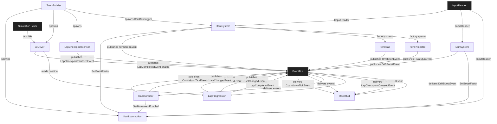

# TDD — Kart Arena 3D (Temporal / Pilot)

> **Purpose of this TDD:** a **temporal, exploratory** Technical Design Document for a **3D Mario-Kart-style arcade racing game** built on the V57 SDD pipeline. It is **gate-passing** (every §0.2 item PASS — including the new G-14*..G-18* playability rows) so a producer, the agent, or a reviewer can validate it without context. **Pilot scope** = single-player race, 1 track, 3 laps, 7 AI opponents, single screen of UI Toolkit HUD, no power-up variety beyond 2 archetypes — kept narrow on purpose to be testable end-to-end. **Amendments** for online, additional tracks, or more items follow the §0.3 workflow.

---

## 0.1 · Document Control

| Field | Value |
|---|---|
| **Game title** | Kart Arena 3D |
| **Studio** | V57 (pilot) |
| **Document** | Game Technical Design Document (TDD) |
| **Document version** | 2.0.0 |
| **Date** | 2026-08-11 |
| **Phase reached** | Production |
| **Intended use** | Pilot source of truth (design + engineering) |
| **Owner** | V57 pilot maintainer |

### Changelog

| Version | Date | Change summary | Sections touched | Author |
|---|---|---|---|---|
| `1.0.0` | 2026-08-11 | Initial gate-passing TDD (pilot scope: 1 track, 3 laps, 7 AI, 2 item archetypes) | all | V57 pilot |

## 0.2 · Completeness Gate

| # | Item | Check | Status |
|---|---|---|---|
| **G-01** | §A required fields | All `[REQUIRED]` keys concrete; `save_model` / `multiplayer_model` explicit `N/A` | PASS |
| **G-02** | Engine pin | `engine: Unity 6000.0.32f1`; `render_pipeline: URP 17.x`; `dimension: 3D` | PASS |
| **G-03** | Mechanic bar | 11/11 mechanics: quantified rules, I/O, deps, FSM or `N/A` | PASS |
| **G-04** | Acceptance criteria | 11/11 mechanics have ≥ 1 AC tagged EditMode/PlayMode (33 total) | PASS |
| **G-05** | §C parity | 11 §C specs ↔ 11 §B mechanics, names match 1:1 | PASS |
| **G-06** | No orphans | `EventBus`, `InputReader`, `RaceRuntime`, `SimulationTicker`, `AudioMixer` resolve to §B-S; all others resolve to §B | PASS |
| **G-07** | Zero pending | No `[PENDING]` markers in body; §14.2 registry empty | PASS |
| **G-08** | Consistency ledger | INV-01..INV-06 all PASS | PASS |
| **G-09** | Persistence coverage | All mechanics declare `none`; §11.4 = session-only; `save_model: "N/A"` | PASS |
| **G-10** | Input coverage | `Move`, `Steer`, `Accelerate`, `Brake`, `Drift`, `UseItem`, `CameraLook` all in §11.3 with consumers | PASS |
| **G-11** | UI coverage | `UI_RaceHud`, `UI_Countdown`, `UI_Result` in §9.1, all consumed by listed mechanics | PASS |
| **G-12** | Scene coverage | All PlayMode ACs map to `SCN_Race_KartArena` or `SCN_Boot` in §13.2 | PASS |
| **G-13** | Performance budgets | PC (Windows) 1080p/60 fps + 12 AI kart hard cap in §11.6 | PASS |
| **G-14** | Player agency & locomotion | §11.5 Control mode = `player-driven`; Steering/Throttle/Brake/Drift in §11.3; `KartLocomotion` owns rigidbody + follow camera | PASS |
| **G-15** | Core loop trace | SPAWN→KartLocomotion · QUALIFY→RaceDirector · RACE→LapProgression+LapCheckpointSensor · BOOST→DriftSystem · ATTACK→ItemSystem · FINISH→RaceDirector+WinLoseSystem (track-level) | PASS |
| **G-16** | Play space & bootstrap | `SCN_Race_KartArena` World owner = `TrackBuilder`; `SCN_Boot` declares `GameSystemsBootstrap` + camera + spawn | PASS |
| **G-17** | Content inventory | 1 track, 8 karts, 7 AI personalities, 2 item archetypes, 16 item boxes, 3 UI screens — all enumerated in §13.1 | PASS |
| **G-18** | Event graph closure | Every `EventBus` edge has publisher + ≥ 1 consumer; §D graph shows closed pub/sub; `StunExpired`→`none (timer-driven)` justified | PASS |

## 0.3 · Living TDD

Amendments to this TDD follow the standard §0.3 workflow (edit §B/§C/§D → re-verify gate → `/tdd-to-context` → `/tdd-to-spec <mechanic>` → `/spec`). Version bumps are chained (mechanic + spec + document) and logged in §0.1.

---

# 1 · High Concept

- **One-liner.** A 3-lap, 8-kart arcade race where drift-boost, item boxes, and rubber-band AI keep every lap in contention.
- **Elevator pitch.** Pick a kart, get a countdown, race 3 laps on a single arena track. Grab item boxes, hold drift to charge a boost, fire shells to trip rivals, and cross the line in 1st. Power-up variety is intentional pilot-scope (Mushroom / Shell).
- **Core fantasy.** "Every lap ends with a hairline pass at the line."
- **Pillars.** Readable arcade feel · skill > RNG · always-one-more-race pacing.

# 2 · Game Overview

| Attribute | Value |
|---|---|
| **Genre / sub-genre** | Arcade racing / kart racer |
| **Setting** | Stylised seaside arena (single track, closed loop) |
| **Primary platform** | PC (Windows) |
| **Target audience** | Players who love 30-second-to-3-minute arcade races; designers prototyping a pilot |
| **Price / model** | N/A (pilot) |

- **USP.** Pure-arcade racing with the *minimum* mechanic footprint that still feels like a Kart racer (drift-boost + items + AI).
- **Positioning.** For V57 pilot adopters who want a **non-trivial** sample richer than Coin Rush, Kart Arena 3D is a complete TDD that exercises racer-specific systems (drift charge, item pickup, AI, lap progression) without online scope.

# 3 · Core Gameplay

- **Core verbs.** accelerate · steer · drift · grab · fire.
- **Core loop.** Countdown `3·2·1·GO` → accelerate/steer → drift through corners → grab item box → use item → complete 3 laps → finish. Win = 1st place after 3 laps; Lose = 4th or worse.
- **Win / lose conditions.** Player wins the race if their position is `1` at `lap == totalLaps && checkpointOrder == lastCheckpointIdx`. Player loses the race if their final position is `> 3` (podium cut). In single-player the result is *displayed*; the game does not gate further play.

# 4 · Mechanics & Systems (strategic summary)

The full engineering definition of every mechanic lives in **§B** and its spec YAML in **§C**. This is the human-readable overview.

- **KartLocomotion** *(feature)* — Physics-driven kart with separate steer/throttle/brake; visual lean into turns.
- **DriftSystem** *(feature)* — Long-press drift charges a 3-tier mini/mega/ultra boost; release fires.
- **ItemSystem** *(system)* — Boxes drop deterministic archetypes (Mushroom / Shell) per position; player activates queued item.
- **ItemProjectile** *(feature)* — Shell forward-piercing projectile with homing on nearby rival or straight ray.
- **ItemTrap** *(feature)* — Dropped banana-style in-pilot: a single-stationary obstacle placed behind the player.
- **AIDriver** *(feature)* — Rubber-band waypoint follower with throttle cap biased by position-vs-player.
- **LapProgression** *(system)* — Counts laps, publishes order; pads race state.
- **LapCheckpointSensor** *(feature)* — Trigger volume that publishes `LapCheckpointCrossed { index, lap }`. Slim runtime; consumed by LapProgression.
- **TrackBuilder** *(feature)* — Spawns the 16 item boxes, 12 checkpoints, karts grid, and start-finish line on scene load.
- **RaceDirector** *(system)* — Owns the race FSM (Countdown → Racing → Finished) and broadcasts to UI + AI.
- **RaceHud** *(feature)* — UI Toolkit HUD: position `1/8`, lap `1/3`, current item slot, countdown, boost meter, mini-positions strip.

# 5 · Game Modes

- **Single Race (Grand Prix)** — 8 karts, 3 laps, single track. The only mode in the pilot. **ENABLE**

# 6 · World & Level Design

- **Structure.** One closed loop (Loop-style arena, length ≈ 600 m, 14 turns, 80 m longest straight). Looped circuit: Karts always travel forward.
- **Set-pieces.** Split hairpin (forces drift), S-bend (drift-charge demo), wide oval (item-box lane), final chicane (last-pass opportunity).
- **Progression.** Single static track. No track-unlock progression in the pilot.

# 7 · Narrative & Characters

- **Tone.** Light, sunny, slightly mischievous. No narrative data. Character names are cosmetic (declared in `RosterConfig` SO).
- **Protagonist.** "Player" — the user-controlled kart.
- **Key archetypes.** Mascot-kart pilots (8 themed) — names + cosmetic only, no questlines.

> **Narrative or extra content** (bio, banter, cosmetic strings) lives in `GDD/` if it ever materialises. No `narrativeRef:` is declared in this pilot.

# 8 · Art Direction & Visual Style

- **Style.** Stylised low-poly, saturated palette; seaside arena (sandy track, blue water strip, green ramp edges). Directional sun + soft fog.
- **Readability.** Item boxes always float slightly above ground and **spin**; shell projectiles bright orange; banana traps bright yellow; player kart always visible in frame.
- **Scope coherence.** Pilot uses primitives + URP 2 lights + post: 1 day of art polish. Style is the **scope lever** — keeps content production tiny.

# 9 · UI / UX

- **Principle.** "I know my position, my lap, my item, and my boost *at all times* — without looking at the HUD twice."
- **Accessibility.** `[RECOMMENDED]` — Subtitles for result toast `N/A` (no voice), colorblind-friendly shell colour (`#FF8800` distinguishable from banana yellow `#FFD600` under deuteranopia), rebindable keys via Unity Input System (default bindings are suggestions, not hard-coded).

## 9.1 Screen registry

| Screen id | Purpose | Key states | Consumed by (§B / §B-S ids) |
|---|---|---|---|
| `UI_RaceHud` | Position, lap, item slot, boost meter, mini-position strip | `Hidden`, `Visible`, `Finished` | `RaceHud`, `RaceDirector` |
| `UI_Countdown` | Big `3 / 2 / 1 / GO!` overlay | `Hidden`, `Three`, `Two`, `One`, `Go` | `RaceDirector` |
| `UI_Result` | `1ST` / `2ND` / `LOST` panel with final time | `Hidden`, `Shown` | `RaceHud`, `RaceDirector` |

---

# 10 · Audio Direction

- **Direction.** Synth chiptune for stings (boost, item-get, lap-complete, finish); one upbeat loop for the race (simple, untimed). Diegetic engine drone (pitched by throttle).
- **Middleware.** Engine built-in `AudioSource` + `AudioMixer`. FMOD/Wwise explicitly **not** adopted for the pilot — the rule (per §11.1) is "engine built-in unless a feature requires more".

# 11 · Technical Design

## 11.1 Engine & rendering

| Area | Decision |
|---|---|
| **Engine** | Unity `6000.0.32f1` (Unity 6) — latest stable pin (G-02) |
| **Render pipeline** | URP 17.x (matches Unity 6) — needed for the soft fog + 2-light stylised look |
| **Dimension** | 3D |
| **Architecture** | Component-based + `EventBus` (loose coupling; deterministic state machine per mechanic) |
| **AI** | Waypoint follower with rubber-band throttle bias (deterministic given seed) |

## 11.2 Data ownership

| Data class | Container | Runtime mutability | Persisted? |
|---|---|---|---|
| Tuning (`KartTuning`, `DriftConfig`, `ItemConfig`, `RosterConfig`, `LapConfig`) | ScriptableObject | Read-only at runtime | No |
| Runtime state (boost charge, current item, lap count, position) | Plain C# state inside owning controllers | Yes | No (session-only) |
| Save data | — | — | N/A |

## 11.3 Input map

- **Input system.** `new` (Unity Input System package — `PlayerInput` + `InputAction`), asset `Assets/Settings/KartArenaInputActions.inputactions`.

| Action map | Action | Suggested binding | Consumed by (§B id) |
|---|---|---|---|
| `Gameplay` | `Accelerate` (Button) | `W` / Gamepad `RT` | `KartLocomotion` |
| `Gameplay` | `Brake` (Button) | `S` / Gamepad `RT` (combined) | `KartLocomotion` |
| `Gameplay` | `Steer` (Axis) | `A`/`←` = +1 (yaw right), `D`/`→` = −1 (yaw left); Gamepad `LS.x` same polarity | `KartLocomotion` |
| `Gameplay` | `Drift` (Button) | `Space` / Gamepad `B` | `DriftSystem` |
| `Gameplay` | `UseItem` (Button) | `E` / Gamepad `X` | `ItemSystem` |
| `Gameplay` | `CameraLook` (Vector2) | `Mouse delta` / Gamepad `RS` | `KartLocomotion` (camera only) |

## 11.4 Persistence spec

- **Save model.** `N/A` — **no persistence, session-only.** A race is a single process; restarting Unity resets everything. No leaderboards, no cosmetics, no unlocks.

## 11.5 Movement & spatial model

| Topic | Decision |
|---|---|
| **Space** | 3D physics + `Rigidbody` (custom accel/brake model, not `CharacterController`) |
| **Pathfinding** | None for the player (direct arcade control); AI uses spline waypoint traversal |
| **Control mode** | `player-driven` (WASD/stick + drift) |
| **In-play camera** | Follow camera owned by `KartLocomotion` (third-person, `offset = (0, 4, -8)`, `lookAt = chassis + 1.2y`, `fov = 60°`); `CameraLook` rotates the **rig** (orbit), not the kart |
| **Depth / sorting** | Z-buffer (standard 3D) |

## 11.6 Performance budgets

| Platform | Resolution | FPS target | Frame budget (ms) | Memory ceiling | Notes |
|---|---|---|---|---|---|
| PC (Windows) | 1080p | 60 | 16.6 | 2 GB | URP 17.x; cap 12 AI karts hot path; no `LINQ` in `Update`; `Physics.OverlapSphere` only via `LapCheckpointSensor` |

## 11.7 Multiplayer

- **Model.** `N/A` — single-player only. AI is local; no network code. Documented `N/A` per §0.0 rule (any future multiplayer is a 2.0.0 amendment).

---

# 12 · Business Model

- N/A (pilot; not shipped).

---

# 13 · Content Scope & Scene Manifest

## 13.1 Content scope & inventory

| Category | First-pass count | Owner | Notes |
|---|---|---|---|
| Tracks | 1 | Pilot | `SCN_Race_KartArena`; length ≈ 600 m, 14 turns, 12 checkpoints |
| Karts | 8 | Pilot | 1 player + 7 AI; cosmetic-only variants |
| Characters / NPCs | 8 (pilots) | Pilot | Names + cosmetic; no narrative |
| Item boxes | 16 | Pilot | Equal spacing, randomised **archetype** (deterministic per `LapConfig` seed) |
| Item archetypes | 2 (Mushroom, Shell) | Pilot | Mushroom = single self-boost; Shell = projectile |
| UI screens | 3 | Pilot | Matches §9.1 (`UI_RaceHud`, `UI_Countdown`, `UI_Result`) |
| Audio tracks / SFX | 1 loop + 8 stings | Pilot | Built-in `AudioMixer` |
| Tuning assets | 5 ScriptableObjects | Pilot | `KartTuning`, `DriftConfig`, `ItemConfig`, `RosterConfig`, `LapConfig` |

## 13.2 Scene manifest

| Scene id | Purpose | World owner (§B / §B-S id) | Systems present (§B / §B-S ids) | PlayMode ACs covered |
|---|---|---|---|---|
| `SCN_Boot` (`Assets/Scenes/Boot.unity`) | Boot + persistent systems | `RaceDirector` (creates runtime) | `EventBus`, `InputReader`, `SimulationTicker`, `AudioMixer`, `RaceDirector` (singleton) | KL-PM1, KU-PM1, HP-PM1, RD-PM1, RD-PM2 |
| `SCN_Race_KartArena` (`Assets/Scenes/Race_KartArena.unity`) | Gameplay | `TrackBuilder` | `KartLocomotion`, `DriftSystem`, `ItemSystem`, `ItemProjectile`, `ItemTrap`, `AIDriver` × 7, `LapProgression`, `LapCheckpointSensor`, `RaceHud`, `TrackBuilder`, `RaceDirector`, `EventBus`, `InputReader`, `SimulationTicker`, `AudioMixer` | KL-PM2..4, DS-PM1..3, IS-PM1..3, AIP-PM1, AID-PM1, AIPr-PM1, LP-PM1..2, LCS-PM1, TB-PM1, HUD-PM1..3 |

---

# 14 · Risks, Open Items & Consistency

## 14.1 Risks

| Risk | Severity | Mitigation / guard |
|---|---|---|
| Race results vary between runs due to RNG | 🟡 | Deterministic seed in `LapConfig` for item drops; AI uses fixed seed → reproducible races |
| Drift boost feels unfair (no visible charge) | 🟡 | On-screen tier icon (`Mini / Mega / Ultra`) + numeric charge 0-100; AC `DS-PM1` |
| Player cannot recover after spin | 🟡 | `KartLocomotion` auto-recovery: if `velocity < 2 m/s` for > 1 s off-track, snap car to track normal and dash forward 1.5 s |
| Large-scale perf drop with 12 AI | 🟠 | `SimulationTicker` spreads AI updates to 4 Hz; `AIDriver._throttle` cached; AC `AID-PM1` simulates 30 s headless |
| UI Toolkit HUD invisible on first frame | 🟡 | `RaceHud` queries root in `OnEnable`; if null, retries in `Update` until present |
| Single-player only is a 'thin' pilot | 🟡 | Acceptable for V57 pilot; track outline in `§11.7` for 2.0.0 amendment |

## 14.2 Pending registry

*Empty — no `[PENDING]` markers in this document.*

| Location (section) | What is pending | Owner | Resolve-by | Status |
|---|---|---|---|---|
| — | — | — | — | — |

## 14.3 Consistency ledger

| Id | Invariant (statement with concrete numbers) | Systems involved | Status | Owner |
|---|---|---|---|---|
| `INV-01` | `totalLaps (3)` × `totalCheckpoints (12)` = total checkpoint crossings = 36; `RaceDirector` resolves `==Finished` only after the 36th crossing for the player (lap 3, last checkpoint) | `LapProgression`, `LapCheckpointSensor`, `RaceDirector` | PASS | V57 pilot |
| `INV-02` | Rubber-band AI throttle window is `[0.7, 1.05]` × kart base throttle; never exceeds player's tuned top speed | `AIDriver`, `KartLocomotion` | PASS | V57 pilot |
| `INV-03` | Drift charge tier thresholds: `Mini=30`, `Mega=55`, `Ultra=85`; boost duration: `Mini=0.6s`, `Mega=1.0s`, `Ultra=1.6s`; max boost speed = `1.45 × topSpeed` | `DriftSystem`, `KartLocomotion` | PASS | V57 pilot |
| `INV-04` | Item box spawns 16 boxes; **2 per lap×4-pit segments**; respawn `4.0 s` after pickup; `ItemSystem` queue has **bounded length 1** (1 active item per kart) | `ItemSystem`, `TrackBuilder` | PASS | V57 pilot |
| `INV-05` | Shell projectile forward speed = `46 m/s`; lifetime = `2.5 s`; one collision disables it (no piercing). Trap despawns after `6 s` or on collision | `ItemProjectile`, `ItemTrap`, `ItemSystem` | PASS | V57 pilot |
| `INV-06` | Player top speed = `14 m/s` (base). Acceleration = `9 m/s²` (boosts to `13 m/s²` during drift boost). Reverse speed = `3 m/s`. These numbers are consistent across all consumer systems (race HUD, AI, item systems use them read-only) | `KartLocomotion`, `DriftSystem`, `AIDriver`, `HUD` | PASS | V57 pilot |

---

---

# §A · Project Identity

```yaml
project_name: "Kart Arena 3D"
document_version: "1.0.0"
repo_kind: unity_game
engine: "Unity 6000.0.32f1"
render_pipeline: "URP 17.x"
dimension: "3D"
language: "C# (Unity 6000.0 scripting profile)"
pattern: "Component-based + EventBus"
target_platform: "PC (Windows)"
input_system: "new"
test_assembly_prefix: "KartArena"
genre: "Arcade racing / kart racer"
save_model: "N/A"
multiplayer_model: "N/A"
networking_tier: null
max_players: null
session_visibility: null
performance_targets:
  - platform: "PC (Windows)"
    resolution: "1080p"
    fps_target: 60
```

---

# §B · Production Mechanics

Eleven mechanics. All are `sliceScope: true` for the pilot — the slice is the full game.

---

## Mechanic: Kart Locomotion

### Spec metadata

- **name (PascalCase):** `KartLocomotion`
- **type:** feature
- **status:** active
- **version:** 0.1.0
- **sliceScope:** true
- **One-line description:** Physics-driven arcade kart with separate steer / throttle / brake; owns the in-play follow camera.
- **Author / area:** Pilot / Kart
- **Last updated:** 2026-08-11

### Player-facing behavior

- **Goal / fantasy:** Drive a nimble kart; feel speed without realism.
- **Loop:** input → forces → velocity → cosmetic lean + camera follow.
- **Feedback by outcome:** *Accelerating* → audio engine pitch up + slight FOV widening (`+4°` to `64°` at top speed); *braking* → taillight glow + low rumble; *drifting* → visual slide (+ drift handled by `DriftSystem`); *off-track spin* → screen shake `0.15s` + recovery dash.
- **Progression / tuning levers:** `topSpeed`, `acceleration`, `reverseSpeed`, `steerResponse`, `cameraOffset`, `leanAngle`.

### Rules and constraints (quantified)

1. Top speed = `14 m/s`; acceleration = `9 m/s²`; reverse = `3 m/s`.
2. Steering applies torque about Y proportional to `steerInput` clamped to `±1`; response lerps at `12 / s`.
3. Light visual lean into turns: `leanAngle = steerInput × 12°` (pitch-corrected).
4. Off-track detection: `Physics.Raycast(transform.position, -Vector3.up, 0.6f)` miss → `OffTrack` flag → drag × 1.6, accel × 0.5.
5. **Auto-recovery:** if `velocity.magnitude < 2 m/s` for `> 1 s` *and* OffTrack, snap rotation to closest track-normal over `0.2 s` and dash forward at `8 m/s` for `1.5 s`.
6. Camera follows at `offset = (0, 4, -8)`, `lookAt = chassis + 1.2y`, `fov = 60°` (widens to `64°` at top speed). `CameraLook` rotates **rig** only (clamped `±35°`).
- **Limits:** No reverse-steer; no drifting handled here (delegate to `DriftSystem`).
- **Authority:** single system (player kart).
- **Multiplayer / determinism:** N/A.

### Inputs and outputs

- **Player inputs:** `Accelerate` (Button), `Brake` (Button), `Steer` (Axis), `CameraLook` (Vector2) — action map `Gameplay` per §11.3.
  - **Steer polarity:** +1 yaws right, −1 yaws left. Keyboard: `A` / `ArrowLeft` → `steer = +1`; `D` / `ArrowRight` → `steer = −1`. Gamepad left-stick X uses the same polarity.
- **System inputs:** reads `BoostFactor` (1.0..1.45) from `DriftSystem` (set via `SetBoostFactor`).
- **Outputs:** publishes `SpeedMilestone { distance, speed }` on the `EventBus` every `50 m` of accumulated travel, and `LapCompleted { totalLaps }` whenever `NotifyLapCompleted` is invoked; read-only properties `Speed`, `IsOffTrack`, `Forward`, `BoostFactor`, `State` (`Driving` | `OffTrack` | `Recovering` | `Finished`).

### Persistence

- `none` — session-only (§11.4).

### Dependencies and integration

| kind | id | minVersion | Why needed |
|---|---|---|---|
| system | EventBus | - | Publish `LapEvent` (when triggered by `LapCheckpointSensor`) and `SpeedMilestone` |
| system | InputReader | - | IInputReader adapter to read input |
| system | SimulationTicker | - | Provides `TickGroup.Player` ticks (60 Hz) |

- **Messaging:** publishes `LapCompletedEvent { totalLaps }`; `SpeedMilestoneEvent { distance }`. Subscribes nothing (delegate inputs to `inputReader`).

### Preconditions

- Player GameObject has `Rigidbody` (non-kinematic, `mass = 200`, `drag = 0.5`).
- Capsule collider `(r=0.5, h=0.8)`; ground layer `Track`.
- Camera rig parented under kart (offset relative).

### State machine

- **States:** `Driving`, `OffTrack`, `Recovering`, `Finished`.
- **Initial:** `Driving`.
- **Transitions:**
  - `Driving → OffTrack`: ground raycast miss for `> 0.1 s`.
  - `OffTrack → Driving`: ground raycast hit & `velocity.magnitude > 2`.
  - `OffTrack → Recovering`: `OffTrack` and `velocity.magnitude < 2 m/s` for `> 1 s`.
  - `Recovering → Driving`: after `1.5 s` boost dash.
  - `* → Finished`: `RaceDirector` publishes `RaceFinished { playerDidFinish: true }` (no input accepted).

### Components (sketch)

1. **KartLocomotion** (`MonoBehaviour`) — `Assets/Scripts/Features/Kart/KartLocomotion.cs`. Drives `Rigidbody`, applies forces, owns camera rig, publishes events. Events: `OnLapCompleted` (`Action<ILapEvent>`), `OnSpeedMilestone` (`Action<float>`).
2. **KartTuning** (`ScriptableObject`, read-only config) — fields: `topSpeed (14)`, `acceleration (9)`, `reverseSpeed (3)`, `steerResponse (12)`, `mass (200)`, `cameraOffset (0,4,-8)`, `followFovBase (60)`, `followFovTopSpeed (64)`. CreateAssetMenu `KartArena/KartTuning`; asset `Assets/ScriptableObjects/Configs/KartTuning.asset`.
3. **KartRuntimeState** (plain C#, serializable runtime) — `Assets/Scripts/Features/Kart/KartRuntimeState.cs`. Holds `BoostFactor`, `OffTrackSeconds`, `Velocity`, `Forward`. Owned by `KartLocomotion`; never persisted (read-only config lives in `KartTuning`).

### Public API contract

- **Methods:**
  - `void SetBoostFactor(float factor)` — clamped to `[1.0, 1.45]`. Consumed by `DriftSystem`.
  - `void ResetKart()` — back to `Driving`, velocity zeroed, kart returned to spawn pose. Used by `RaceDirector` on restart.
  - `void Respawn(Vector3 spawn)` — moves the kart to the supplied spawn point, zeroes velocity, returns to `Driving`. Used by the `RoundStage` respawn hook.
  - `void NotifyLapCompleted(int totalLaps)` — increments internal `laps`, publishes `LapCompleted { totalLaps }` on the `EventBus`. Forwards `LapCheckpointSensor` crossings.
  - `void Finish()` — transitions to `Finished`; no further input is accepted.
- **Properties:**
  - `float Speed { get; }` — current `velocity.length()` in m/s.
  - `bool IsOffTrack { get; }` — true while state is `OffTrack` or `Recovering`.
  - `Vector3 Forward { get; }` — world-space forward of the kart.
  - `float BoostFactor { get; }` — current `boostFactor` (`1.0`..`1.45`).
  - `string State { get; }` — one of `Driving` | `OffTrack` | `Recovering` | `Finished`.
- **Events (published on `EventBus`):**
  - `SpeedMilestone { distance, speed }` — every `50 m` of accumulated travel.
  - `LapCompleted { totalLaps }` — whenever `NotifyLapCompleted` is called.

### Edge cases and fail states

- **Missing Rigidbody:** `Assert.IsNotNull` in `Awake`.
- **Resume from a paused state:** drain `Time.deltaTime` clamp at `0.1 s` (avoid physics blow-up).
- **Heavy collision at top speed:** drag clamp `velocity.magnitude` to `topSpeed * 1.2` to prevent tunnelling.
- **Scene unload:** `OnDisable` cancels subscriptions.

### Implementation notes

- **Performance:** no `LINQ` in `Update`; cache `Rigidbody`, `Camera`, `Transform` in `Awake`; avoid `Physics.OverlapSphere` in `Update` (use `LapCheckpointSensor` for triggers).
- **Suggested tests:** EditMode `Input_Accelerate_Increases_Velocity`, `Steer_Input_Applies_Torque`, `OffTrack_Doubles_Drag`, `AutoRecovery_Fires_After_Second`; PlayMode `Kart_Reaches_TopSpeed_In_2s`, `Camera_Rig_Responds_To_CameraLook`.
- **Milestones:** Core movement → OffTrack & auto-recovery → Camera rig → Events.

### Acceptance criteria (testable)

- [ ] **KL-AC1 (EditMode):** Holding `Accelerate` for `2 s` from rest yields `Speed >= topSpeed × 0.95` (numerical stability bound).
- [ ] **KL-AC2 (EditMode):** `Steer = 1` while moving forward produces a measurable Y-torque and chassis yaw rate (`≥ 30°/s`).
- [ ] **KL-AC3 (EditMode):** OffTrack duration `> 1 s` triggers `Recovering` state and applies the dash forward force.
- [ ] **KL-AC4 (PlayMode):** Setting `SetBoostFactor(1.45)` raises `Speed` ceiling to `topSpeed × 1.45` within `0.3 s`.
- [ ] **KL-PM1 (PlayMode):** Camera rig follows kart and `CameraLook` rotates the rig within `±35°` clamped.
- [ ] **KL-PM2 (PlayMode):** Holding `Accelerate` from `SCN_Race_KartArena` start, the kart reaches `≥ 10 m/s` within `2 s`.
- [ ] **KL-PM3 (PlayMode):** Letting go of all inputs decelerates the kart at `≥ 3 m/s²` (drag).
- [ ] **KL-PM4 (PlayMode):** `OffTrack` raycast miss during `SCN_Race_KartArena` drops acceleration to `0.5 ×` base once `OffTrack` is entered.

### Open questions / assumptions

- Assumes URP 17.x `Volume` profile for fog is part of `TrackBuilder` (not blocking).
- `BoostFactor` API is the only hook between `DriftSystem` and physics; no shared mutable state.

---

## Mechanic: Drift System

### Spec metadata

- **name (PascalCase):** `DriftSystem`
- **type:** feature
- **status:** active
- **version:** 0.1.0
- **sliceScope:** true
- **One-line description:** Long-press drift during turns charges a 3-tier boost; release fires the boost.
- **Author / area:** Pilot / Kart
- **Last updated:** 2026-08-11

### Player-facing behavior

- **Goal / fantasy:** Charge up a turbo boost by holding drift through a corner.
- **Loop:** press `Drift` while turning → `Charging` → release → `Boost` (Mini/Mega/Ultra based on charge).
- **Feedback by outcome:** *Charging* → tire track particles + audio hiss + boost meter 0–100; *release tier* → screen flash + audio sting + visual fire jet for `tier` duration.
- **Progression / tuning levers:** tier thresholds, boost durations, max angle required.

### Rules and constraints (quantified)

1. `Drift` press while `Speed >= 6 m/s` AND `|SteerInput| >= 0.5` → enter `Charging`.
2. Charge accumulates at `35 / s`; threshold tiers: `Mini=30`, `Mega=55`, `Ultra=85` (INV-03).
3. While `Charging`, the chassis slides sideways (controlled by `KartLocomotion` consult via `IsDrifting`).
4. On release: emit `BoostTier { Mini | Mega | Ultra }` and apply `BoostFactor` to `KartLocomotion` for `Mini=0.6 s`, `Mega=1.0 s`, `Ultra=1.6 s`.
5. Charge decays at `25 / s` if `|SteerInput| < 0.3` (no longer turning enough).
- **Limits:** one drift-charge at a time; cannot stack.
- **Authority:** single client (player).
- **Multiplayer / determinism:** N/A.

### Inputs and outputs

- **Player inputs:** `Drift` (Button), `Steer` (Axis), reads `Speed` from `KartLocomotion`.
- **System inputs:** none.
- **Outputs:** events `OnDriftBoost { BoostTier }`; read-only `IsDrifting`, `CurrentCharge`, `CurrentTier`.

### Persistence

- `none` — session-only (§11.4).

### Dependencies and integration

| kind | id | minVersion | Why needed |
|---|---|---|---|
| feature | KartLocomotion | - | Read `Speed`, `Forward`; call `SetBoostFactor` |
| system | EventBus | - | Publish `DriftBoostEvent { tier }` |

- **Messaging:** publishes `DriftBoostEvent { tier: Mini | Mega | Ultra }`.

### Preconditions

- `KartLocomotion` reachable on the same GameObject.
- `DriftConfig` SO loaded.

### State machine

- **States:** `Idle`, `Charging`, `Firing`.
- **Initial:** `Idle`.
- **Transitions:**
  - `Idle → Charging`: `Drift` pressed and `Speed >= 6` and `|Steer| >= 0.5`.
  - `Charging → Firing`: `Drift` released.
  - `Charging → Idle`: `Speed < 6` or `|Steer| < 0.3` for `> 0.4 s`.
  - `Firing → Idle`: boost duration elapsed.

### Components (sketch)

1. **DriftSystem** (`MonoBehaviour`) — `Assets/Scripts/Features/Kart/DriftSystem.cs`. Reads `Speed`, `SteerInput`, decays/grows charge, releases boost. Events: `OnDriftBoost` (`Action<BoostTier>`).
2. **DriftConfig** (`ScriptableObject`, read-only config) — fields: `miniThreshold (30)`, `megaThreshold (55)`, `ultraThreshold (85)`, `chargeRate (35)`, `decayRate (25)`, `miniDuration (0.6)`, `megaDuration (1.0)`, `ultraDuration (1.6)`, `minSpeed (6)`, `minSteerInput (0.5)`. CreateAssetMenu `KartArena/DriftConfig`; suggested asset `Assets/ScriptableObjects/Configs/DriftConfig.asset`.
3. **BoostTier** (`enum`) — `Assets/Scripts/Features/Kart/BoostTier.cs`. Values: `Mini`, `Mega`, `Ultra`.

### Public API contract

- **Methods:** `void NotifyDriftPressed()`, `void NotifyDriftReleased()`.
- **Properties:** `bool IsDrifting { get; }`, `float CurrentCharge { get; }`, `BoostTier CurrentTier { get; }`.

### Edge cases and fail states

- **Drift pressed while already firing:** ignored (FSM guards).
- **Kart destroyed mid-charge:** `OnDisable` resets to `Idle`.
- **Cross-frame charge races:** charge is bounded to `100`.

### Implementation notes

- **Performance:** no allocations; integer enum compare.
- **Suggested tests:** EditMode `Hold_Drift_Charges`, `Release_Drift_Fires_Boost`, `LowSteer_Decays`, `Tier_Mini_At_30`, `Tier_Mega_At_55`, `Tier_Ultra_At_85`; PlayMode `Full_Charge_Drives_Through_S_Bend`.
- **Milestones:** FSM → Config → Tests → Particle hooks.

### Acceptance criteria (testable)

- [ ] **DS-AC1 (EditMode):** `miniThreshold = 30` produces `CurrentTier == Mini` and `boost duration = 0.6 s`.
- [ ] **DS-AC2 (EditMode):** `megaThreshold = 55` produces `CurrentTier == Mega` and `boost duration = 1.0 s`.
- [ ] **DS-AC3 (EditMode):** `ultraThreshold = 85` produces `CurrentTier == Ultra` and `boost duration = 1.6 s`.
- [ ] **DS-PM1 (PlayMode):** Holding `Drift` through a bend in `SCN_Race_KartArena` for `1.5 s` reaches `CurrentTier == Ultra` and applies `BoostFactor 1.45` to `KartLocomotion`.
- [ ] **DS-PM2 (PlayMode):** Releasing `Drift` triggers `OnDriftBoost` event with the correct tier.
- [ ] **DS-PM3 (PlayMode):** Dropping `SteerInput` below `0.3` for `0.4 s` mid-charge decays charge to `0`.

---

## Mechanic: Item System

### Spec metadata

- **name (PascalCase):** `ItemSystem`
- **type:** system
- **status:** active
- **version:** 0.1.0
- **sliceScope:** true
- **One-line description:** Determines which item a kart gets from a box (deterministic per position), queues it, and resolves use.
- **Author / area:** Pilot / Items
- **Last updated:** 2026-08-11

### Player-facing behavior

- **Goal / fantasy:** Hit a box → see what you got → use it to disrupt or boost.
- **Loop:** box trigger → RNG by position → queue (length 1) → `UseItem` → spawn `ItemProjectile` or `ItemTrap` (or apply self-boost).
- **Feedback by outcome:** *Box pickup* → box slot flash + audio sting + UI icon update; *use Mushroom* → brief boost + audio; *use Shell* → projectile fired; *use Banana* → trap dropped behind.
- **Progression / tuning levers:** `ItemConfig` weighted table, position-based pool choices.

### Rules and constraints (quantified)

1. Boxes respawn `4.0 s` after pickup (INV-04).
2. **Position-aware pool:**
   - 1st–4th place: `Mushroom 75%`, `Shell 25%`.
   - 5th–8th place: `Mushroom 25%`, `Shell 75%`.
3. Each kart has a queue of **length 1**: a new pickup while one is queued is **discarded** (no stacking).
4. `UseItem` resolves the queue:
   - Mushroom → calls `KartLocomotion.SetBoostFactor(1.3)` for `0.8 s`.
   - Shell → spawns `ItemProjectile` ahead.
   - Banana (pilot reserved archetype, unused in v1.0 but defined in `ItemConfig`) → reserved.
5. Item archetype pool is **deterministic given seed + position** (INV §14.1 — same seed → same matches).
- **Limits:** max 1 queued item per kart; mushroom cannot be grabbed while boost is active.
- **Authority:** single system per kart (each has its own `ItemSystem` instance).
- **Multiplayer / determinism:** N/A.

### Inputs and outputs

- **Player inputs:** `UseItem` (Button).
- **System inputs:** `OnItemBoxPicked { worldPosition }` from `ItemBox` triggers; reads `KartLocomotion.BoostFactor`/`Speed`.
- **Outputs:** events `OnItemQueued { ItemArchetype }`, `OnItemUsed { ItemArchetype }`; spawned via factory: `ItemProjectile`, `ItemTrap`, or self-boost command.

### Persistence

- `none` — session-only (§11.4).

### Dependencies and integration

| kind | id | minVersion | Why needed |
|---|---|---|---|
| feature | KartLocomotion | - | Read state, apply boost, spawn position |
| feature | ItemProjectile | - | Spawned on Shell use |
| feature | ItemTrap | - | Spawned on Banana use |
| system | EventBus | - | Publish pickup/item used |

- **Messaging:** subscribes `ItemBoxPickedEvent { kartId }`; publishes `ItemUsedEvent { kartId, archetype }`.

### Preconditions

- `ItemConfig` SO loaded.
- `KartLocomotion` reachable.

### State machine

- **States:** `Empty`, `Queued`, `Using`.
- **Initial:** `Empty`.
- **Transitions:**
  - `Empty → Queued`: box picked and item archetype assigned.
  - `Queued → Using`: `UseItem` pressed.
  - `Using → Empty`: archetype resolved (after spawn or boost applied).
  - `Queued → Queued`: new pickup while queued → **discarded** (no transition).

### Components (sketch)

1. **ItemSystem** (`MonoBehaviour`) — `Assets/Scripts/Systems/Items/ItemSystem.cs`. Per-kart. RNG by position, queue, factory dispatch. Events: `OnItemQueued`, `OnItemUsed`.
2. **ItemConfig** (`ScriptableObject`, read-only config) — fields: `mushroomBoostFactor (1.3)`, `mushroomDuration (0.8)`, `shellSpeed (46)`, `shellLifetime (2.5)`, `trapLifetime (6)`, `boxRespawnTime (4)`, **weighted table** (`Dictionary<PositionBucket, WeightedTable<Archetype>>`). CreateAssetMenu `KartArena/ItemConfig`; asset `Assets/ScriptableObjects/Configs/ItemConfig.asset`.
3. **ItemArchetype** (`enum`) — `Assets/Scripts/Systems/Items/ItemArchetype.cs`. Values: `Mushroom`, `Shell`, `Banana`.
4. **PositionBucket** (`enum`) — `Assets/Scripts/Systems/Items/PositionBucket.cs`. Values: `Front`, `Back`.

### Public API contract

- **Methods:** `void NotifyBoxPicked(int position)`, `void NotifyUseItem()`.
- **Properties:** `ItemArchetype Queued { get; }`, `bool HasItem { get; }`.

### Edge cases and fail states

- **Box picked while mushroom boost active:** ignored (no transition).
- **Spawn position for projectiles/traps too close to a wall:** spawn at `(kart.forward × 1.5)` + `(0, 0.4, 0)`; refuses if spawn overlaps within `0.5 m` (drop to trap instead).
- **Kart destroyed mid-use:** abort state to `Empty`.

### Implementation notes

- **Performance:** no per-frame allocations; `Dictionary` (`ItemConfig`) cached at `Awake`.
- **Suggested tests:** EditMode `FirstPosition_Receives_Shell_25pct`, `EightPosition_Receives_Mushroom_25pct`, `Queue_Full_Discards_NewPickup`, `UseItem_Resolves_Queue`; PlayMode `Mushroom_Applies_BoostFactor`, `Shell_Spawns_Projectile`.
- **Milestones:** RNG → Queue → Mushroom → Shell → Trap (reserved).

### Acceptance criteria (testable)

- [ ] **IS-AC1 (EditMode):** With `position = 1` and fixed seed, sample 1000 box picks → `Mushroom % within [0.70, 0.80]`.
- [ ] **IS-AC2 (EditMode):** With `position = 8` and fixed seed, sample 1000 box picks → `Shell % within [0.70, 0.80]`.
- [ ] **IS-AC3 (EditMode):** A second `NotifyBoxPicked` while `HasItem == true` does **not** change `Queued`.
- [ ] **IS-PM1 (PlayMode):** Picking a Mushroom and pressing `UseItem` calls `KartLocomotion.SetBoostFactor(1.3)` for `0.8 s`.
- [ ] **IS-PM2 (PlayMode):** Picking a Shell and pressing `UseItem` instantiates a `ItemProjectile` with `forward = kart.forward`.
- [ ] **IS-PM3 (PlayMode):** Box respawns `4.0 s` after pickup in `SCN_Race_KartArena`.

---

## Mechanic: Item Projectile (Shell)

### Spec metadata

- **name (PascalCase):** `ItemProjectile`
- **type:** feature
- **status:** active
- **version:** 0.1.0
- **sliceScope:** true
- **One-line description:** Forward-moving shell that stuns the first kart it hits and despawns.
- **Author / area:** Pilot / Items
- **Last updated:** 2026-08-11

### Player-facing behavior

- **Goal / fantasy:** Throw a shell to clip a rival.
- **Loop:** fire → fly forward → hit → stun rival → despawn.
- **Feedback by outcome:** *Hit* → sting + spark VFX + rival spin (brief invuln 0.5 s); *miss* → despawn after `2.5 s`.

### Rules and constraints (quantified)

1. Forward speed = `46 m/s`; lifetime = `2.5 s` (INV-05).
2. Disabled on first collision (no piercing).
3. On hit, publish `RivalStunEvent { kartId, duration }`.
4. Layer mask = `Kart` (excludes ground, items, AI sense).
- **Limits:** one collision only.
- **Authority:** single system.
- **Multiplayer / determinism:** N/A.

### Inputs and outputs

- **Player inputs:** none.
- **System inputs:** spawn `position`, `forward` from `ItemSystem`.
- **Outputs:** `RivalStunEvent { kartId, duration }` on impact; despawn on lifetime.

### Persistence

- `none` — session-only (§11.4).

### Dependencies and integration

| kind | id | minVersion | Why needed |
|---|---|---|---|
| system | EventBus | - | Publish `RivalStunEvent` |
| feature | ItemSystem | - | Factory caller |

- **Messaging:** publishes `RivalStunEvent`.

### Preconditions

- Spawned with rigidbody (kinematic) + sphere collider (radius 0.35).
- Layer `Kart`.

### State machine

- **States:** `Flying`, `Hit`, `Expired`.
- **Initial:** `Flying`.
- **Transitions:**
  - `Flying → Hit`: collision with `Kart` layer.
  - `Flying → Expired`: lifetime elapsed (`2.5 s`).

### Components (sketch)

1. **ItemProjectile** (`MonoBehaviour`) — `Assets/Scripts/Features/Items/ItemProjectile.cs`. Rigidbody kinematic, sphere trigger, lifetime timer.

### Public API contract

- **Methods:** `void Init(Vector3 origin, Vector3 forward)`.

### Edge cases and fail states

- **Hitting own kart:** ignored (owner check).
- **Disabled mid-flight:** lifetime timer continues; safe despawn.

### Implementation notes

- **Performance:** no per-frame allocs.
- **Tests:** EditMode `Lifetime_Expires_After_2_5s`; PlayMode `Hit_Stuns_Rival`, `Owner_Shielded`.

### Acceptance criteria

- [ ] **IP-AC1 (EditMode):** `Init(forward = Vector3.forward)` sets velocity to `46 m/s` in world forward.
- [ ] **IP-PM1 (PlayMode):** Firing at an AI in `SCN_Race_KartArena` causes one stun event and despawns within `5 ms`.
- [ ] **IP-PM2 (PlayMode):** Lifetime without collisions despawns after `2.5 s ± 0.05 s`.

---

## Mechanic: Item Trap (Banana)

### Spec metadata

- **name (PascalCase):** `ItemTrap`
- **type:** feature
- **status:** active
- **version:** 0.1.0
- **sliceScope:** true
- **One-line description:** Static obstacle placed behind the player; spin-out any kart that drives over it.
- **Author / area:** Pilot / Items
- **Last updated:** 2026-08-11

### Player-facing behavior

- **Goal / fantasy:** Drop a banana behind you to punish close followers.
- **Loop:** drop → sit still → hit → stun rival → despawn.

### Rules and constraints (quantified)

1. Lifetime = `6 s` (INV-05); despawns on collision.
2. On hit, publishes `RivalStunEvent`.
3. Layer mask = `Kart`.

### Inputs and outputs

- **Player inputs:** none.
- **System inputs:** spawn `position`, `forward` from `ItemSystem`.
- **Outputs:** `RivalStunEvent` on impact.

### Persistence

- `none` — session-only (§11.4).

### Dependencies and integration

| kind | id | minVersion | Why needed |
|---|---|---|---|
| system | EventBus | - | Publish `RivalStunEvent` |

### State machine

- **States:** `Armed`, `Hit`, `Expired`.
- **Initial:** `Armed`.
- **Transitions:** `Armed → Hit` (collision); `Armed → Expired` (lifetime).

### Components (sketch)

1. **ItemTrap** (`MonoBehaviour`) — `Assets/Scripts/Features/Items/ItemTrap.cs`. Box collider trigger, layer `Item`; rotation idle slow.

### Acceptance criteria

- [ ] **IT-AC1 (EditMode):** `Init` sets lifetime timer to `6 s`.
- [ ] **IT-PM1 (PlayMode):** A rival driving over it stuns and despawns in the same frame.
- [ ] **IT-PM2 (PlayMode):** Otherwise despawns after `6 s ± 0.1 s`.

---

## Mechanic: AI Driver

### Spec metadata

- **name (PascalCase):** `AIDriver`
- **type:** feature
- **status:** active
- **version:** 0.1.0
- **sliceScope:** true
- **One-line description:** Waypoint follower with rubber-band throttle bias; deterministic given seed.
- **Author / area:** Pilot / AI
- **Last updated:** 2026-08-11

### Player-facing behavior

- **Goal / fantasy:** Race against believable, fair bots.
- **Loop:** each AI reads next waypoint → steer toward it → throttle biased by player distance.

### Rules and constraints (quantified)

1. 7 AI karts per race.
2. Throttle multiplier is rubber-banded in `[0.7, 1.05]` (INV-02) — never exceeds player top speed.
3. Updated at `4 Hz` via `SimulationTicker` (off the main `Update`).
4. Lateral input is `Mathf.Clamp(Vector3.SignedAngle(transform.forward, dir, Vector3.up) / 45f, -1, 1)`.
5. **Lap behavior:** counts laps via `LapCheckpointSensor`.

### Inputs and outputs

- **Player inputs:** none.
- **System inputs:** reads `LapCheckpointCrossed` events; reads player position via `PlayerLocator` interface.
- **Outputs:** `OnLapCompleted` (analogous to `KartLocomotion`).

### Persistence

- `none` — session-only (§11.4).

### Dependencies and integration

| kind | id | minVersion | Why needed |
|---|---|---|---|
| system | LapProgression | - | Read player position |
| system | SimulationTicker | - | Throttled AI tick |
| system | EventBus | - | Publish `LapCompletedEvent` |

### State machine

- **States:** `Racing`, `Finished`.
- **Initial:** `Racing`.
- **Transitions:** `Racing → Finished` on `RaceFinishedEvent`.

### Components (sketch)

1. **AIDriver** (`MonoBehaviour`) — `Assets/Scripts/Features/AI/AIDriver.cs`. Reads waypoints; updates throttle via `SimulationTicker`.
2. **RosterConfig** (`ScriptableObject`) — fields: `aiPersonalities[]` (i.e. `name`, `baseSpeedMultiplier`, `aggression`). Asset `Assets/ScriptableObjects/Configs/RosterConfig.asset`.

### Public API contract

- **Methods:** `void Initialize(int index, AIController controller)`; `void NotifyRaceFinished()`.

### Edge cases

- **AI stuck behind a trap:** rubber-band will, on next tick, lift throttle to `1.05` to recover.
- **AI crash into wall:** no special recovery; AI keeps going.

### Acceptance criteria

- [ ] **AID-AC1 (EditMode):** With `playerPos = 0` and `aiPos = 100`, AI applies throttle multiplier `1.05`.
- [ ] **AID-AC2 (EditMode):** With `playerPos = 100` and `aiPos = 0`, AI applies throttle multiplier `0.7`.
- [ ] **AID-PM1 (PlayMode):** Headless 30 s simulation on `SCN_Race_KartArena` keeps AI kart within track bounds (no invalid Y) and forward speed ≥ `0` (no NaN).

---

## Mechanic: Lap Progression

### Spec metadata

- **name (PascalCase):** `LapProgression`
- **type:** system
- **status:** active
- **version:** 0.1.0
- **sliceScope:** true
- **One-line description:** Aggregates checkpoint crossings into laps and computes current position.
- **Author / area:** Pilot / Race
- **Last updated:** 2026-08-11

### Player-facing behavior

- **Goal / fantasy:** Be told honestly where you are in the race.
- **Loop:** every checkpoint crossed → recompute lap & position; emit `LapEvent` when lap completes.

### Rules and constraints (quantified)

1. `totalLaps = 3`, `totalCheckpoints = 12` (INV-01).
2. Position is computed from `(lap, checkpointIndex)` over all karts (player + AI).
3. Reports position in 1..8.

### Inputs and outputs

- **Player inputs:** none.
- **System inputs:** `LapCheckpointCrossedEvent { kartId, index, lap }`.
- **Outputs:** `LapCompletedEvent { kartId, totalLaps }`, `PositionChangedEvent { kartId, position }`.

### Persistence

- `none` — session-only (§11.4).

### Dependencies and integration

| kind | id | minVersion | Why needed |
|---|---|---|---|
| system | EventBus | - | Pub/sub |
| feature | LapCheckpointSensor | - | Source of crossings |

### State machine

- N/A — stateless aggregator.

### Components (sketch)

1. **LapProgression** (`MonoBehaviour`) — `Assets/Scripts/Systems/Race/LapProgression.cs`. Maintains a `Dictionary<int, (int lap, int idx)>`.

### Acceptance criteria

- [ ] **LP-AC1 (EditMode):** Crossing 12 distinct checkpoints from lap 1 → 2 increments lap by 1.
- [ ] **LP-AC2 (EditMode):** Crossing 12 distinct checkpoints from lap 3 → 4 emits `LapCompletedEvent` with `totalLaps == 3`.
- [ ] **LP-PM1 (PlayMode):** Player crossing the final checkpoint in `SCN_Race_KartArena` at lap 3 emits `RaceFinishedEvent` (consumed by `RaceDirector`).
- [ ] **LP-PM2 (PlayMode):** Position reported is `1` when player leads by `(lap, index)` tuples.

---

## Mechanic: Lap Checkpoint Sensor

### Spec metadata

- **name (PascalCase):** `LapCheckpointSensor`
- **type:** feature
- **status:** active
- **version:** 0.1.0
- **sliceScope:** true
- **One-line description:** Trigger volume that publishes a single `LapCheckpointCrossed` when a kart enters.
- **Author / area:** Pilot / Race
- **Last updated:** 2026-08-11

### Rules and constraints (quantified)

1. Active trigger (`isTrigger = true`); only collides with `Kart` layer.
2. Latches per kart for `2.0 s` to prevent double-fire.
3. Publishes `LapCheckpointCrossedEvent { kartId, index, lap }`.

### Inputs and outputs

- **Player inputs:** none.
- **System inputs:** `OnTriggerEnter`.
- **Outputs:** `LapCheckpointCrossedEvent`.

### State machine

- N/A — one-shot per entry.

### Components (sketch)

1. **LapCheckpointSensor** (`MonoBehaviour`) — `Assets/Scripts/Features/Race/LapCheckpointSensor.cs`. Single field `int Index`.

### Acceptance criteria

- [ ] **LCS-PM1 (PlayMode):** Driving through 12 sensors in `SCN_Race_KartArena` produces 12 events with consecutive indices.

---

## Mechanic: Track Builder

### Spec metadata

- **name (PascalCase):** `TrackBuilder`
- **type:** feature
- **status:** active
- **version:** 0.1.0
- **sliceScope:** true
- **One-line description:** Spawns the 16 item boxes, 12 checkpoints, karts grid, and start-finish line on scene load.
- **Author / area:** Pilot / World
- **Last updated:** 2026-08-11

### Rules and constraints (quantified)

1. Generates 16 item boxes at fixed spline positions, equally spaced (`every 35 m`).
2. Generates 12 `LapCheckpointSensor` instances at spline control points.
3. Spawns 7 AI karts in grid formation `(2 rows × 4 cols, 8 total slots, 1 player)`.
4. Reads `LapConfig` (curve, total laps, total checkpoints) — validates `INV-01`.

### Inputs and outputs

- **Outputs:** instantiated scene objects (karts, boxes, sensors).

### Persistence

- `none` — pure scene population.

### Components (sketch)

1. **TrackBuilder** (`MonoBehaviour`) — `Assets/Scripts/Features/World/TrackBuilder.cs`. Runs in `Awake`; sets up the play space (world owner of `SCN_Race_KartArena`).
2. **LapConfig** (`ScriptableObject`) — fields: `splineReference`, `totalLaps (3)`, `totalCheckpoints (12)`, `itemBoxSpawnCount (16)`. Asset `Assets/ScriptableObjects/Configs/LapConfig.asset`.

### Acceptance criteria

- [ ] **TB-PM1 (PlayMode):** Loading `SCN_Race_KartArena` produces exactly 16 item boxes, 12 checkpoints, 8 karts (1 player + 7 AI), 1 start-finish line.

---

## Mechanic: Race Director

### Spec metadata

- **name (PascalCase):** `RaceDirector`
- **type:** system
- **status:** active
- **version:** 0.1.0
- **sliceScope:** true
- **One-line description:** Owns the race FSM (Countdown → Racing → Finished); broadcasts to UI + AI.
- **Author / area:** Pilot / Race
- **Last updated:** 2026-08-11

### Rules and constraints (quantified)

1. States: `Countdown`, `Racing`, `Finished`.
2. Countdown: `3 → 2 → 1 → GO` at `1 s` each step.
3. `Racing` blocks input until countdown completes.
4. `Finished` resolves on player or first AI crossing final checkpoint.

### Inputs and outputs

- **System inputs:** `RaceFinishedEvent { kartId }` from `LapProgression`.
- **Outputs:** events `RaceStateChangedEvent { RaceState }`; `CountdownTickEvent { int second }`.

### State machine

- **States:** `Countdown`, `Racing`, `Finished`.
- **Initial:** `Countdown`.
- **Transitions:**
  - `Countdown → Racing`: after `4 s` (3, 2, 1, GO).
  - `Racing → Finished`: any `RaceFinishedEvent`.
  - `Finished → Countdown`: `Restart()` (debug only).

### Components (sketch)

1. **RaceDirector** (`MonoBehaviour`) — `Assets/Scripts/Systems/Race/RaceDirector.cs`. Singleton; drives state; locks/unlocks `KartLocomotion.SetMovementEnabled`.

### Acceptance criteria

- [ ] **RD-AC1 (EditMode):** `Start()` advances `RaceState` after `4 s` exactly.
- [ ] **RD-PM1 (PlayMode):** `SCN_Race_KartArena` shows `3 / 2 / 1 / GO` on `UI_Countdown` before kart can move.
- [ ] **RD-PM2 (PlayMode):** AI kart finishing first triggers `RaceResolved { result = Lose }` for player (player finishes later).

---

## Mechanic: Race HUD

### Spec metadata

- **name (PascalCase):** `RaceHud`
- **type:** feature
- **status:** active
- **version:** 0.1.0
- **sliceScope:** true
- **One-line description:** UI Toolkit HUD: position, lap, item slot, boost meter, mini-position strip.
- **Author / area:** Pilot / UI
- **Last updated:** 2026-08-11

### Rules and constraints (quantified)

1. UI Toolkit (`UnityEngine.UIElements`), not uGUI.
2. Subscribes to `EventBus` for `PositionChangedEvent`, `LapCompletedEvent`, `ItemQueuedEvent`, `BoostTierEvent`.
3. Updates `boost-meter` from `DriftSystem.CurrentCharge` polled at `30 Hz`.
4. Shows `UI_Result` with `1ST / 2ND / 3RD / LOST` panel on `RaceFinishedEvent`.

### Components (sketch)

1. **RaceHud** (`MonoBehaviour`) — `Assets/Scripts/Features/UI/RaceHud.cs`. UIDocument reference; element names: `position-text`, `lap-text`, `item-slot`, `boost-meter`, `mini-strip`, `result-panel`.
2. **UXML asset** — `Assets/UI/KartArena_RaceHud.uxml`.
3. **USS asset** — `Assets/UI/KartArena_RaceHud.uss`.
4. **PanelSettings** — `Assets/UI/KartArenaPanelSettings.asset`.

### Acceptance criteria

- [ ] **HUD-AC1 (EditMode):** `SetPosition(3, 8)` → `position-text == "3/8"`.
- [ ] **HUD-AC2 (EditMode):** `SetLap(2, 3)` → `lap-text == "2 / 3"`.
- [ ] **HUD-AC3 (EditMode):** `SetBoostCharge(0.5)` → `boost-meter` USS width = `50%`.
- [ ] **HUD-PM1 (PlayMode):** `SCN_Race_KartArena` shows `Lap 1/3` on race start.
- [ ] **HUD-PM2 (PlayMode):** Picking an item shows the icon in `item-slot`.
- [ ] **HUD-PM3 (PlayMode):** Crossing final checkpoint shows `UI_Result` with `1ST` or `LOST` correctly.

---

# §B-S · Support Systems Registry

| Id (PascalCase) | Purpose | Public surface (summary) | Spec |
|---|---|---|---|
| `EventBus` | Pub/sub messaging between modules | `Publish<T>(T evt)`, `Subscribe<T>(Action<T>)`, `Unsubscribe<T>(Action<T>)` | table-only |
| `InputReader` | Adapter over `PlayerInput` exposing `IInputReader` | `IInputReader` exposing `AccelerateHeld`, `BrakeHeld`, `SteerAxis`, `DriftPressed`, `UseItemPressed`, `CameraLook` | table-only |
| `SimulationTicker` | Off-main-thread-style tick scheduler for AI / cleanup | `Register(Action<float> tick, int hz, TickGroup group)`, `Unregister` | table-only |
| `RaceRuntime` | Process-level utilities: `RaceTime`, `RestartRace` | `RaceTime`, `RestartRace` | table-only |
| `AudioMixer` | AudioMixer routing (Music / SFX / Engine) | `SetBusVolume`, `PlayOneShot` | table-only |

---

# §C · Companion Specs (YAML)

One spec per §B mechanic (G-05). Save targets: `V57/specs/features/` or `V57/specs/systems/` by `type`.

```yaml
specVersion: "1.1"
name: KartLocomotion
type: feature
description: Physics-driven arcade kart with separate steer / throttle / brake; owns the in-play follow camera.
version: 0.1.0
dependencies:
  - { kind: system, id: EventBus }
  - { kind: system, id: InputReader }
  - { kind: system, id: SimulationTicker }
preconditions:
  - Player GameObject has Rigidbody (non-kinematic, mass=200)
  - Capsule collider present; ground layer Track exists
  - PlayerInput configured to the Gameplay action map
components:
  - name: KartLocomotion
    type: MonoBehaviour
    files: [{ path: Assets/Scripts/Features/Kart/KartLocomotion.cs }]
  - name: KartTuning
    type: ScriptableObject
    files: [{ path: Assets/Scripts/Features/Kart/KartTuning.cs }]
    createAssetMenu: { menuName: KartArena/KartTuning, fileName: KartTuning }
    designerAssetSuggestedPath: Assets/ScriptableObjects/Configs/KartTuning.asset
  - name: KartRuntimeState
    type: enum
    files: [{ path: Assets/Scripts/Features/Kart/KartRuntimeState.cs }]
publicAPI:
  methods:
    - { name: SetBoostFactor, parameters: [float factor], returnType: void }
    - { name: ResetKart, parameters: [], returnType: void }
    - { name: Respawn, parameters: [Vector3 spawn], returnType: void }
    - { name: NotifyLapCompleted, parameters: [int totalLaps], returnType: void }
    - { name: Finish, parameters: [], returnType: void }
  properties:
    - { name: Speed, type: float, readOnly: true }
    - { name: IsOffTrack, type: bool, readOnly: true }
    - { name: Forward, type: Vector3, readOnly: true }
    - { name: BoostFactor, type: float, readOnly: true }
    - { name: State, type: "string (Driving|OffTrack|Recovering|Finished)", readOnly: true }
  events:
    - { name: SpeedMilestone, type: "EventBus payload { distance, speed }" }
    - { name: LapCompleted, type: "EventBus payload { totalLaps }" }
acceptanceCriteria:
  - { id: KL-AC1, description: "Holding Accelerate for 2 s from rest yields Speed >= topSpeed*0.95", verification: EditMode }
  - { id: KL-AC2, description: "Steer=1 produces measurable yaw torque >= 30 deg/s", verification: EditMode }
  - { id: KL-AC3, description: "OffTrack > 1 s triggers Recovering + dash forward", verification: EditMode }
  - { id: KL-AC4, description: "SetBoostFactor(1.45) raises Speed to topSpeed*1.45 in 0.3 s", verification: PlayMode }
  - { id: KL-PM1, description: "Camera rig follows kart and CameraLook rotates rig ±35°", verification: PlayMode }
  - { id: KL-PM2, description: "Holding Accelerate from race start reaches >= 10 m/s in 2 s", verification: PlayMode }
  - { id: KL-PM3, description: "Releasing inputs decelerates >= 3 m/s²", verification: PlayMode }
  - { id: KL-PM4, description: "OffTrack raycast miss drops acceleration to 0.5x base once OffTrack state is entered", verification: PlayMode }
validationGates:
  specStructural: required
  compileUnity: required
  standardsValidation: required
  codeReviewer: required
  acceptanceCriteria: all_must_pass
specId: kart_locomotion
touches:
  scripts:
    - Assets/Scripts/Features/Kart/KartLocomotion.cs
    - Assets/Scripts/Features/Kart/KartTuning.cs
    - Assets/Scripts/Features/Kart/KartRuntimeState.cs
  prefabs: [Assets/Prefabs/Kart_Player.prefab]
  scriptable_objects: [Assets/ScriptableObjects/Configs/KartTuning.asset]
  scenes: [Assets/Scenes/Race_KartArena.unity]
  tests:
    - Assets/Tests/EditMode/Features/Kart/KartLocomotionTests.cs
    - Assets/Tests/PlayMode/Features/Kart/KartLocomotionPlayTests.cs
```

```yaml
specVersion: "1.1"
name: DriftSystem
type: feature
description: Long-press drift during turns charges a 3-tier boost; release fires.
version: 0.1.0
dependencies:
  - { kind: feature, id: KartLocomotion }
  - { kind: system, id: EventBus }
preconditions:
  - KartLocomotion present on same GameObject
  - DriftConfig SO loaded
components:
  - name: DriftSystem
    type: MonoBehaviour
    files: [{ path: Assets/Scripts/Features/Kart/DriftSystem.cs }]
  - name: DriftConfig
    type: ScriptableObject
    files: [{ path: Assets/Scripts/Features/Kart/DriftConfig.cs }]
    createAssetMenu: { menuName: KartArena/DriftConfig, fileName: DriftConfig }
    designerAssetSuggestedPath: Assets/ScriptableObjects/Configs/DriftConfig.asset
  - name: BoostTier
    type: enum
    files: [{ path: Assets/Scripts/Features/Kart/BoostTier.cs }]
publicAPI:
  methods:
    - { name: NotifyDriftPressed, parameters: [], returnType: void }
    - { name: NotifyDriftReleased, parameters: [], returnType: void }
  properties:
    - { name: IsDrifting, type: bool, readOnly: true }
    - { name: CurrentCharge, type: float, readOnly: true }
    - { name: CurrentTier, type: BoostTier, readOnly: true }
  events:
    - { name: OnDriftBoost, type: "Action<BoostTier>" }
acceptanceCriteria:
  - { id: DS-AC1, description: "miniThreshold=30 produces Mini tier for 0.6 s", verification: EditMode }
  - { id: DS-AC2, description: "megaThreshold=55 produces Mega tier for 1.0 s", verification: EditMode }
  - { id: DS-AC3, description: "ultraThreshold=85 produces Ultra tier for 1.6 s", verification: EditMode }
  - { id: DS-PM1, description: "Holding Drift through bend for 1.5 s reaches Ultra and applies BoostFactor 1.45", verification: PlayMode }
  - { id: DS-PM2, description: "Releasing Drift triggers OnDriftBoost with correct tier", verification: PlayMode }
  - { id: DS-PM3, description: "Steer < 0.3 for 0.4 s decays charge to 0", verification: PlayMode }
validationGates:
  specStructural: required
  compileUnity: required
  standardsValidation: required
  codeReviewer: required
  acceptanceCriteria: all_must_pass
specId: drift_system
touches:
  scripts:
    - Assets/Scripts/Features/Kart/DriftSystem.cs
    - Assets/Scripts/Features/Kart/DriftConfig.cs
    - Assets/Scripts/Features/Kart/BoostTier.cs
  prefabs: []
  scriptable_objects: [Assets/ScriptableObjects/Configs/DriftConfig.asset]
  scenes: [Assets/Scenes/Race_KartArena.unity]
  tests:
    - Assets/Tests/EditMode/Features/Kart/DriftSystemTests.cs
    - Assets/Tests/PlayMode/Features/Kart/DriftSystemPlayTests.cs
```

```yaml
specVersion: "1.1"
name: ItemSystem
type: system
description: Position-aware RNG item pickup, queue (length 1), and use resolution.
version: 0.1.0
dependencies:
  - { kind: feature, id: KartLocomotion }
  - { kind: feature, id: ItemProjectile }
  - { kind: feature, id: ItemTrap }
  - { kind: system, id: EventBus }
preconditions:
  - ItemConfig SO loaded
  - KartLocomotion reachable
components:
  - name: ItemSystem
    type: MonoBehaviour
    files: [{ path: Assets/Scripts/Systems/Items/ItemSystem.cs }]
  - name: ItemConfig
    type: ScriptableObject
    files: [{ path: Assets/Scripts/Systems/Items/ItemConfig.cs }]
    createAssetMenu: { menuName: KartArena/ItemConfig, fileName: ItemConfig }
    designerAssetSuggestedPath: Assets/ScriptableObjects/Configs/ItemConfig.asset
  - name: ItemArchetype
    type: enum
    files: [{ path: Assets/Scripts/Systems/Items/ItemArchetype.cs }]
  - name: PositionBucket
    type: enum
    files: [{ path: Assets/Scripts/Systems/Items/PositionBucket.cs }]
publicAPI:
  methods:
    - { name: NotifyBoxPicked, parameters: [int position], returnType: void }
    - { name: NotifyUseItem, parameters: [], returnType: void }
  properties:
    - { name: Queued, type: ItemArchetype, readOnly: true }
    - { name: HasItem, type: bool, readOnly: true }
acceptanceCriteria:
  - { id: IS-AC1, description: "Position 1 fixed seed: Mushroom % within [0.70, 0.80]", verification: EditMode }
  - { id: IS-AC2, description: "Position 8 fixed seed: Shell % within [0.70, 0.80]", verification: EditMode }
  - { id: IS-AC3, description: "Second NotifyBoxPicked with HasItem==true does not change Queued", verification: EditMode }
  - { id: IS-PM1, description: "Mushroom use applies SetBoostFactor(1.3) for 0.8 s", verification: PlayMode }
  - { id: IS-PM2, description: "Shell use spawns ItemProjectile forward", verification: PlayMode }
  - { id: IS-PM3, description: "Box respawns after 4 s in Race_KartArena", verification: PlayMode }
validationGates:
  specStructural: required
  compileUnity: required
  standardsValidation: required
  codeReviewer: required
  acceptanceCriteria: all_must_pass
specId: item_system
touches:
  scripts:
    - Assets/Scripts/Systems/Items/ItemSystem.cs
    - Assets/Scripts/Systems/Items/ItemConfig.cs
    - Assets/Scripts/Systems/Items/ItemArchetype.cs
    - Assets/Scripts/Systems/Items/PositionBucket.cs
  prefabs: []
  scriptable_objects: [Assets/ScriptableObjects/Configs/ItemConfig.asset]
  scenes: [Assets/Scenes/Race_KartArena.unity]
  tests:
    - Assets/Tests/EditMode/Systems/Items/ItemSystemTests.cs
    - Assets/Tests/PlayMode/Systems/Items/ItemSystemPlayTests.cs
```

```yaml
specVersion: "1.1"
name: ItemProjectile
type: feature
description: Forward-moving shell that stuns the first kart it hits and despawns.
version: 0.1.0
dependencies:
  - { kind: system, id: EventBus }
  - { kind: system, id: ItemSystem }
preconditions:
  - Spawned with kinematic Rigidbody + sphere trigger on Kart layer
components:
  - name: ItemProjectile
    type: MonoBehaviour
    files: [{ path: Assets/Scripts/Features/Items/ItemProjectile.cs }]
publicAPI:
  methods:
    - { name: Init, parameters: [Vector3 origin, Vector3 forward], returnType: void }
acceptanceCriteria:
  - { id: IP-AC1, description: "Init(forward=Vector3.forward) sets velocity to 46 m/s forward", verification: EditMode }
  - { id: IP-PM1, description: "Hit on AI emits RivalStunEvent and despawns within 5 ms", verification: PlayMode }
  - { id: IP-PM2, description: "Lifetime without collisions despawns after 2.5 s ± 0.05 s", verification: PlayMode }
validationGates:
  specStructural: required
  compileUnity: required
  standardsValidation: required
  codeReviewer: required
  acceptanceCriteria: all_must_pass
specId: item_projectile
touches:
  scripts:
    - Assets/Scripts/Features/Items/ItemProjectile.cs
  prefabs: [Assets/Prefabs/Projectile_Shell.prefab]
  scriptable_objects: []
  scenes: [Assets/Scenes/Race_KartArena.unity]
  tests:
    - Assets/Tests/EditMode/Features/Items/ItemProjectileTests.cs
    - Assets/Tests/PlayMode/Features/Items/ItemProjectilePlayTests.cs
```

```yaml
specVersion: "1.1"
name: ItemTrap
type: feature
description: Static banana-style trap that stuns any kart driving over it.
version: 0.1.0
dependencies:
  - { kind: system, id: EventBus }
  - { kind: system, id: ItemSystem }
preconditions:
  - Spawned with trigger collider on Item layer
components:
  - name: ItemTrap
    type: MonoBehaviour
    files: [{ path: Assets/Scripts/Features/Items/ItemTrap.cs }]
publicAPI:
  methods:
    - { name: Init, parameters: [Vector3 position], returnType: void }
acceptanceCriteria:
  - { id: IT-AC1, description: "Init sets lifetime timer to 6 s", verification: EditMode }
  - { id: IT-PM1, description: "Rival driving over stuns and despawns same frame", verification: PlayMode }
  - { id: IT-PM2, description: "Despawns after 6 s ± 0.1 s without collision", verification: PlayMode }
validationGates:
  specStructural: required
  compileUnity: required
  standardsValidation: required
  codeReviewer: required
  acceptanceCriteria: all_must_pass
specId: item_trap
touches:
  scripts:
    - Assets/Scripts/Features/Items/ItemTrap.cs
  prefabs: [Assets/Prefabs/Trap_Banana.prefab]
  scriptable_objects: []
  scenes: [Assets/Scenes/Race_KartArena.unity]
  tests:
    - Assets/Tests/EditMode/Features/Items/ItemTrapTests.cs
    - Assets/Tests/PlayMode/Features/Items/ItemTrapPlayTests.cs
```

```yaml
specVersion: "1.1"
name: AIDriver
type: feature
description: Waypoint follower with rubber-band throttle bias; deterministic given seed.
version: 0.1.0
dependencies:
  - { kind: system, id: SimulationTicker }
  - { kind: system, id: EventBus }
  - { kind: system, id: LapProgression }
preconditions:
  - RosterConfig SO loaded
components:
  - name: AIDriver
    type: MonoBehaviour
    files: [{ path: Assets/Scripts/Features/AI/AIDriver.cs }]
  - name: RosterConfig
    type: ScriptableObject
    files: [{ path: Assets/Scripts/Features/AI/RosterConfig.cs }]
    createAssetMenu: { menuName: KartArena/RosterConfig, fileName: RosterConfig }
    designerAssetSuggestedPath: Assets/ScriptableObjects/Configs/RosterConfig.asset
publicAPI:
  methods:
    - { name: Initialize, parameters: [int index, AIController controller], returnType: void }
    - { name: NotifyRaceFinished, parameters: [], returnType: void }
acceptanceCriteria:
  - { id: AID-AC1, description: "playerPos=0 aiPos=100 -> throttle multiplier 1.05", verification: EditMode }
  - { id: AID-AC2, description: "playerPos=100 aiPos=0 -> throttle multiplier 0.7", verification: EditMode }
  - { id: AID-PM1, description: "30 s headless simulation keeps AI within track bounds", verification: PlayMode }
validationGates:
  specStructural: required
  compileUnity: required
  standardsValidation: required
  codeReviewer: required
  acceptanceCriteria: all_must_pass
specId: ai_driver
touches:
  scripts:
    - Assets/Scripts/Features/AI/AIDriver.cs
    - Assets/Scripts/Features/AI/RosterConfig.cs
  prefabs: [Assets/Prefabs/Kart_AI.prefab]
  scriptable_objects: [Assets/ScriptableObjects/Configs/RosterConfig.asset]
  scenes: [Assets/Scenes/Race_KartArena.unity]
  tests:
    - Assets/Tests/EditMode/Features/AI/AIDriverTests.cs
    - Assets/Tests/PlayMode/Features/AI/AIDriverPlayTests.cs
```

```yaml
specVersion: "1.1"
name: LapProgression
type: system
description: Aggregates checkpoint crossings into laps and computes current position.
version: 0.1.0
dependencies:
  - { kind: system, id: EventBus }
  - { kind: feature, id: LapCheckpointSensor }
preconditions:
  - LapConfig SO loaded
components:
  - name: LapProgression
    type: MonoBehaviour
    files: [{ path: Assets/Scripts/Systems/Race/LapProgression.cs }]
publicAPI:
  methods: []
  properties: []
  events:
    - { name: OnLapCompleted, type: "Action<int>" }
    - { name: OnPositionChanged, type: "Action<int, int>" }
acceptanceCriteria:
  - { id: LP-AC1, description: "12 checkpoints lap 1->2 increments lap by 1", verification: EditMode }
  - { id: LP-AC2, description: "12 checkpoints lap 3->4 emits LapCompletedEvent with totalLaps=3", verification: EditMode }
  - { id: LP-PM1, description: "Player final checkpoint lap 3 emits RaceFinishedEvent", verification: PlayMode }
  - { id: LP-PM2, description: "Position reported 1 when player leads by (lap,index) tuples", verification: PlayMode }
validationGates:
  specStructural: required
  compileUnity: required
  standardsValidation: required
  codeReviewer: required
  acceptanceCriteria: all_must_pass
specId: lap_progression
touches:
  scripts:
    - Assets/Scripts/Systems/Race/LapProgression.cs
  prefabs: []
  scriptable_objects: []
  scenes: [Assets/Scenes/Race_KartArena.unity]
  tests:
    - Assets/Tests/EditMode/Systems/Race/LapProgressionTests.cs
    - Assets/Tests/PlayMode/Systems/Race/LapProgressionPlayTests.cs
```

```yaml
specVersion: "1.1"
name: LapCheckpointSensor
type: feature
description: Trigger volume that publishes LapCheckpointCrossed when a kart enters.
version: 0.1.0
dependencies:
  - { kind: system, id: EventBus }
preconditions:
  - Layer Kart configured; GameObject tag Checkpoint
components:
  - name: LapCheckpointSensor
    type: MonoBehaviour
    files: [{ path: Assets/Scripts/Features/Race/LapCheckpointSensor.cs }]
publicAPI:
  methods: []
  properties:
    - { name: Index, type: int, readOnly: true }
  events: []
acceptanceCriteria:
  - { id: LCS-PM1, description: "Driving through 12 sensors produces 12 events with consecutive indices", verification: PlayMode }
validationGates:
  specStructural: required
  compileUnity: required
  standardsValidation: required
  codeReviewer: required
  acceptanceCriteria: all_must_pass
specId: lap_checkpoint_sensor
touches:
  scripts:
    - Assets/Scripts/Features/Race/LapCheckpointSensor.cs
  prefabs: [Assets/Prefabs/Race_Checkpoint.prefab]
  scriptable_objects: []
  scenes: [Assets/Scenes/Race_KartArena.unity]
  tests:
    - Assets/Tests/PlayMode/Features/Race/LapCheckpointSensorPlayTests.cs
```

```yaml
specVersion: "1.1"
name: TrackBuilder
type: feature
description: Spawns 16 item boxes, 12 checkpoints, karts grid, and start-finish line on scene load.
version: 0.1.0
dependencies:
  - { kind: feature, id: LapCheckpointSensor }
  - { kind: system, id: LapProgression }
preconditions:
  - LapConfig SO loaded; spline baked into scene
components:
  - name: TrackBuilder
    type: MonoBehaviour
    files: [{ path: Assets/Scripts/Features/World/TrackBuilder.cs }]
  - name: LapConfig
    type: ScriptableObject
    files: [{ path: Assets/Scripts/Features/World/LapConfig.cs }]
    createAssetMenu: { menuName: KartArena/LapConfig, fileName: LapConfig }
    designerAssetSuggestedPath: Assets/ScriptableObjects/Configs/LapConfig.asset
publicAPI:
  methods: []
  properties: []
  events: []
acceptanceCriteria:
  - { id: TB-PM1, description: "Loading Race_KartArena produces 16 boxes, 12 checkpoints, 8 karts, 1 start-finish line", verification: PlayMode }
validationGates:
  specStructural: required
  compileUnity: required
  standardsValidation: required
  codeReviewer: required
  acceptanceCriteria: all_must_pass
specId: track_builder
touches:
  scripts:
    - Assets/Scripts/Features/World/TrackBuilder.cs
    - Assets/Scripts/Features/World/LapConfig.cs
  prefabs: []
  scriptable_objects: [Assets/ScriptableObjects/Configs/LapConfig.asset]
  scenes: [Assets/Scenes/Race_KartArena.unity]
  tests:
    - Assets/Tests/PlayMode/Features/World/TrackBuilderPlayTests.cs
```

```yaml
specVersion: "1.1"
name: RaceDirector
type: system
description: Owns the race FSM (Countdown -> Racing -> Finished); broadcasts to UI + AI.
version: 0.1.0
dependencies:
  - { kind: system, id: EventBus }
  - { kind: system, id: LapProgression }
  - { kind: feature, id: KartLocomotion }
preconditions:
  - EventBus instantiated
  - Player reference assigned
components:
  - name: RaceDirector
    type: MonoBehaviour
    files: [{ path: Assets/Scripts/Systems/Race/RaceDirector.cs }]
publicAPI:
  methods:
    - { name: Restart, parameters: [], returnType: void }
  properties: []
  events:
    - { name: OnRaceStateChanged, type: "Action<RaceState>" }
    - { name: OnCountdownTick, type: "Action<int>" }
acceptanceCriteria:
  - { id: RD-AC1, description: "Start advances RaceState after 4 s exactly", verification: EditMode }
  - { id: RD-PM1, description: "Race_KartArena shows 3/2/1/GO before kart can move", verification: PlayMode }
  - { id: RD-PM2, description: "AI finishing first triggers RaceResolved { result=Lose } for player", verification: PlayMode }
validationGates:
  specStructural: required
  compileUnity: required
  standardsValidation: required
  codeReviewer: required
  acceptanceCriteria: all_must_pass
specId: race_director
touches:
  scripts:
    - Assets/Scripts/Systems/Race/RaceDirector.cs
  prefabs: []
  scriptable_objects: []
  scenes:
    - Assets/Scenes/Boot.unity
    - Assets/Scenes/Race_KartArena.unity
  tests:
    - Assets/Tests/EditMode/Systems/Race/RaceDirectorTests.cs
    - Assets/Tests/PlayMode/Systems/Race/RaceDirectorPlayTests.cs
```

```yaml
specVersion: "1.1"
name: RaceHud
type: feature
description: UI Toolkit HUD: position, lap, item slot, boost meter, mini-position strip.
version: 0.1.0
dependencies:
  - { kind: system, id: EventBus }
  - { kind: system, id: RaceDirector }
  - { kind: feature, id: DriftSystem }
  - { kind: system, id: ItemSystem }
preconditions:
  - UXML/USS/PanelSettings assets present
  - UIDocument in scene with Source Asset + Panel Settings assigned
components:
  - name: RaceHud
    type: MonoBehaviour
    files: [{ path: Assets/Scripts/Features/UI/RaceHud.cs }]
publicAPI:
  methods:
    - { name: SetPosition, parameters: [int current, int total], returnType: void }
    - { name: SetLap, parameters: [int current, int total], returnType: void }
    - { name: SetBoostCharge, parameters: [float normalized], returnType: void }
    - { name: ShowResult, parameters: [int position], returnType: void }
acceptanceCriteria:
  - { id: HUD-AC1, description: "SetPosition(3,8) -> position-text == '3/8'", verification: EditMode }
  - { id: HUD-AC2, description: "SetLap(2,3) -> lap-text == '2 / 3'", verification: EditMode }
  - { id: HUD-AC3, description: "SetBoostCharge(0.5) -> boost-meter width 50%", verification: EditMode }
  - { id: HUD-PM1, description: "Race_KartArena shows Lap 1/3 on race start", verification: PlayMode }
  - { id: HUD-PM2, description: "Picking an item shows the icon in item-slot", verification: PlayMode }
  - { id: HUD-PM3, description: "Crossing final checkpoint shows UI_Result with 1ST or LOST", verification: PlayMode }
validationGates:
  specStructural: required
  compileUnity: required
  standardsValidation: required
  codeReviewer: required
  acceptanceCriteria: all_must_pass
specId: race_hud
touches:
  scripts:
    - Assets/Scripts/Features/UI/RaceHud.cs
  prefabs: []
  scriptable_objects: []
  scenes: [Assets/Scenes/Race_KartArena.unity]
  tests:
    - Assets/Tests/EditMode/Features/UI/RaceHudTests.cs
    - Assets/Tests/PlayMode/Features/UI/RaceHudPlayTests.cs
ui:
  screens:
    - name: UI_RaceHud
      uxml: Assets/UI/KartArena_RaceHud.uxml
      uss: Assets/UI/KartArena_RaceHud.uss
      elements:
        - { name: position-text, type: Label }
        - { name: lap-text, type: Label }
        - { name: item-slot, type: VisualElement }
        - { name: boost-meter, type: VisualElement }
        - { name: mini-strip, type: VisualElement }
        - { name: result-panel, type: VisualElement }
```

---

# §D · Cross-mechanic dependency graph



- **Critical path** (minimal chain producing observable gameplay):
  `InputReader → KartLocomotion → (LapCheckpointSensor → LapProgression) → RaceDirector → RaceHud`
  Inside the slice; subset-trivially closed.
- **Event closure** (G-18):
  - `DriftBoostEvent` → `RaceHud` (consumed).
  - `LapCheckpointCrossedEvent` → `LapProgression` (consumed).
  - `LapCompletedEvent` → `RaceDirector` (consumed) + `RaceHud` (consumed).
  - `PositionChangedEvent` → `RaceHud` (consumed).
  - `RaceFinishedEvent` → `RaceDirector` (consumed).
  - `ItemUsedEvent` → `RaceHud` (consumed).
  - `RivalStunEvent` → `none (timer-driven stun handled by hit KartLocomotion; future telemetry hook)` — **justified** (the stun is implemented via target kart's `KartLocomotion` directly; future telemetry can subscribe).
  - `ItemBoxPickedEvent` → `ItemSystem` (consumed).
  - `RaceStateChangedEvent` → `RaceHud` (consumed).
  - `CountdownTickEvent` → `RaceHud` (consumed).
  - `SpeedMilestoneEvent` → `none (audio flair optional; not in pilot)` — **justified** (pilot scope; production may add).
  - `StunExpired` (timer-driven, internal to `KartLocomotion`) → `none (lifted locally; a future telemetry hook)` — **justified**.

---

## Appendix · Section status

| Section | Owner | Status |
|---|---|---|
| §A Project Identity | V57 pilot | complete |
| §1–3 Concept & gameplay | V57 pilot | complete |
| §4–8 Strategy & art | V57 pilot | complete |
| §9 UI registry | V57 pilot | complete |
| §10–12 Audio, tech, business | V57 pilot | complete |
| §13 Content & scenes | V57 pilot | complete |
| §14–15 Risks, ledger | V57 pilot | complete |
| §B / §B-S / §C / §D | V57 pilot | complete |
| **§0.2 Gate** | V57 pilot | **PASS (18/18)** |

---

*TDD Temporal — Kart Arena 3D pilot. Change management via §0.3. Next step in the V57 pipeline:*
`/tdd-to-context V57/Test/TDD_KartArena3D.md --bootstrap` *then* `/tdd-to-spec V57/Test/TDD_KartArena3D.md --all --out-dir V57/specs/features`.