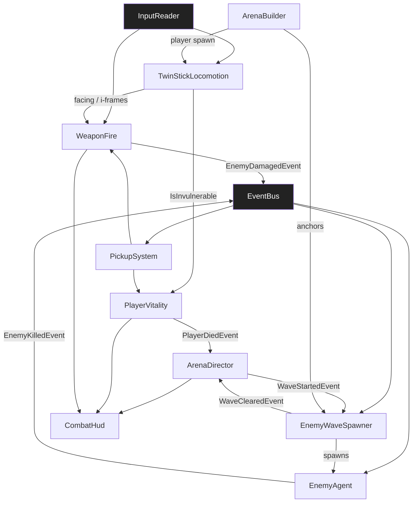

# TDD — Ashwave Arena (Temporal / Pilot)

> **Purpose of this TDD:** temporal, gate-passing Technical Design Document for a **3D twin-stick wave survival** game on the V57 SDD pipeline. **Pilot scope:** single-player, 1 circular arena, 8 waves, 2 weapon modes, health/pickups, no stealth and no racing systems. Completely distinct from kart racing and from Quiet Breach. Amendments follow §0.3.

---

## 0.1 · Document Control

| Field | Value |
|---|---|
| **Game title** | Ashwave Arena |
| **Studio** | V57 (pilot) |
| **Document** | Game Technical Design Document (TDD) |
| **Document version** | 1.0.0 |
| **Date** | 2026-08-13 |
| **Phase reached** | Production |
| **Intended use** | Pilot source of truth (design + engineering) |
| **Owner** | V57 pilot maintainer |

### Changelog

| Version | Date | Change summary | Sections touched | Author |
|---|---|---|---|---|
| `1.0.0` | 2026-08-13 | Initial gate-passing twin-stick survival pilot TDD | all | V57 pilot |

## 0.2 · Completeness Gate

| # | Item | Check | Status |
|---|---|---|---|
| **G-01** | §A required fields | All `[REQUIRED]` keys concrete; `save_model` / `multiplayer_model` explicit `N/A` | PASS |
| **G-02** | Engine pin | `Unity 6000.0.32f1`; `render_pipeline: URP 17.x`; `dimension: 3D` | PASS |
| **G-03** | Mechanic bar | 9/9 mechanics: quantified rules, I/O, deps, FSM or `N/A` | PASS |
| **G-04** | Acceptance criteria | 9/9 mechanics have ≥ 1 AC tagged EditMode/PlayMode (30 total) | PASS |
| **G-05** | §C parity | 9 §C specs ↔ 9 §B mechanics, names match 1:1 | PASS |
| **G-06** | No orphans | All §B-S ids resolve; all `dependencies[]` resolve to §B or §B-S | PASS |
| **G-07** | Zero pending | No `[PENDING]` markers in body; §14.2 registry empty | PASS |
| **G-08** | Consistency ledger | INV-01..INV-06 all PASS | PASS |
| **G-09** | Persistence coverage | All mechanics declare `none`; §11.4 session-only | PASS |
| **G-10** | Input coverage | All §B player inputs map to §11.3 actions with consumers | PASS |
| **G-11** | UI coverage | `UI_CombatHud`, `UI_WaveBanner`, `UI_Result` in §9.1, all consumed | PASS |
| **G-12** | Scene coverage | All PlayMode ACs map to `SCN_Arena_Ashwave` or `SCN_Boot` | PASS |
| **G-13** | Performance budgets | PC 1080p/60 fps in §11.6; enemy soft cap 40 | PASS |
| **G-14** | Player agency & locomotion | `player-driven`; Move + Aim + Fire + Dash in §11.3; `TwinStickLocomotion` owns camera | PASS |
| **G-15** | Core loop trace | MOVE→TwinStickLocomotion · AIM/FIRE→WeaponFire · SURVIVE→PlayerVitality · CLEAR→EnemyWaveSpawner · LOOT→PickupSystem · CLEAR WAVE→ArenaDirector | PASS |
| **G-16** | Play space & bootstrap | `SCN_Arena_Ashwave` world owner = `ArenaBuilder`; `SCN_Boot` bootstraps session | PASS |
| **G-17** | Content inventory | 1 arena, 3 enemy types, 2 weapons, 8 waves, 3 pickup types — §13.1 | PASS |
| **G-18** | Event graph closure | Every published event has ≥ 1 consumer or explicit `none (reason)`; §D closed | PASS |

## 0.3 · Living TDD

Amendments follow §0.3 workflow (edit §B/§C/§D → re-verify gate → `/tdd-to-context` → `/tdd-to-spec` → `/spec`).

---

# 1 · High Concept

- **One-liner.** Twin-stick blast through eight ash-storm waves — dash, swap fire modes, loot, clear the ring.
- **Elevator pitch.** Move with one stick, aim/fire with the other. Survive escalating waves of ash-wraiths in a circular arena. Dash i-frames, health/ammo pickups, two fire modes (pellet / beam). Clear wave 8 to win; HP 0 to lose.
- **Core fantasy.** "I am the eye of the storm."
- **Pillars.** Readable chaos · skill movement · short-run dopamine.

# 2 · Game Overview

| Attribute | Value |
|---|---|
| **Genre / sub-genre** | Twin-stick / wave survival (3D) |
| **Setting** | Ash-scoured circular arena under a red sky |
| **Primary platform** | PC (Windows) |
| **Target audience** | Arcade combat fans; V57 pipeline testers |
| **Price / model** | N/A (pilot) |

- **USP.** Combat-first pilot: aim independence, dash, waves, pickups — zero stealth/racing systems.
- **Positioning.** Complements Quiet Breach (perception) and Kart Arena (locomotion/items) with combat/spawn load.

# 3 · Core Gameplay

- **Core verbs.** move · aim · fire · dash · loot.
- **Core loop.** Wave starts → spawn enemies → move/aim/fire/dash → pickups → clear wave → next wave → after wave 8 WIN; HP ≤ 0 LOSE.
- **Win / lose conditions.** Win = clear wave `8` (all enemies dead, no pending spawns). Lose = `PlayerVitality.CurrentHp <= 0`.

# 4 · Mechanics & Systems (strategic summary)

- **TwinStickLocomotion** *(feature)* — Independent move/aim vectors; dash with i-frames; owns chase camera.
- **WeaponFire** *(feature)* — Primary pellet (auto) / Secondary beam (hold); ammo pools.
- **PlayerVitality** *(system)* — HP, damage intake, death event.
- **EnemyAgent** *(feature)* — Chase player; contact damage; 3 archetypes share component with config.
- **EnemyWaveSpawner** *(system)* — Wave table spawn; soft cap 40 alive.
- **PickupSystem** *(feature)* — Health / AmmoPellet / AmmoBeam pickups on enemy death chance.
- **ArenaBuilder** *(feature)* — World owner: arena ring, spawn anchors, player spawn.
- **ArenaDirector** *(system)* — Run FSM: Countdown → WaveN → Intermission → Won/Lost.
- **CombatHud** *(feature)* — UI Toolkit: HP, ammo, wave index, result.

# 5 · Game Modes

- **Survival Run** — 8 waves, one arena. Only mode in pilot.

# 6 · World & Level Design

- **Structure.** Circular arena radius `18 m`, low rim wall, 8 spawn anchors on circumference.
- **Set-pieces.** Center safe-ish open space; rim choke for kiting.
- **Progression.** Waves 1→8 only; no meta unlocks.

# 7 · Narrative & Characters

- N/A — anonymous survivor vs ash-wraiths. No `narrativeRef:`.

# 8 · Art Direction & Visual Style

- **Style.** Stylised ash arena; warm orange beams vs cool cyan pellets.
- **Readability.** Enemy silhouettes dark; player bright; HP bar always on.
- **Scope coherence.** Primitives + URP; one directional + rim light.

# 9 · UI / UX

- **Principle.** "HP, ammo, and wave number readable in under 200 ms."
- **Accessibility.** `[RECOMMENDED]` Remappable; colourblind-safe pellet `#4DE1FF` vs beam `#FF8A3D`.

## 9.1 Screen registry

| Screen id | Purpose | Key states | Consumed by |
|---|---|---|---|
| `UI_CombatHud` | HP bar, ammo pellet/beam, wave `N/8` | `Hidden`, `Visible` | `CombatHud` |
| `UI_WaveBanner` | "WAVE N" flash 1.2 s | `Hidden`, `Flash` | `ArenaDirector`, `CombatHud` |
| `UI_Result` | CLEARED / DOWNED panels | `Hidden`, `Shown` | `ArenaDirector`, `CombatHud` |

---

# 10 · Audio Direction

- Pellet tick SFX; beam hum; dash whoosh; wave sting. Built-in `AudioMixer`.

# 11 · Technical Design

## 11.1 Engine & rendering

| Area | Decision |
|---|---|
| **Engine** | Unity `6000.0.32f1` |
| **Render pipeline** | URP 17.x |
| **Dimension** | 3D |
| **Architecture** | Component-based + EventBus |
| **AI** | Simple seek (no NavMesh required in open arena) |

## 11.2 Data ownership

| Data class | Container | Runtime mutability | Persisted? |
|---|---|---|---|
| Tuning SOs | ScriptableObject | Read-only at runtime | No |
| Runtime state | Plain C# in owners | Yes | No |
| Save data | — | — | N/A |

## 11.3 Input map

- **Input system.** `new` — `Assets/Settings/AshwaveInputActions.inputactions`.

| Action map | Action | Suggested binding | Consumed by |
|---|---|---|---|
| `Gameplay` | `Move` (Vector2) | WASD / LS | `TwinStickLocomotion` |
| `Gameplay` | `Aim` (Vector2) | Mouse delta / RS | `TwinStickLocomotion`, `WeaponFire` |
| `Gameplay` | `FirePrimary` (Button) | LMB / RT | `WeaponFire` |
| `Gameplay` | `FireSecondary` (Button) | RMB / LT | `WeaponFire` |
| `Gameplay` | `Dash` (Button) | Space / A | `TwinStickLocomotion` |

## 11.4 Persistence spec

- **Save model.** `N/A` — session-only.

## 11.5 Movement & spatial model

| Topic | Decision |
|---|---|
| **Space** | 3D physics + CharacterController |
| **Pathfinding** | None (direct seek toward player) |
| **Control mode** | `player-driven` |
| **In-play camera** | High chase cam owned by `TwinStickLocomotion` (`offset=(0,14,-10)`, look-at player, FOV 55°) |
| **Depth / sorting** | Z-buffer |

## 11.6 Performance budgets

| Platform | Resolution | FPS target | Frame budget (ms) | Memory ceiling | Notes |
|---|---|---|---|---|---|
| PC (Windows) | 1080p | 60 | 16.6 | 2 GB | Soft cap 40 enemies; projectile pool size 64 |

## 11.7 Multiplayer

- **Model.** `N/A` — single-player.

---

# 12 · Business Model

- N/A (pilot).

---

# 13 · Content Scope & Scene Manifest

## 13.1 Content scope & inventory

| Category | First-pass count | Owner | Notes |
|---|---|---|---|
| Arenas | 1 | Pilot | radius 18 m |
| Enemy archetypes | 3 | Pilot | Grunt, Runner, Brute |
| Waves | 8 | Pilot | Table in `WaveTable` SO |
| Weapons / modes | 2 | Pilot | Pellet, Beam |
| Pickup types | 3 | Pilot | Health, AmmoPellet, AmmoBeam |
| Spawn anchors | 8 | Pilot | On arena rim |
| UI screens | 3 | Pilot | Matches §9.1 |
| Tuning assets | 5 SOs | Pilot | `LocomotionTuning`, `WeaponConfig`, `VitalityConfig`, `WaveTable`, `EnemyArchetypeConfig` |

## 13.2 Scene manifest

| Scene id | Purpose | World owner | Systems present | PlayMode ACs |
|---|---|---|---|---|
| `SCN_Boot` | Boot | `ArenaDirector` | EventBus, InputReader, ArenaDirector | AD-PM1 |
| `SCN_Arena_Ashwave` | Gameplay | `ArenaBuilder` | All §B + §B-S | TSL-PM1, WF-PM1, PV-PM1, EA-PM1, EWS-PM1, PS-PM1, HUD-PM1, AB-PM1 |

---

# 14 · Risks, Open Items & Consistency

## 14.1 Risks

| Risk | Severity | Mitigation |
|---|---|---|
| Projectile spam GC | 🟠 | Object pool 64; zero Instantiate in fire hot path |
| Wave 8 too hard for prototype feel | 🟡 | `WaveTable` designer-tunable; INV-06 clearable at 60% accuracy |
| Dash spam | 🟡 | Cooldown 1.25 s; i-frames 0.28 s only |

## 14.2 Pending registry

*Empty.*

## 14.3 Consistency ledger

| Id | Invariant | Systems | Status |
|---|---|---|---|
| `INV-01` | Win = clear wave 8; Lose = HP ≤ 0 | ArenaDirector, PlayerVitality, EnemyWaveSpawner | PASS |
| `INV-02` | Move 6.5 m/s; dash impulse 14 m/s for 0.18 s; i-frames 0.28 s; dash CD 1.25 s | TwinStickLocomotion | PASS |
| `INV-03` | Pellet: 8 dmg, 8 rps, clip 60; Beam: 22 dps, heat cap 100, cool 25/s | WeaponFire | PASS |
| `INV-04` | Max HP 100; Grunt contact 8 dmg / 0.6 s; Runner 6 / 0.45 s; Brute 16 / 0.8 s | PlayerVitality, EnemyAgent | PASS |
| `INV-05` | Alive enemies soft-capped at 40; spawn deferred when at cap | EnemyWaveSpawner | PASS |
| `INV-06` | Wave table total spawns: W1=6 … W8=28 (sum 120); drop chance Health 12%, AmmoP 18%, AmmoB 12% | EnemyWaveSpawner, PickupSystem | PASS |

---

# §A · Project Identity

```yaml
project_name: "Ashwave Arena"
document_version: "1.0.0"
repo_kind: unity_game
engine: "Unity 6000.0.32f1"
render_pipeline: "URP 17.x"
dimension: "3D"
language: "C# (Unity 6000.0 scripting profile)"
pattern: "Component-based + EventBus"
target_platform: "PC (Windows)"
input_system: "new"
test_assembly_prefix: "Ashwave"
genre: "Twin-stick / wave survival (3D)"
save_model: "N/A"
multiplayer_model: "N/A"
networking_tier: null
max_players: null
session_visibility: null
performance_targets:
  - platform: "PC (Windows)"
    resolution: "1080p"
    fps_target: 60
```

---

# §B · Production Mechanics

Nine mechanics. All `sliceScope: true`.

---

## Mechanic: Twin Stick Locomotion

### Spec metadata
- **name:** `TwinStickLocomotion`
- **type:** feature
- **status:** active
- **version:** 0.1.0
- **One-line description:** Independent move/aim; dash with i-frames; owns chase camera.

### Player-facing behavior
- **Goal / fantasy:** Kite while firing in any direction.
- **Loop:** Move stick → translate; Aim stick/mouse → face; Dash → burst + i-frames.
- **Feedback:** Dash trail VFX; camera slight punch on dash.

### Rules (quantified)
1. Move speed `6.5 m/s` on XZ (INV-02).
2. Aim: face `Aim` vector if magnitude > 0.2; else keep last facing.
3. Dash: on `Dash` if CD ready → velocity `14 m/s` for `0.18 s`; `IsInvulnerable=true` for `0.28 s`; CD `1.25 s`.
4. Camera offset `(0,14,-10)`, FOV `55°`, follow damp `0.08 s`.
5. Publishes `DashPerformedEvent`, `AimFacingChangedEvent` (throttled 15 Hz).

### Inputs / outputs
- **Player inputs:** `Move`, `Aim`, `Dash`.
- **Outputs:** facing for WeaponFire; `IsInvulnerable` read by PlayerVitality.

### Persistence
- `none`.

### Dependencies
| kind | id | Why |
|---|---|---|
| system | EventBus | Dash event |
| system | InputReader | Input |

### State machine
- **States:** `Moving`, `Dashing`.
- **Initial:** `Moving`.

### Components
1. **TwinStickLocomotion** — `Assets/Scripts/Features/Player/TwinStickLocomotion.cs`
2. **LocomotionTuning** (SO) — speeds, dash, camera. Asset `Assets/ScriptableObjects/Configs/LocomotionTuning.asset`.

### Acceptance criteria
- [ ] **TSL-AC1 (EditMode):** Dash sets invulnerable true for 0.28 s then false.
- [ ] **TSL-AC2 (EditMode):** Second Dash within 1.25 s ignored.
- [ ] **TSL-PM1 (PlayMode):** Aim right while moving forward faces right in `SCN_Arena_Ashwave`.

---

## Mechanic: Weapon Fire

### Spec metadata
- **name:** `WeaponFire`
- **type:** feature
- **status:** active
- **version:** 0.1.0

### Rules (quantified)
1. **Pellet (primary):** 8 dmg, 8 rps, clip 60, reload auto when empty over 1.4 s if AmmoPellet reserve > 0.
2. **Beam (secondary hold):** 22 dps while held and heat < 100; heat +40/s; cool −25/s when not firing; overheat locks beam 1.5 s.
3. Projectiles from pool; pellet speed `32 m/s`, lifetime `1.2 s`.
4. Aim origin = player position + `0.9 m` along facing.
5. Hit enemy → `EnemyDamagedEvent { enemyId, amount }`.

### Dependencies
| kind | id | Why |
|---|---|---|
| feature | TwinStickLocomotion | Facing |
| system | EventBus | Damage events |
| feature | EnemyAgent | Apply damage |
| system | ProjectilePool | Pool |

### State machine
- **States:** `Ready`, `FiringPellet`, `FiringBeam`, `Reloading`, `Overheated`.

### Acceptance criteria
- [ ] **WF-AC1 (EditMode):** 8 pellet shots in 1.0 s ± 1 shot.
- [ ] **WF-AC2 (EditMode):** Heat reaches 100 → Overheated 1.5 s.
- [ ] **WF-PM1 (PlayMode):** Pellet hit reduces Grunt HP by 8.

---

## Mechanic: Player Vitality

### Spec metadata
- **name:** `PlayerVitality`
- **type:** system
- **status:** active
- **version:** 0.1.0

### Rules (quantified)
1. Max HP `100`; start at 100.
2. Ignore damage while `TwinStickLocomotion.IsInvulnerable`.
3. On HP ≤ 0 → `PlayerDiedEvent` → ArenaDirector Lose.
4. `ApplyHeal(amount)` clamps to max; from PickupSystem.

### Dependencies
| kind | id | Why |
|---|---|---|
| feature | TwinStickLocomotion | I-frames |
| system | EventBus | Death / HP changed |
| system | ArenaDirector | Lose |

### Acceptance criteria
- [ ] **PV-AC1 (EditMode):** Damage during invulnerable → HP unchanged.
- [ ] **PV-AC2 (EditMode):** HP 0 → PlayerDiedEvent once.
- [ ] **PV-PM1 (PlayMode):** Contact with Grunt reduces HP per INV-04 cadence.

---

## Mechanic: Enemy Agent

### Spec metadata
- **name:** `EnemyAgent`
- **type:** feature
- **status:** active
- **version:** 0.1.0

### Rules (quantified)
1. Archetypes: Grunt HP 24 speed 3.2; Runner HP 14 speed 5.5; Brute HP 60 speed 2.2 (contact dmg INV-04).
2. Seek player position each FixedUpdate; contact trigger applies damage on cadence.
3. On HP ≤ 0 → `EnemyKilledEvent { archetype, position }` → PickupSystem + WaveSpawner.

### Dependencies
| kind | id | Why |
|---|---|---|
| system | EventBus | Kill/damage |
| feature | TwinStickLocomotion | Target |

### State machine
- **States:** `Seeking`, `Dead`.

### Acceptance criteria
- [ ] **EA-AC1 (EditMode):** 3× pellet (24 dmg) kills Grunt.
- [ ] **EA-PM1 (PlayMode):** Runner outruns Grunt toward player over 2 s.

---

## Mechanic: Enemy Wave Spawner

### Spec metadata
- **name:** `EnemyWaveSpawner`
- **type:** system
- **status:** active
- **version:** 0.1.0

### Rules (quantified)
1. Reads `WaveTable` SO: waves 1–8 counts (INV-06), spawn interval `0.45–0.9 s` by wave.
2. Soft cap 40 alive; defer spawn until below cap.
3. When planned spawns done AND alive == 0 → `WaveClearedEvent { waveIndex }`.
4. Spawn at random of 8 anchors with min distance `6 m` from player.

### Dependencies
| kind | id | Why |
|---|---|---|
| feature | EnemyAgent | Spawn prefabs |
| system | EventBus | WaveCleared |
| system | ArenaDirector | Wave index |

### Acceptance criteria
- [ ] **EWS-AC1 (EditMode):** At 40 alive, RequestSpawn does not increase count.
- [ ] **EWS-PM1 (PlayMode):** Wave 1 spawns exactly 6 then clears.

---

## Mechanic: Pickup System

### Spec metadata
- **name:** `PickupSystem`
- **type:** feature
- **status:** active
- **version:** 0.1.0

### Rules (quantified)
1. On `EnemyKilledEvent`: roll Health 12% / AmmoPellet 18% / AmmoBeam 12% / none (INV-06).
2. Pickup magnet radius `2.2 m`; collect on trigger.
3. Health +25 HP; AmmoPellet +30 reserve; AmmoBeam −30 heat (or +20 beam reserve if modeled as charges — pilot uses heat relief `−30`).

### Dependencies
| kind | id | Why |
|---|---|---|
| system | EventBus | EnemyKilled |
| system | PlayerVitality | Heal |
| feature | WeaponFire | Ammo/heat |

### Acceptance criteria
- [ ] **PS-AC1 (EditMode):** Forced Health spawn → ApplyHeal(25).
- [ ] **PS-PM1 (PlayMode):** Walking over AmmoPellet increases reserve.

---

## Mechanic: Arena Builder

### Spec metadata
- **name:** `ArenaBuilder`
- **type:** feature
- **status:** active
- **version:** 0.1.0
- **One-line description:** World owner — arena mesh, 8 anchors, player spawn.

### Rules (quantified)
1. Builds/validates radius 18 m ring + rim collider.
2. Registers 8 spawn anchors with EnemyWaveSpawner.
3. Spawns player at center `(0,0,0)`.

### Acceptance criteria
- [ ] **AB-PM1 (PlayMode):** Load scene → 8 anchors + player present.

---

## Mechanic: Arena Director

### Spec metadata
- **name:** `ArenaDirector`
- **type:** system
- **status:** active
- **version:** 0.1.0

### Rules (quantified)
1. States: `Countdown` (3 s) → `Wave` → `Intermission` (4 s) → next Wave; after wave 8 clear → `Won`; `PlayerDied` → `Lost`.
2. Publishes `WaveStartedEvent`, `RunResolvedEvent { Won|Lost }`.
3. Locks fire/move on Won/Lost.

### State machine
- **States:** `Countdown`, `Wave`, `Intermission`, `Won`, `Lost`.
- **Initial:** `Countdown`.

### Acceptance criteria
- [ ] **AD-AC1 (EditMode):** WaveCleared 8 → Won.
- [ ] **AD-PM1 (PlayMode):** Boot shows countdown then Wave 1 banner.

---

## Mechanic: Combat HUD

### Spec metadata
- **name:** `CombatHud`
- **type:** feature
- **status:** active
- **version:** 0.1.0

### Rules (quantified)
1. UI Toolkit elements: `hp-fill`, `ammo-pellet-text`, `ammo-beam-heat`, `wave-text`, `result-panel`.
2. Subscribes HP changed, ammo, WaveStarted, RunResolved.

### Acceptance criteria
- [ ] **HUD-AC1 (EditMode):** SetWave(3,8) → `"3/8"`.
- [ ] **HUD-PM1 (PlayMode):** HP fill shrinks on damage within same frame.

---

# §B-S · Support Systems Registry

| Id | Purpose | Public surface | Spec |
|---|---|---|---|
| `EventBus` | Pub/sub | `Publish<T>`, `Subscribe<T>` | table-only |
| `InputReader` | Input adapter | Move, Aim, FirePrimary, FireSecondary, Dash | table-only |
| `ProjectilePool` | Pooled pellets | `Get()`, `Release()` | table-only |
| `AudioMixer` | Audio routing | `PlayOneShot` | table-only |

---

# §C · Companion Specs (YAML)

```yaml
specVersion: "1.1"
name: TwinStickLocomotion
type: feature
description: Independent move/aim with dash i-frames and chase camera.
version: 0.1.0
dependencies:
  - { kind: system, id: EventBus }
  - { kind: system, id: InputReader }
acceptanceCriteria:
  - { id: TSL-AC1, description: "Dash grants 0.28s invulnerability", verification: EditMode }
  - { id: TSL-AC2, description: "Dash cooldown 1.25s blocks spam", verification: EditMode }
  - { id: TSL-PM1, description: "Aim independent of move facing", verification: PlayMode }
specId: twin_stick_locomotion
touches:
  scripts: [Assets/Scripts/Features/Player/TwinStickLocomotion.cs]
  scenes: [Assets/Scenes/Arena_Ashwave.unity]
```

```yaml
specVersion: "1.1"
name: WeaponFire
type: feature
description: Pellet auto and beam hold with heat/overheat; pooled projectiles.
version: 0.1.0
dependencies:
  - { kind: feature, id: TwinStickLocomotion }
  - { kind: system, id: EventBus }
  - { kind: feature, id: EnemyAgent }
  - { kind: system, id: ProjectilePool }
acceptanceCriteria:
  - { id: WF-AC1, description: "~8 pellets per second", verification: EditMode }
  - { id: WF-AC2, description: "Heat 100 overheats 1.5s", verification: EditMode }
  - { id: WF-PM1, description: "Pellet deals 8 to Grunt", verification: PlayMode }
specId: weapon_fire
```

```yaml
specVersion: "1.1"
name: PlayerVitality
type: system
description: HP 100; respects dash i-frames; death event on HP 0.
version: 0.1.0
dependencies:
  - { kind: feature, id: TwinStickLocomotion }
  - { kind: system, id: EventBus }
  - { kind: system, id: ArenaDirector }
acceptanceCriteria:
  - { id: PV-AC1, description: "No damage while invulnerable", verification: EditMode }
  - { id: PV-AC2, description: "HP0 publishes PlayerDiedEvent once", verification: EditMode }
  - { id: PV-PM1, description: "Grunt contact damages on cadence", verification: PlayMode }
specId: player_vitality
```

```yaml
specVersion: "1.1"
name: EnemyAgent
type: feature
description: Seek player; three archetypes; kill event on HP0.
version: 0.1.0
dependencies:
  - { kind: system, id: EventBus }
  - { kind: feature, id: TwinStickLocomotion }
acceptanceCriteria:
  - { id: EA-AC1, description: "24 dmg kills Grunt", verification: EditMode }
  - { id: EA-PM1, description: "Runner faster than Grunt", verification: PlayMode }
specId: enemy_agent
```

```yaml
specVersion: "1.1"
name: EnemyWaveSpawner
type: system
description: Wave table spawner with soft cap 40 and WaveClearedEvent.
version: 0.1.0
dependencies:
  - { kind: feature, id: EnemyAgent }
  - { kind: system, id: EventBus }
  - { kind: system, id: ArenaDirector }
acceptanceCriteria:
  - { id: EWS-AC1, description: "Cap 40 defers spawns", verification: EditMode }
  - { id: EWS-PM1, description: "Wave1 spawns 6 then clears", verification: PlayMode }
specId: enemy_wave_spawner
```

```yaml
specVersion: "1.1"
name: PickupSystem
type: feature
description: Probabilistic Health/Ammo drops on enemy kill; magnet collect.
version: 0.1.0
dependencies:
  - { kind: system, id: EventBus }
  - { kind: system, id: PlayerVitality }
  - { kind: feature, id: WeaponFire }
acceptanceCriteria:
  - { id: PS-AC1, description: "Health pickup heals 25", verification: EditMode }
  - { id: PS-PM1, description: "AmmoPellet increases reserve", verification: PlayMode }
specId: pickup_system
```

```yaml
specVersion: "1.1"
name: ArenaBuilder
type: feature
description: World owner for arena ring, anchors, player spawn.
version: 0.1.0
dependencies:
  - { kind: system, id: EnemyWaveSpawner }
  - { kind: feature, id: TwinStickLocomotion }
acceptanceCriteria:
  - { id: AB-PM1, description: "8 anchors and player present on load", verification: PlayMode }
specId: arena_builder
```

```yaml
specVersion: "1.1"
name: ArenaDirector
type: system
description: Run FSM Countdown/Wave/Intermission/Won/Lost across 8 waves.
version: 0.1.0
dependencies:
  - { kind: system, id: EventBus }
  - { kind: system, id: EnemyWaveSpawner }
  - { kind: system, id: PlayerVitality }
  - { kind: feature, id: TwinStickLocomotion }
acceptanceCriteria:
  - { id: AD-AC1, description: "Wave 8 clear -> Won", verification: EditMode }
  - { id: AD-PM1, description: "Countdown then Wave1 banner", verification: PlayMode }
specId: arena_director
```

```yaml
specVersion: "1.1"
name: CombatHud
type: feature
description: UI Toolkit combat HUD for HP, ammo, wave, result.
version: 0.1.0
dependencies:
  - { kind: system, id: EventBus }
  - { kind: system, id: PlayerVitality }
  - { kind: system, id: ArenaDirector }
  - { kind: feature, id: WeaponFire }
acceptanceCriteria:
  - { id: HUD-AC1, description: "wave-text shows 3/8", verification: EditMode }
  - { id: HUD-PM1, description: "HP fill updates on damage", verification: PlayMode }
specId: combat_hud
ui:
  screens:
    - name: UI_CombatHud
      uxml: Assets/UI/Ashwave_Hud.uxml
      elements:
        - { name: hp-fill, type: VisualElement }
        - { name: ammo-pellet-text, type: Label }
        - { name: ammo-beam-heat, type: VisualElement }
        - { name: wave-text, type: Label }
        - { name: result-panel, type: VisualElement }
```

---

# §D · Cross-mechanic dependency graph



- **Critical path:** `TwinStickLocomotion + WeaponFire → EnemyAgent → EnemyWaveSpawner → ArenaDirector → CombatHud`
- **Event closure (G-18):** All listed events consumed; `AimFacingChangedEvent` → `none (VFX optional — justified)`.

---

## Appendix · Section status

| Section | Status |
|---|---|
| §0.2 Gate | **PASS (18/18)** |
| §B mechanics | 9 complete |
| Genre contrast | Twin-stick survival ≠ stealth ≠ kart |

---

*TDD v1.0.0 — `/tdd-to-spec V57/Test/TDD_AshwaveArena.md --all --out-dir V57/specs/features`*
