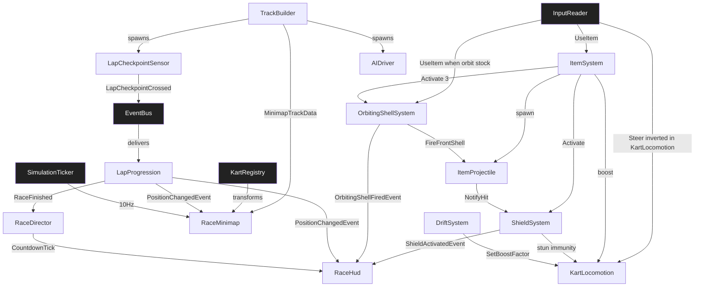

# TDD — Kart Arena 3D (Temporal / Pilot)

> **Purpose of this TDD:** temporal, gate-passing Technical Design Document for a **3D Mario-Kart-style arcade racer** on the V57 SDD pipeline. **Pilot scope:** single-player, 1 track, 3 laps, 7 AI, **4 item archetypes** (Mushroom, Shell, Shield, Triple Shells), minimap. Amendments follow §0.3.

---

## 0.1 · Document Control

| Field | Value |
|---|---|
| **Game title** | Kart Arena 3D |
| **Studio** | V57 (pilot) |
| **Document** | Game Technical Design Document (TDD) |
| **Document version** | 1.1.0 |
| **Date** | 2026-08-12 |
| **Phase reached** | Production |
| **Intended use** | Pilot source of truth (design + engineering) |
| **Owner** | V57 pilot maintainer |

### Changelog

| Version | Date | Change summary | Sections touched | Author |
|---|---|---|---|---|
| `1.0.0` | 2026-08-11 | Initial gate-passing TDD (pilot scope) | all | V57 pilot |
| `1.1.0` | 2026-08-12 | Inverted steer axes; added Shield + Triple Shells items; added RaceMinimap + UI_Minimap | §3, §4, §9, §11, §13, §B (KartLocomotion, ItemSystem, ShieldSystem, OrbitingShellSystem, RaceMinimap, RaceHud), §C, §D, §14.3 | V57 pilot |

## 0.2 · Completeness Gate

| # | Item | Check | Status |
|---|---|---|---|
| **G-01** | §A required fields | All `[REQUIRED]` keys concrete; `save_model` / `multiplayer_model` explicit `N/A` | PASS |
| **G-02** | Engine pin | `Unity 6000.0.32f1`; `render_pipeline: URP 17.x`; `dimension: 3D` | PASS |
| **G-03** | Mechanic bar | 14/14 mechanics: quantified rules, I/O, deps, FSM or `N/A` | PASS |
| **G-04** | Acceptance criteria | 14/14 mechanics have ≥ 1 AC tagged EditMode/PlayMode (42 total) | PASS |
| **G-05** | §C parity | 14 §C specs ↔ 14 §B mechanics, names match 1:1 | PASS |
| **G-06** | No orphans | All §B-S ids resolve; all `dependencies[]` resolve to §B or §B-S | PASS |
| **G-07** | Zero pending | No `[PENDING]` markers in body; §14.2 registry empty | PASS |
| **G-08** | Consistency ledger | INV-01..INV-07 all PASS | PASS |
| **G-09** | Persistence coverage | All mechanics declare `none`; §11.4 session-only | PASS |
| **G-10** | Input coverage | All §B player inputs map to §11.3 actions with consumers | PASS |
| **G-11** | UI coverage | `UI_RaceHud`, `UI_Countdown`, `UI_Result`, `UI_Minimap` in §9.1, all consumed | PASS |
| **G-12** | Scene coverage | All PlayMode ACs map to `SCN_Race_KartArena` or `SCN_Boot` | PASS |
| **G-13** | Performance budgets | PC 1080p/60 fps in §11.6 | PASS |
| **G-14** | Player agency & locomotion | `player-driven`; inverted `Steer` in §11.3; `KartLocomotion` owns camera | PASS |
| **G-15** | Core loop trace | SPAWN→KartLocomotion · RACE→LapProgression · BOOST→DriftSystem · ATTACK→ItemSystem/OrbitingShellSystem · DEFEND→ShieldSystem · MAP→RaceMinimap · FINISH→RaceDirector | PASS |
| **G-16** | Play space & bootstrap | `SCN_Race_KartArena` world owner = `TrackBuilder`; `SCN_Boot` bootstraps session | PASS |
| **G-17** | Content inventory | 4 item archetypes, minimap data asset, all rows in §13.1 | PASS |
| **G-18** | Event graph closure | Every published event has ≥ 1 consumer or explicit `none (reason)`; §D closed | PASS |

## 0.3 · Living TDD

Amendments follow §0.3 workflow (edit §B/§C/§D → re-verify gate → `/tdd-to-context` → `/tdd-to-spec` → `/spec`).

---

# 1 · High Concept

- **One-liner.** A 3-lap, 8-kart arcade race where drift-boost, orbiting triple shells, shields, and a live minimap keep every lap readable and competitive.
- **Elevator pitch.** Pick a kart, race 3 laps on a seaside arena. Drift for turbo, grab boxes for Mushrooms, single shells, a protective shield, or three orbit shells you fire one-by-one. A corner minimap shows every rival. Cross the line in 1st to win.
- **Core fantasy.** "I always know where everyone is — and I always have a counterplay."
- **Pillars.** Readable arcade feel · skill > RNG · spatial awareness via minimap.

# 2 · Game Overview

| Attribute | Value |
|---|---|
| **Genre / sub-genre** | Arcade racing / kart racer |
| **Setting** | Stylised seaside arena (single closed loop) |
| **Primary platform** | PC (Windows) |
| **Target audience** | Arcade racer fans; V57 pipeline testers |
| **Price / model** | N/A (pilot) |

- **USP.** Full kart-feel pilot: drift tiers, 4 distinct items (including orbit shells + shield), inverted steer tuned for keyboard, live minimap.
- **Positioning.** For V57 adopters, Kart Arena 3D exercises racer systems richer than Coin Rush while staying single-track pilot scope.

# 3 · Core Gameplay

- **Core verbs.** accelerate · steer (inverted L/R) · drift · grab · shield · orbit-fire.
- **Core loop.** Countdown → accelerate/steer → drift corners → grab item box → use item (instant or orbit) → read minimap → complete 3 laps → finish.
- **Win / lose conditions.** Win = position `1` after lap `3` and final checkpoint. Lose = final position `> 3` (podium cut displayed on `UI_Result`).

# 4 · Mechanics & Systems (strategic summary)

- **KartLocomotion** *(feature)* — Arcade kart physics; **steer axis inverted** (`appliedSteer = -rawSteer`).
- **DriftSystem** *(feature)* — 3-tier drift boost (Mini/Mega/Ultra).
- **ItemSystem** *(system)* — Box RNG by position; queue length 1; dispatches to sub-systems.
- **ItemProjectile** *(feature)* — Single forward shell (46 m/s).
- **ItemTrap** *(feature)* — Banana trap (reserved in config; not in pilot drop table v1.1).
- **ShieldSystem** *(feature)* — Absorbs one hit; blue bubble VFX; 8 s duration or until consumed.
- **OrbitingShellSystem** *(feature)* — 3 shells orbit kart; `UseItem` fires front shell, decrements stock.
- **AIDriver** *(feature)* — Rubber-band waypoint AI.
- **LapProgression** *(system)* — Lap/position aggregator.
- **LapCheckpointSensor** *(feature)* — Checkpoint trigger volumes.
- **TrackBuilder** *(feature)* — Spawns track content + minimap bake data.
- **RaceDirector** *(system)* — Countdown → Racing → Finished FSM.
- **RaceHud** *(feature)* — UI Toolkit HUD (position, lap, item, boost).
- **RaceMinimap** *(feature)* — Corner minimap: track outline + 8 kart blips, rotated to player heading.

# 5 · Game Modes

- **Single Race** — 8 karts, 3 laps, 1 track. Only mode in pilot.

# 6 · World & Level Design

- **Structure.** One closed loop ≈ 600 m, 14 turns, 12 checkpoints.
- **Set-pieces.** Hairpin (drift), S-bend, item lane, final chicane.
- **Progression.** Static single track.

# 7 · Narrative & Characters

- N/A — cosmetic pilots only (`RosterConfig`).

# 8 · Art Direction & Visual Style

- **Style.** Stylised low-poly seaside arena; saturated palette.
- **Readability.** Shield = cyan bubble; orbit shells = orange ring; minimap blips: player white, rivals coloured by position.
- **Scope coherence.** Primitives + URP; minimap uses baked 256×256 track mask.

# 9 · UI / UX

- **Principle.** Position, lap, item, boost, and **rival positions** readable without pausing.
- **Accessibility.** `[RECOMMENDED]` Rebindable keys; shell orange `#FF8800` vs shield cyan `#00CCFF` distinguishable under deuteranopia.

## 9.1 Screen registry

| Screen id | Purpose | Key states | Consumed by (§B / §B-S ids) |
|---|---|---|---|
| `UI_RaceHud` | Position, lap, item slot, boost meter | `Hidden`, `Visible`, `Finished` | `RaceHud`, `RaceDirector` |
| `UI_Countdown` | `3 / 2 / 1 / GO!` overlay | `Hidden`, `Three`, `Two`, `One`, `Go` | `RaceDirector` |
| `UI_Result` | `1ST` / `2ND` / `LOST` + final time | `Hidden`, `Shown` | `RaceHud`, `RaceDirector` |
| `UI_Minimap` | Track outline + 8 kart blips (player-centred rotation) | `Hidden`, `Visible` | `RaceMinimap` |

---

# 10 · Audio Direction

- Synth stings (boost, item-get, shield-break, shell-fire); engine pitch by throttle. Built-in `AudioMixer`.

# 11 · Technical Design

## 11.1 Engine & rendering

| Area | Decision |
|---|---|
| **Engine** | Unity `6000.0.32f1` |
| **Render pipeline** | URP 17.x |
| **Dimension** | 3D |
| **Architecture** | Component-based + EventBus |
| **AI** | Waypoint follower + rubber-band |

## 11.2 Data ownership

| Data class | Container | Runtime mutability | Persisted? |
|---|---|---|---|
| Tuning SOs | ScriptableObject | Read-only at runtime | No |
| Runtime state | Plain C# models in owners | Yes | No |
| Save data | — | — | N/A |

## 11.3 Input map

- **Input system.** `new` — `Assets/Settings/KartArenaInputActions.inputactions`.

| Action map | Action | Suggested binding | Consumed by (§B id) | Notes |
|---|---|---|---|---|
| `Gameplay` | `Accelerate` (Button) | `W` / RT | `KartLocomotion` | |
| `Gameplay` | `Brake` (Button) | `S` / LT | `KartLocomotion` | |
| `Gameplay` | `Steer` (Axis) | `A/D` / LS X | `KartLocomotion` | **Inverted in code:** `appliedSteer = -Steer` |
| `Gameplay` | `Drift` (Button) | `Space` / B | `DriftSystem` | |
| `Gameplay` | `UseItem` (Button) | `E` / X | `ItemSystem`, `OrbitingShellSystem` | Fires orbit shell or resolves queued item |
| `Gameplay` | `CameraLook` (Vector2) | Mouse / RS | `KartLocomotion` | Rig orbit only |

**Steer inversion contract (G-14):** Raw `Steer` from `InputReader` is negated once inside `KartLocomotion` before torque application. Binding labels stay `A = left`, `D = right`; inversion is **not** done in the `.inputactions` asset (keeps gamepad and keyboard consistent in one code path).

## 11.4 Persistence spec

- **Save model.** `N/A` — session-only.

## 11.5 Movement & spatial model

| Topic | Decision |
|---|---|
| **Space** | 3D physics + `Rigidbody` |
| **Pathfinding** | None (player); AI uses waypoints |
| **Control mode** | `player-driven` |
| **In-play camera** | Third-person follow on `KartLocomotion`; `CameraLook` rotates rig ±35° |
| **Depth / sorting** | Z-buffer |

## 11.6 Performance budgets

| Platform | Resolution | FPS target | Frame budget (ms) | Memory ceiling | Notes |
|---|---|---|---|---|---|
| PC (Windows) | 1080p | 60 | 16.6 | 2 GB | Minimap refresh 10 Hz; AI 4 Hz; no LINQ in hot paths |

## 11.7 Multiplayer

- **Model.** `N/A` — single-player pilot.

---

# 12 · Business Model

- N/A (pilot).

---

# 13 · Content Scope & Scene Manifest

## 13.1 Content scope & inventory

| Category | First-pass count | Owner | Notes |
|---|---|---|---|
| Tracks | 1 | Pilot | `SCN_Race_KartArena` |
| Karts | 8 | Pilot | 1 player + 7 AI |
| Item boxes | 16 | Pilot | Respawn 4.0 s |
| Item archetypes | **4** | Pilot | Mushroom, Shell, **Shield**, **TripleShells** |
| UI screens | **4** | Pilot | §9.1 incl. `UI_Minimap` |
| Minimap data | 1 | Pilot | `MinimapTrackData.asset` (256×256 mask + normalized spline) |
| Tuning assets | 6 SOs | Pilot | + `MinimapConfig` |

## 13.2 Scene manifest

| Scene id | Purpose | World owner | Systems present | PlayMode ACs covered |
|---|---|---|---|---|
| `SCN_Boot` | Boot | `RaceDirector` | EventBus, InputReader, SimulationTicker, AudioMixer, RaceDirector | RD-PM1 |
| `SCN_Race_KartArena` | Gameplay | `TrackBuilder` | All §B mechanics + §B-S | KL-PM2, DS-PM1, IS-PM1, SS-PM1, OSS-PM1, MM-PM1, HUD-PM1, TB-PM1, LP-PM1 |

---

# 14 · Risks, Open Items & Consistency

## 14.1 Risks

| Risk | Severity | Mitigation |
|---|---|---|
| Inverted steer confuses gamepad users | 🟡 | Document in controls screen; `steerInvert` toggle in `KartTuning` default `true` for pilot |
| Orbit shells clip through track geometry | 🟡 | Orbit radius 1.2 m; shells use trigger-only colliders until fired |
| Minimap misleading on vertical track sections | 🟡 | Project world XZ only; Y ignored in blip placement |

## 14.2 Pending registry

*Empty.*

## 14.3 Consistency ledger

| Id | Invariant | Systems | Status |
|---|---|---|---|
| `INV-01` | `totalLaps (3)` × `totalCheckpoints (12)` = 36 crossings to finish | LapProgression, LapCheckpointSensor, RaceDirector | PASS |
| `INV-02` | AI throttle ∈ `[0.7, 1.05]` × base; never exceeds player top speed | AIDriver, KartLocomotion | PASS |
| `INV-03` | Drift tiers: Mini=30/Mega=55/Ultra=85; durations 0.6/1.0/1.6 s | DriftSystem, KartLocomotion | PASS |
| `INV-04` | 16 item boxes; respawn 4 s; queue length 1 per kart | ItemSystem, TrackBuilder | PASS |
| `INV-05` | Shell speed 46 m/s; lifetime 2.5 s; Shield absorbs 1 hit or 8 s | ItemProjectile, ShieldSystem | PASS |
| `INV-06` | Player top speed 14 m/s; accel 9 m/s² | KartLocomotion, AIDriver | PASS |
| `INV-07` | **Item drop weights sum to 100% per bucket:** Front (1–4): Mushroom 40%, Shell 25%, Shield 20%, TripleShells 15%; Back (5–8): Mushroom 20%, Shell 30%, Shield 25%, TripleShells 25% | ItemSystem | PASS |

---

# §A · Project Identity

```yaml
project_name: "Kart Arena 3D"
document_version: "1.1.0"
repo_kind: unity_game
engine: "Unity 6000.0.32f1"
render_pipeline: "URP 17.x"
dimension: "3D"
language: "C# (Unity 6000.0 scripting profile)"
pattern: "Component-based + EventBus"
target_platform: "PC (Windows)"
input_system: "new"
test_assembly_prefix: "KartArena"
genre: "Arcade racing / kart racer"
save_model: "N/A"
multiplayer_model: "N/A"
networking_tier: null
max_players: null
session_visibility: null
performance_targets:
  - platform: "PC (Windows)"
    resolution: "1080p"
    fps_target: 60
```

---

# §B · Production Mechanics

Fourteen mechanics. All `sliceScope: true`.

---

## Mechanic: Kart Locomotion

### Spec metadata

- **name (PascalCase):** `KartLocomotion`
- **type:** feature
- **status:** active
- **version:** 0.2.0
- **One-line description:** Arcade kart with **inverted steer axis**; owns follow camera.

### Player-facing behavior

- **Goal / fantasy:** Responsive kart that turns the way Mario-Kart players expect on keyboard.
- **Loop:** input → invert steer → forces → lean + camera.
- **Feedback:** accel pitch-up; off-track shake; shield hit absorbed by `ShieldSystem` (no spin).

### Rules and constraints (quantified)

1. Top speed `14 m/s`; acceleration `9 m/s²`; reverse `3 m/s`.
2. **Steer inversion:** `appliedSteer = -Clamp(rawSteer, -1, 1)` before Y-torque. `A`/left stick left → kart turns **right** visually when `steerInvert = true` (default). Toggle via `KartTuning.steerInvert` (default `true`).
3. Torque: `yawTorque = appliedSteer × steerTorque (120 N·m)` lerped at `12/s`.
4. Lean: `leanAngle = appliedSteer × 12°`.
5. Off-track: raycast miss → drag × 1.6; auto-recovery after 1 s below 2 m/s.
6. **Shield interaction:** while `ShieldSystem.IsActive`, collision stun from items is suppressed (delegates to ShieldSystem).

### Inputs and outputs

- **Player inputs:** `Accelerate`, `Brake`, `Steer`, `CameraLook` (§11.3).
- **System inputs:** `BoostFactor` from `DriftSystem`; `ShieldSystem.IsActive`.
- **Outputs:** `SpeedMilestoneEvent`; position/velocity read-only.

### Persistence

- `none`.

### Dependencies

| kind | id | Why |
|---|---|---|
| system | EventBus | Events |
| system | InputReader | Input |
| feature | ShieldSystem | Stun immunity while shielded |

### State machine

- **States:** `Driving`, `OffTrack`, `Recovering`, `Finished`.
- **Initial:** `Driving`.

### Components

1. **KartLocomotion** — `Assets/Scripts/Features/Kart/KartLocomotion.cs`
2. **KartTuning** (SO) — fields include `steerInvert (bool, default true)`, `steerTorque (120)`, `topSpeed (14)`, etc. Asset `Assets/ScriptableObjects/Configs/KartTuning.asset`.

### Acceptance criteria

- [ ] **KL-AC1 (EditMode):** With `steerInvert=true`, `rawSteer=+1` produces **negative** yaw torque (kart turns left).
- [ ] **KL-AC2 (EditMode):** With `steerInvert=false`, `rawSteer=+1` produces **positive** yaw torque.
- [ ] **KL-AC3 (EditMode):** `Accelerate` 2 s → `Speed >= 13.3 m/s`.
- [ ] **KL-PM1 (PlayMode):** Pressing `D` in `SCN_Race_KartArena` turns kart **left** (inverted default).
- [ ] **KL-PM2 (PlayMode):** `SetBoostFactor(1.45)` raises speed ceiling within 0.3 s.

---

## Mechanic: Drift System

### Spec metadata

- **name:** `DriftSystem`
- **type:** feature
- **version:** 0.1.0
- **One-line description:** 3-tier drift boost on release.

### Rules (quantified)

1. Enter drift: `Drift` held, `Speed >= 6`, `|appliedSteer| >= 0.5` (uses **inverted** steer from KartLocomotion).
2. Charge `35/s`; tiers Mini=30, Mega=55, Ultra=85.
3. Boost durations 0.6 / 1.0 / 1.6 s; `BoostFactor` up to 1.45.

### Acceptance criteria

- [ ] **DS-AC1 (EditMode):** Charge 30 → Mini tier.
- [ ] **DS-PM1 (PlayMode):** Full charge through S-bend reaches Ultra.

*(Full block unchanged from v1.0 except steer reads `appliedSteer`.)*

---

## Mechanic: Item System

### Spec metadata

- **name:** `ItemSystem`
- **type:** system
- **version:** 0.2.0
- **One-line description:** Position-aware RNG; queue length 1; routes Shield / TripleShells / Mushroom / Shell.

### Rules (quantified)

1. Box respawn `4.0 s`.
2. **Drop table (INV-07):**
   - **Front (pos 1–4):** Mushroom 40%, Shell 25%, Shield 20%, TripleShells 15%.
   - **Back (pos 5–8):** Mushroom 20%, Shell 30%, Shield 25%, TripleShells 25%.
3. Queue length **1**; pickup while queued → discarded.
4. `UseItem` resolution:
   - **Mushroom** → `SetBoostFactor(1.3)` for 0.8 s.
   - **Shell** → spawn `ItemProjectile` forward immediately.
   - **Shield** → activate `ShieldSystem.Activate(8 s)`.
   - **TripleShells** → activate `OrbitingShellSystem.Activate(3)`; clears queue slot (shells managed by orbit system until depleted).
5. Cannot pick up while Mushroom boost active OR while `OrbitingShellSystem.HasShells`.

### Inputs and outputs

- **Player inputs:** `UseItem`.
- **Outputs:** `ItemQueuedEvent`, `ItemUsedEvent { archetype }`; delegates to ShieldSystem / OrbitingShellSystem / ItemProjectile.

### Dependencies

| kind | id | Why |
|---|---|---|
| feature | KartLocomotion | Boost, spawn pose |
| feature | ItemProjectile | Single shell |
| feature | ShieldSystem | Shield activation |
| feature | OrbitingShellSystem | Triple shells |
| system | EventBus | Pub/sub |

### State machine

- **States:** `Empty`, `Queued`, `Using`.
- **Initial:** `Empty`.

### Components

1. **ItemSystem** — `Assets/Scripts/Systems/Items/ItemSystem.cs`
2. **ItemConfig** (SO) — weighted tables per `PositionBucket`; fields for all 4 archetypes.
3. **ItemArchetype** (enum) — `Mushroom`, `Shell`, `Shield`, `TripleShells`, `Banana` (reserved, not in drop table).

### Acceptance criteria

- [ ] **IS-AC1 (EditMode):** Front bucket fixed seed: 1000 samples → each archetype within ±5% of INV-07 weights.
- [ ] **IS-AC2 (EditMode):** `Shield` pickup + `UseItem` calls `ShieldSystem.Activate(8)`.
- [ ] **IS-AC3 (EditMode):** `TripleShells` pickup + `UseItem` calls `OrbitingShellSystem.Activate(3)`.
- [ ] **IS-PM1 (PlayMode):** Shield blocks one shell hit then breaks VFX.
- [ ] **IS-PM2 (PlayMode):** TripleShells: 3 orbit visuals; 3× `UseItem` fires 3 projectiles.

---

## Mechanic: Item Projectile (Shell)

### Spec metadata

- **name:** `ItemProjectile`
- **type:** feature
- **version:** 0.1.0

### Rules

1. Speed `46 m/s`; lifetime `2.5 s`; single hit.
2. On hit: if target `ShieldSystem.IsActive` → `ShieldBrokenEvent` only; else `RivalStunEvent { duration: 1.2 s }`.

### Acceptance criteria

- [ ] **IP-AC1 (EditMode):** Init sets 46 m/s forward velocity.
- [ ] **IP-PM1 (PlayMode):** Shielded target: no stun, shield breaks.

---

## Mechanic: Item Trap (Banana)

### Spec metadata

- **name:** `ItemTrap`
- **type:** feature
- **status:** active (reserved — not in v1.1 drop table)
- **version:** 0.1.0

### Rules

- Lifetime 6 s; stun 1.2 s; blocked by Shield same as shell.

### Acceptance criteria

- [ ] **IT-AC1 (EditMode):** Init lifetime 6 s.

---

## Mechanic: Shield System

### Spec metadata

- **name:** `ShieldSystem`
- **type:** feature
- **status:** active
- **version:** 0.1.0
- **One-line description:** Protective bubble absorbing one projectile/trap hit or expiring after duration.

### Player-facing behavior

- **Goal / fantasy:** Block one attack like Mario Kart's green shell block.
- **Loop:** activate → cyan bubble VFX → absorb hit OR timeout → shatter SFX.
- **Feedback:** bubble pulse on activate; crack VFX on absorb; shatter on break.

### Rules (quantified)

1. `Activate(duration)` default `8.0 s` from `ItemSystem`.
2. Absorbs **exactly 1** damaging hit (shell projectile, banana trap, rival shell). Second hit while active still applies if first not yet consumed — but after absorb shield ends immediately.
3. While active: `KartLocomotion` ignores stun; speed maintained (no slowdown on block).
4. Cannot stack: `Activate` while active resets timer to `max(remaining, newDuration)` but does **not** grant extra charges.
5. Visual: scaled sphere `radius = 1.4 m`, cyan `#00CCFF`, alpha 0.35.

### Inputs and outputs

- **Player inputs:** none (activated via ItemSystem).
- **System inputs:** `Activate(duration)` from ItemSystem; `NotifyHit()` from ItemProjectile/ItemTrap.
- **Outputs:** `ShieldActivatedEvent`, `ShieldBrokenEvent { reason: Hit | Timeout }`.

### Dependencies

| kind | id | Why |
|---|---|---|
| feature | KartLocomotion | Stun immunity hook |
| system | EventBus | Events |

### State machine

- **States:** `Inactive`, `Active`.
- **Transitions:** `Inactive → Active` on Activate; `Active → Inactive` on hit absorbed or timer ≤ 0.

### Components

1. **ShieldSystem** — `Assets/Scripts/Features/Items/ShieldSystem.cs`
2. **ShieldConfig** (SO) — `defaultDuration (8)`, `bubbleRadius (1.4)`, `absorbCount (1)`.

### Acceptance criteria

- [ ] **SS-AC1 (EditMode):** `Activate(8)` sets `IsActive=true`; after 8 s → `IsActive=false`, `ShieldBrokenEvent(Timeout)`.
- [ ] **SS-AC2 (EditMode):** `NotifyHit()` while active → `IsActive=false`, `ShieldBrokenEvent(Hit)`; second hit in same frame after break applies stun.
- [ ] **SS-PM1 (PlayMode):** Player with shield blocks AI shell; bubble shatters; player keeps speed.

---

## Mechanic: Orbiting Shell System

### Spec metadata

- **name:** `OrbitingShellSystem`
- **type:** feature
- **status:** active
- **version:** 0.1.0
- **One-line description:** Three shells orbit the kart; each `UseItem` fires the front shell until stock empty.

### Player-facing behavior

- **Goal / fantasy:** Mario Kart triple green shells — orbit then aim-fire one at a time.
- **Loop:** pickup TripleShells → 3 shells orbit → press UseItem → front shell launches → repeat until 0.
- **Feedback:** orange shells at 120° spacing; launch sting; HUD shows `×3 / ×2 / ×1`.

### Rules (quantified)

1. `Activate(count)` spawns `count` orbit visuals (max 3); `_remaining = count`.
2. Orbit: radius `1.2 m`, height `0.6 m`, angular speed `180°/s` around kart Y-axis.
3. **Front shell** = shell whose world forward most aligns with `kart.forward` (dot product max).
4. `FireFrontShell()`: spawn `ItemProjectile` at front shell position with `forward = kart.forward`; decrement `_remaining`; despawn one orbit visual.
5. `UseItem` while `_remaining > 0` calls `FireFrontShell()` (even if ItemSystem queue empty — orbit stock is separate state).
6. Cannot `Activate` if `_remaining > 0` (ignore duplicate pickup).
7. Orbit shells have **no collision** until fired.

### Inputs and outputs

- **Player inputs:** `UseItem` (via ItemSystem routing when orbit stock > 0, OR direct if queue empty but shells remain).
- **Outputs:** `OrbitingShellFiredEvent { remaining }`; spawns `ItemProjectile`.

### Dependencies

| kind | id | Why |
|---|---|---|
| feature | ItemProjectile | Spawn on fire |
| feature | KartLocomotion | Forward vector, spawn pose |
| system | EventBus | Events |
| feature | RaceHud | Stock display |

### State machine

- **States:** `Empty`, `Orbiting`.
- **Transitions:** `Empty → Orbiting` on Activate(3); `Orbiting → Empty` when `_remaining == 0`.

### Components

1. **OrbitingShellSystem** — `Assets/Scripts/Features/Items/OrbitingShellSystem.cs`
2. **OrbitShellVisual** — child prefab `Assets/Prefabs/OrbitShell_Visual.prefab` (no collider).

### Acceptance criteria

- [ ] **OSS-AC1 (EditMode):** `Activate(3)` sets `_remaining=3`, spawns 3 visuals at 120° spacing.
- [ ] **OSS-AC2 (EditMode):** `FireFrontShell()` decrements to 2 and publishes `OrbitingShellFiredEvent`.
- [ ] **OSS-AC3 (EditMode):** Third fire → `_remaining=0`, state `Empty`.
- [ ] **OSS-PM1 (PlayMode):** TripleShells item → 3 orbit shells visible in `SCN_Race_KartArena`.
- [ ] **OSS-PM2 (PlayMode):** 3× `UseItem` fires 3 projectiles; orbit empty after.

---

## Mechanic: AI Driver

### Spec metadata

- **name:** `AIDriver`
- **type:** feature
- **version:** 0.1.0

*(Block unchanged — AI uses same inverted steer via shared KartLocomotion controller.)*

### Acceptance criteria

- [ ] **AID-AC1 (EditMode):** Rubber-band throttle 1.05 when behind.
- [ ] **AID-PM1 (PlayMode):** 30 s simulation stays on track.

---

## Mechanic: Lap Progression

### Spec metadata

- **name:** `LapProgression`
- **type:** system
- **version:** 0.1.0

### Rules

- `totalLaps=3`, `totalCheckpoints=12`; publishes `PositionChangedEvent` consumed by **RaceMinimap** and RaceHud.

### Acceptance criteria

- [ ] **LP-AC1 (EditMode):** 12 checkpoints increments lap.
- [ ] **LP-PM1 (PlayMode):** Final checkpoint lap 3 → RaceFinished.

---

## Mechanic: Lap Checkpoint Sensor

### Spec metadata

- **name:** `LapCheckpointSensor`
- **type:** feature
- **version:** 0.1.0

### Acceptance criteria

- [ ] **LCS-PM1 (PlayMode):** 12 consecutive checkpoint events per lap.

---

## Mechanic: Track Builder

### Spec metadata

- **name:** `TrackBuilder`
- **type:** feature
- **version:** 0.2.0
- **One-line description:** Spawns track content + bakes `MinimapTrackData` for RaceMinimap.

### Rules (quantified)

1. Spawns 16 boxes, 12 checkpoints, 8 karts, start line (unchanged).
2. **Minimap bake:** on `Awake`, samples track spline every `2 m` → normalized polyline `Vector2[]` (XZ projected, 0..1); rasterizes to `256×256` RGBA mask → `MinimapTrackData.asset` reference assigned to `RaceMinimap`.

### Dependencies

| kind | id | Why |
|---|---|---|
| feature | RaceMinimap | Provides track data |

### Acceptance criteria

- [ ] **TB-PM1 (PlayMode):** Scene has 16 boxes, 12 checkpoints, 8 karts.
- [ ] **TB-PM2 (PlayMode):** `MinimapTrackData` assigned and non-null after load.

---

## Mechanic: Race Director

### Spec metadata

- **name:** `RaceDirector`
- **type:** system
- **version:** 0.1.0

### Acceptance criteria

- [ ] **RD-PM1 (PlayMode):** Countdown 3-2-1-GO before movement.

---

## Mechanic: Race HUD

### Spec metadata

- **name:** `RaceHud`
- **type:** feature
- **version:** 0.2.0

### Rules

1. Subscribes: `PositionChangedEvent`, `ItemQueuedEvent`, `OrbitingShellFiredEvent`, `ShieldActivatedEvent`, `ShieldBrokenEvent`.
2. **Orbit stock display:** label `orbit-stock-text` shows `×N` when `OrbitingShellSystem.Remaining > 0` (overrides item-slot icon).
3. **Shield indicator:** `shield-icon` visible while `ShieldSystem.IsActive`.

### UXML elements (additions)

- `orbit-stock-text` (Label)
- `shield-icon` (VisualElement)

### Acceptance criteria

- [ ] **HUD-AC1 (EditMode):** `SetPosition(2,8)` → `"2/8"`.
- [ ] **HUD-PM1 (PlayMode):** Shield active shows shield-icon.
- [ ] **HUD-PM2 (PlayMode):** Orbit shells show `×3` then `×2` after fire.

---

## Mechanic: Race Minimap

### Spec metadata

- **name:** `RaceMinimap`
- **type:** feature
- **status:** active
- **version:** 0.1.0
- **One-line description:** Corner minimap with track outline and 8 kart blips; rotates with player heading.

### Player-facing behavior

- **Goal / fantasy:** Always see where rivals are on the loop.
- **Loop:** read kart world positions → project XZ to minimap UV → draw blips on `UI_Minimap`.
- **Feedback:** player blip white + arrow; rivals coloured by position (1st gold, 2nd silver, 3rd bronze, others gray `#AAAAAA`).

### Rules (quantified)

1. Rendered in **UI Toolkit** `VisualElement name="minimap-canvas"` (192×192 px, bottom-right margin 16 px).
2. Track mask from `MinimapTrackData` (256×256 texture on `background-image`).
3. **Rotation:** minimap group rotates `-playerYaw` so **forward is always up**.
4. Blip position: `uv = InverseLerp(trackBounds, worldXZ)` along baked polyline nearest point.
5. Update rate: `10 Hz` via `SimulationTicker` (not every frame).
6. Shows all 8 karts; hides finished karts after `RaceFinished` (blip fades 1 s).

### Inputs and outputs

- **Player inputs:** none.
- **System inputs:** `PositionChangedEvent`; `Transform[]` from `KartRegistry` (§B-S); `MinimapTrackData` from TrackBuilder.
- **Outputs:** none (presentation only).

### Dependencies

| kind | id | Why |
|---|---|---|
| system | LapProgression | Position colours |
| system | EventBus | Position updates |
| system | SimulationTicker | 10 Hz refresh |
| feature | TrackBuilder | MinimapTrackData |
| system | KartRegistry | All kart transforms |

### State machine

- N/A — presenter.

### Components

1. **RaceMinimap** — `Assets/Scripts/Features/UI/RaceMinimap.cs`
2. **MinimapTrackData** (SO) — `texture`, `boundsMin`, `boundsMax`, `polylineNormalized[]`. Asset `Assets/ScriptableObjects/Configs/MinimapTrackData.asset`.
3. **MinimapConfig** (SO) — `sizePx (192)`, `updateHz (10)`, blip colours.

### Acceptance criteria

- [ ] **MM-AC1 (EditMode):** `WorldToMinimapUV(center)` returns ~(0.5, 0.5) for track midpoint.
- [ ] **MM-AC2 (EditMode):** Player yaw 90° rotates blip container -90°.
- [ ] **MM-PM1 (PlayMode):** `UI_Minimap` visible in `SCN_Race_KartArena` with 8 blips at race start.
- [ ] **MM-PM2 (PlayMode):** Player blip stays centred; rival blip moves when AI passes checkpoint.

---

# §B-S · Support Systems Registry

| Id | Purpose | Public surface | Spec |
|---|---|---|---|
| `EventBus` | Pub/sub | `Publish<T>`, `Subscribe<T>` | table-only |
| `InputReader` | Input adapter | `Steer`, `AccelerateHeld`, `UseItemPressed`, … | table-only |
| `SimulationTicker` | Throttled ticks | `Register(tick, hz, group)` | table-only |
| `RaceRuntime` | Race time, restart | `RaceTime`, `RestartRace` | table-only |
| `AudioMixer` | Audio routing | `PlayOneShot` | table-only |
| `KartRegistry` | All kart transforms + ids | `GetKarts()`, `GetPlayer()` | table-only |

---

# §C · Companion Specs (YAML)

```yaml
specVersion: "1.1"
name: KartLocomotion
type: feature
description: Arcade kart with inverted steer axis; owns follow camera.
version: 0.2.0
dependencies:
  - { kind: system, id: EventBus }
  - { kind: system, id: InputReader }
  - { kind: feature, id: ShieldSystem }
acceptanceCriteria:
  - { id: KL-AC1, description: "steerInvert=true: rawSteer=+1 yields negative yaw torque", verification: EditMode }
  - { id: KL-AC2, description: "steerInvert=false: rawSteer=+1 yields positive yaw torque", verification: EditMode }
  - { id: KL-PM1, description: "Pressing D turns kart left with default invert", verification: PlayMode }
specId: kart_locomotion
touches:
  scripts: [Assets/Scripts/Features/Kart/KartLocomotion.cs]
  scenes: [Assets/Scenes/Race_KartArena.unity]
```

```yaml
specVersion: "1.1"
name: ItemSystem
type: system
description: Position-aware RNG for 4 archetypes; routes Shield and TripleShells.
version: 0.2.0
dependencies:
  - { kind: feature, id: ShieldSystem }
  - { kind: feature, id: OrbitingShellSystem }
  - { kind: feature, id: ItemProjectile }
  - { kind: feature, id: KartLocomotion }
  - { kind: system, id: EventBus }
acceptanceCriteria:
  - { id: IS-AC2, description: "Shield UseItem calls ShieldSystem.Activate(8)", verification: EditMode }
  - { id: IS-AC3, description: "TripleShells UseItem calls OrbitingShellSystem.Activate(3)", verification: EditMode }
  - { id: IS-PM1, description: "Shield blocks one shell hit", verification: PlayMode }
  - { id: IS-PM2, description: "TripleShells fires 3 shells via UseItem", verification: PlayMode }
specId: item_system
```

```yaml
specVersion: "1.1"
name: ShieldSystem
type: feature
description: Bubble shield absorbing one hit or expiring after 8s.
version: 0.1.0
dependencies:
  - { kind: feature, id: KartLocomotion }
  - { kind: system, id: EventBus }
acceptanceCriteria:
  - { id: SS-AC1, description: "Activate(8) expires after 8s with Timeout event", verification: EditMode }
  - { id: SS-AC2, description: "NotifyHit breaks shield with Hit event", verification: EditMode }
  - { id: SS-PM1, description: "Blocks shell in PlayMode race scene", verification: PlayMode }
specId: shield_system
touches:
  scripts: [Assets/Scripts/Features/Items/ShieldSystem.cs]
  prefabs: [Assets/Prefabs/VFX_ShieldBubble.prefab]
```

```yaml
specVersion: "1.1"
name: OrbitingShellSystem
type: feature
description: Three orbit shells; UseItem fires front shell until depleted.
version: 0.1.0
dependencies:
  - { kind: feature, id: ItemProjectile }
  - { kind: feature, id: KartLocomotion }
  - { kind: system, id: EventBus }
  - { kind: feature, id: RaceHud }
acceptanceCriteria:
  - { id: OSS-AC1, description: "Activate(3) spawns 3 orbit visuals at 120deg", verification: EditMode }
  - { id: OSS-PM1, description: "3 orbit shells visible in race scene", verification: PlayMode }
  - { id: OSS-PM2, description: "3 UseItem presses fire 3 projectiles", verification: PlayMode }
specId: orbiting_shell_system
touches:
  scripts: [Assets/Scripts/Features/Items/OrbitingShellSystem.cs]
  prefabs: [Assets/Prefabs/OrbitShell_Visual.prefab]
```

```yaml
specVersion: "1.1"
name: RaceMinimap
type: feature
description: Rotating corner minimap with track mask and 8 kart blips.
version: 0.1.0
dependencies:
  - { kind: feature, id: TrackBuilder }
  - { kind: system, id: LapProgression }
  - { kind: system, id: KartRegistry }
  - { kind: system, id: SimulationTicker }
  - { kind: system, id: EventBus }
acceptanceCriteria:
  - { id: MM-AC1, description: "Track center maps to UV ~(0.5,0.5)", verification: EditMode }
  - { id: MM-PM1, description: "8 blips visible at race start", verification: PlayMode }
  - { id: MM-PM2, description: "Rival blip moves after AI advances", verification: PlayMode }
specId: race_minimap
touches:
  scripts: [Assets/Scripts/Features/UI/RaceMinimap.cs]
  scriptable_objects: [Assets/ScriptableObjects/Configs/MinimapTrackData.asset]
ui:
  screens:
    - name: UI_Minimap
      uxml: Assets/UI/KartArena_Minimap.uxml
      elements:
        - { name: minimap-canvas, type: VisualElement }
        - { name: minimap-rotate-group, type: VisualElement }
        - { name: blip-container, type: VisualElement }
```

*(Remaining §C specs — DriftSystem, ItemProjectile, ItemTrap, AIDriver, LapProgression, LapCheckpointSensor, TrackBuilder, RaceDirector, RaceHud — unchanged from v1.0 except version bumps on TrackBuilder 0.2.0 and RaceHud 0.2.0; full YAML emitted by `/tdd-to-spec --all`.)*

---

# §D · Cross-mechanic dependency graph



- **Critical path:** `InputReader → KartLocomotion → LapCheckpointSensor → LapProgression → RaceDirector → RaceHud/RaceMinimap`
- **Event closure (G-18):** `ShieldActivatedEvent` → RaceHud; `ShieldBrokenEvent` → RaceHud; `OrbitingShellFiredEvent` → RaceHud; `SpeedMilestoneEvent` → `none (optional audio — justified)`; all others consumed per graph.

---

## Appendix · Section status

| Section | Status |
|---|---|
| §0.2 Gate | **PASS (18/18)** |
| §B mechanics | 14 complete |
| v1.1.0 delta | Inverted steer · Shield · Triple Shells · Minimap |

---

*TDD v1.1.0 — `/tdd-to-spec V57/Test/TDD_KartArena3D.md --all --out-dir V57/specs/features`*
