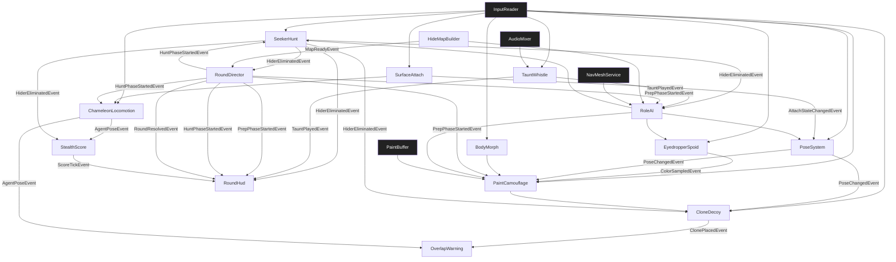

# TDD — Paint Chameleon (Temporal / Pilot)

> **Purpose of this TDD:** temporal, gate-passing Technical Design Document for a **3D paint-camouflage hide-and-seek** game on the V57 SDD pipeline, inspired by *MECCHA CHAMELEON* (めっちゃカメレオン, Lemorion_1224 / Haganeiro, 2026): freehand body painting, 3D eyedropper, poses, wall-attach, clones, first-person hunt, infection/double/gallery modes, proximity scoring. **Pilot networking:** `multiplayer_model: N/A` — every gameplay system exists locally; the opposite role is filled by **RoleAI**. Online listen-host is a 2.0.0 amendment. Amendments follow §0.3.

> **Design sources (research, 2026-08-18):** Steam store page (app 4704690); community/wiki gameplay, paint, controls, clone guides; Wikipedia gameplay summary. Quantified timings that the original does not publish (prep/hunt defaults, FOV, scores) are **pilot locks**, not claims about the commercial title.

---

## 0.1 · Document Control

| Field | Value |
|---|---|
| **Game title** | Paint Chameleon |
| **Studio** | V57 (pilot) |
| **Document** | Game Technical Design Document (TDD) |
| **Template standard** | TDD Standard 2.0.0 |
| **Document version** | 1.0.0 |
| **Date** | 2026-08-18 |
| **Phase reached** | Production |
| **Intended use** | Pilot source of truth (design + engineering) |
| **Owner** | V57 pilot maintainer |

### Changelog

| Version | Date | Change summary | Sections touched | Author |
|---|---|---|---|---|
| `1.0.0` | 2026-08-18 | Initial gate-passing paint-hide TDD (single-player, full mechanic set + RoleAI) | all | V57 pilot |

## 0.2 · Completeness Gate

| # | Item | Check | Status |
|---|---|---|---|
| **G-01** | §A required fields | All `[REQUIRED]` keys concrete; `save_model` / `multiplayer_model` explicit `N/A` | PASS |
| **G-02** | Engine pin | `Unity 6000.0.32f1`; `render_pipeline: URP 17.x`; `dimension: 3D` | PASS |
| **G-03** | Mechanic bar | 15/15 mechanics: quantified rules, I/O, deps, FSM or `N/A` | PASS |
| **G-04** | Acceptance criteria | 15/15 mechanics have ≥ 1 AC tagged EditMode/PlayMode (35 total) | PASS |
| **G-05** | §C parity | 15 §C specs ↔ 15 §B mechanics, names match 1:1 | PASS |
| **G-06** | No orphans | All `dependencies[]` / §D ids resolve to §B or §B-S | PASS |
| **G-07** | Zero pending | No pending markers; §14.2 empty | PASS |
| **G-08** | Consistency ledger | INV-01..INV-08 all PASS | PASS |
| **G-09** | Persistence coverage | All mechanics `none`; §11.4 session-only | PASS |
| **G-10** | Input coverage | Every §B player input maps to §11.3 | PASS |
| **G-11** | UI coverage | Six `UI_*` screens in §9.1, all consumed | PASS |
| **G-12** | Scene coverage | All PlayMode ACs map to `SCN_Boot`, `SCN_Lobby_Local`, or `SCN_Hide_Mansion` | PASS |
| **G-13** | Performance budgets | PC 1080p/60 fps in §11.6 | PASS |
| **G-14** | Player agency & locomotion | `player-driven`; Move/Look + attach/paint/pose/hunt actions; cameras declared | PASS |
| **G-15** | Core loop trace | PREP→Locomotion/Attach/Paint/Spoid/Pose/Morph/Clone · HUNT→SeekerHunt/Taunt/Score · RESOLVE→RoundDirector/Hud | PASS |
| **G-16** | Play space & bootstrap | `SCN_Hide_Mansion` world owner = `HideMapBuilder`; `SCN_Boot` + lobby start run | PASS |
| **G-17** | Content inventory | 1 mansion map, 12 hide spots, 6 poses, 8 body regions, 4 modes — §13.1 | PASS |
| **G-18** | Event graph closure | Every published event has ≥ 1 consumer or `none (reason)`; §D closed | PASS |

## 0.3 · Living TDD

Amendments follow §0.3 (edit §B/§C/§D → re-verify gate → `/tdd-to-context` → `/tdd-to-spec` → `/spec`).

---

# 1 · High Concept

- **One-liner.** Paint your blank chameleon to match the room, pose to break the silhouette, and survive the hunter's eye — or *be* the eye.
- **Elevator pitch.** A 3D hide-and-seek where disguise is **freehand painting**, not a prop picker. During prep you pick a spot, attach to walls, pose, eyedrop the world, paint body regions, drop up to two clones. During hunt the seeker walks first-person and shoots anything that looks wrong. Single-player: you play one role; RoleAI plays the other.
- **Core fantasy.** "I was a painting on the wall — until I whistled."
- **Pillars.** Art is the stealth · readable seeker eye · party-round pacing without a lobby.

# 2 · Game Overview

| Attribute | Value |
|---|---|
| **Genre / sub-genre** | Casual hide-and-seek / paint camouflage |
| **Setting** | Stylised indoor mansion (one floor + stair well) |
| **Primary platform** | PC (Windows) |
| **Target audience** | Party-game and Prop Hunt fans; V57 pipeline testers |
| **Price / model** | N/A (pilot) |

- **USP.** Full *Meccha*-style loop in a prototype: paint + Spoid + pose + attach + clones + hunt gun + four modes + proximity score, without netcode.
- **Positioning.** For V57 adopters, Paint Chameleon exercises mesh painting, role swap, and AI-vs-player rounds — orthogonal to kart / stealth-infil / twin-stick pilots.

# 3 · Core Gameplay

- **Core verbs.** move · attach · pose · sample · paint · clone · hunt-shoot · taunt.
- **Core loop.** Role assign → **Prep** (spot → pose → sample → paint → optional clone) → **Hunt** (seeker scans/shoots; hiders freeze or micro-adjust if still in prep-lock) → **Results** (reveal all hides + scores) → next round or lobby.
- **Win / lose (Normal, player as Hider):** Win if player hider is alive when hunt timer hits 0. Lose if seeker (AI or player) lands a valid shot on the player body **or** one of their clones.
- **Win / lose (Normal, player as Seeker):** Win if all AI hiders eliminated before timer 0. Lose if ≥ 1 AI hider alive at 0.

# 4 · Mechanics & Systems (strategic summary)

- **ChameleonLocomotion** *(feature)* — WASD move, jump, third-person (hider) / first-person (seeker) camera.
- **SurfaceAttach** *(feature)* — Stick to walls; climb up/down; detach.
- **PaintCamouflage** *(feature)* — Freehand paint on 8 body regions; HSV / metallic / roughness; brushes.
- **EyedropperSpoid** *(feature)* — 3D ray sample of world albedo into the active paint slot.
- **PoseSystem** *(feature)* — Pose wheel (6 poses); pose-before-paint contract.
- **BodyMorph** *(feature)* — Blob vs cube silhouette; uniform scale 0.5–1.5.
- **CloneDecoy** *(feature)* — Up to 2 frozen clones; ignore gravity; clone hit = owner out.
- **OverlapWarning** *(feature)* — Red flash when the live body intersects world props (clones exempt).
- **SeekerHunt** *(feature)* — Hitscan gun, no flashlight; eliminates hiders/clones.
- **TauntWhistle** *(feature)* — Optional / forced audible ping that seeker can hear.
- **StealthScore** *(system)* — Hider score from time × proximity while inside seeker FOV uncaught.
- **RoundDirector** *(system)* — Prep → Hunt → Results; modes Normal / Infection / Double / Gallery.
- **RoleAI** *(feature)* — AI hider recipes + AI seeker patrol/scan.
- **HideMapBuilder** *(feature)* — World owner: mansion, hide-spot anchors, spawn cages.
- **RoundHud** *(feature)* — UI Toolkit: prep timer, paint/pose chrome, hunt timer, result reveal.

# 5 · Game Modes

- **Normal** — 1 seeker vs N hiders. Default player role: Hider vs 1 AI seeker (or Seeker vs 5 AI hiders). Lobby toggle.
- **Infection** — Eliminated hider converts to seeker (AI or player). Last hider standing wins if timer remains; seekers win if zero hiders.
- **Double** — All hide in prep; all hunt after. First to eliminate every other (or highest eliminations at timeout) wins. Player vs 5 AI.
- **Gallery** *(Reverse Chicken Race analog)* — 40 s paint on a pedestal theme; 15 s observe all mannequins; hunt phase to find the **live** player among copies. Player paints; 4 AI painted mannequins + 1 live AI decoy.

# 6 · World & Level Design

- **Structure.** One mansion: foyer, gallery hall, kitchen, bedroom, stair well; playable AABB ≈ 28×8×22 m.
- **Set-pieces.** Checker floor (two-tone paint), framed wall (flatten pose), hanging lamps (floating clone), kitchen tiles (grout lines).
- **Progression.** Static map; no unlocks.

# 7 · Narrative & Characters

- N/A — nameless squishy chameleon vs oni-seeker. No `narrativeRef:`.

# 8 · Art Direction & Visual Style

- **Style.** Stylised indoor, readable materials (distinct albedo per surface). Chameleon starts **pure white** unlit-looking until painted.
- **Readability.** Overlap warning = saturated red pulse; seeker muzzle flash; clone diamonds on HUD.
- **Scope coherence.** Primitives + baked vertex colors on props; chameleon uses paintable `RenderTexture` 512×512.

# 9 · UI / UX

- **Principle.** Prep tools never hide the world; hunt HUD never hides camouflage tells.
- **Accessibility.** `[RECOMMENDED]` Remappable keys; colourblind: overlap warning uses **pulse scale 1.08** in addition to red.

## 9.1 Screen registry

| Screen id | Purpose | Key states | Consumed by |
|---|---|---|---|
| `UI_PrepHud` | Prep countdown, role glyph, clone diamonds | `Hidden`, `Visible` | `RoundHud`, `RoundDirector` |
| `UI_PaintPalette` | Wheel, HSV, metallic, roughness, brush size, undo | `Hidden`, `PaintMode` | `PaintCamouflage`, `EyedropperSpoid` |
| `UI_PoseWheel` | 6 pose slots | `Hidden`, `Open` | `PoseSystem` |
| `UI_HuntHud` | Hunt timer, ammo/crosshair, taunt CD | `Hidden`, `Visible` | `RoundHud`, `SeekerHunt` |
| `UI_Result` | Reveal cam + scores + WIN/LOSE | `Hidden`, `Shown` | `RoundHud`, `RoundDirector` |
| `UI_Countdown` | PREP / HUNT phase sting | `Hidden`, `Flash` | `RoundDirector` |

---

# 10 · Audio Direction

- Soft footsteps; whistle taunt (1.2 kHz chirp, 0.4 s); gun shot; clone-place pop; phase sting. Built-in `AudioMixer`. Proximity voice **N/A** (no multiplayer).

# 11 · Technical Design

## 11.1 Engine & rendering

| Area | Decision |
|---|---|
| **Engine** | Unity `6000.0.32f1` |
| **Render pipeline** | URP 17.x (paintable RT + lit materials) |
| **Dimension** | 3D |
| **Architecture** | Component-based + EventBus |
| **AI** | Hide-spot recipes + FOV scan (RoleAI); NavMesh for seeker patrol |

## 11.2 Data ownership

| Data class | Container | Runtime mutability | Persisted? |
|---|---|---|---|
| Tuning / pose clips / hide spots / wave-less round config | ScriptableObject | Read-only at runtime | No |
| Paint RT, clone poses, scores, round timers | Plain C# in owners | Yes | No |
| Save data | — | — | N/A |

## 11.3 Input map

- **Input system.** `new` — `Assets/Settings/PaintChameleonInputActions.inputactions`.

| Action map | Action | Suggested binding | Consumed by |
|---|---|---|---|
| `Gameplay` | `Move` (Vector2) | WASD / LS | `ChameleonLocomotion` |
| `Gameplay` | `Look` (Vector2) | Mouse / RS | `ChameleonLocomotion` |
| `Gameplay` | `Jump` (Button) | Space (when **not** attached and **not** in Paint Mode) | `ChameleonLocomotion` |
| `Gameplay` | `Attach` (Button) | Space near wall (hider, not Paint Mode) | `SurfaceAttach` |
| `Gameplay` | `ClimbUp` (Button) | Space while attached | `SurfaceAttach` |
| `Gameplay` | `ClimbDown` (Button) | Left Ctrl while attached | `SurfaceAttach` |
| `Gameplay` | `Detach` (Button) | Left Shift while attached | `SurfaceAttach` |
| `Gameplay` | `PaintMode` (Button) | F | `PaintCamouflage` |
| `Gameplay` | `Eyedropper` (Button) | Space **in Paint Mode** | `EyedropperSpoid` |
| `Gameplay` | `BrushSize` (Axis) | RMB + mouse X in Paint Mode | `PaintCamouflage` |
| `Gameplay` | `PaintStroke` (Button) | LMB in Paint Mode | `PaintCamouflage` |
| `Gameplay` | `UndoStroke` (Button) | Z in Paint Mode | `PaintCamouflage` |
| `Gameplay` | `PoseWheel` (Button) | R | `PoseSystem` |
| `Gameplay` | `MorphToggle` (Button) | C | `BodyMorph` |
| `Gameplay` | `ScaleAxis` (Axis) | Mouse wheel while Morph panel | `BodyMorph` |
| `Gameplay` | `PlaceClone` (Button) | Q | `CloneDecoy` |
| `Gameplay` | `ClearClones` (Button) | X | `CloneDecoy` |
| `Gameplay` | `Taunt` (Button) | 1 | `TauntWhistle` |
| `Gameplay` | `Fire` (Button) | LMB (Hunt, seeker) | `SeekerHunt` |
| `Gameplay` | `SpectateToggle` (Button) | V (after eliminate / results) | `RoundDirector` |

Context rule: Paint Mode **steals** Space from Jump/Attach (Eyedropper wins). Hunt seeker **steals** LMB from PaintStroke.

## 11.4 Persistence spec

- **Save model.** `N/A` — session-only. Palette swatches reset each round (saved themes are in-memory for the process only).

## 11.5 Movement & spatial model

| Topic | Decision |
|---|---|
| **Space** | 3D CharacterController (hider/seeker); clones are kinematic snapshots |
| **Pathfinding** | NavMesh for RoleAI seeker only |
| **Control mode** | `player-driven` |
| **In-play camera** | **Hider:** third-person follow `offset=(0, 1.6, -4.2)`, FOV 60°, Look orbits ±80° yaw / ±40° pitch. **Seeker:** first-person, eye height 1.55 m, FOV 70°, Look = aim. **Paint Mode:** orbit around body (MMB). **Results/Spectate:** free-fly 8 m/s |
| **Depth / sorting** | Z-buffer |

## 11.6 Performance budgets

| Platform | Resolution | FPS target | Frame budget (ms) | Memory ceiling | Notes |
|---|---|---|---|---|---|
| PC (Windows) | 1080p | 60 | 16.6 | 2 GB | Paint RT 512²; max 3 chameleon meshes (body+2 clones); AI hiders share material instances |

## 11.7 Multiplayer

- **Model.** `N/A` — single-player. Roles and modes run locally vs RoleAI. No `NetworkSession`. Future `ngo_listen_host_lan` is out of this document version.

---

# 12 · Business Model

- N/A (pilot).

---

# 13 · Content Scope & Scene Manifest

## 13.1 Content scope & inventory

| Category | First-pass count | Owner | Notes |
|---|---|---|---|
| Maps | 1 | Pilot | Mansion analog of “Hide-and-Seek Mansion” |
| Hide-spot anchors | 12 | Pilot | `HideSpotTable` SO |
| Poses | 6 | Pilot | Stand, Crouch, Lie, Ball, FlattenWall, FlattenFloor |
| Body paint regions | 8 | Pilot | Head, Torso, ArmL, ArmR, LegL, LegR, Hands, Feet |
| Morph silhouettes | 2 | Pilot | Blob, Cube |
| Clone cap | 2 | Pilot | + live body = 3 instances |
| Round modes | 4 | Pilot | Normal, Infection, Double, Gallery |
| AI hiders (max) | 5 | Pilot | RoleAI |
| AI seekers (max) | 3 | Pilot | Infection snowball cap in pilot |
| UI screens | 6 | Pilot | Matches §9.1 |
| Tuning SOs | 6 | Pilot | `MoveTuning`, `PaintConfig`, `PoseCatalog`, `CloneConfig`, `RoundConfig`, `HideSpotTable` |

## 13.2 Scene manifest

| Scene id | Purpose | World owner | Systems present | PlayMode ACs |
|---|---|---|---|---|
| `SCN_Boot` | Persistent systems | `RoundDirector` | EventBus, InputReader, AudioMixer, RoundDirector | RD-PM1 |
| `SCN_Lobby_Local` | Mode / role / start | `RoundDirector` | RoundHud (lobby subset) | RD-PM2 |
| `SCN_Hide_Mansion` | Gameplay | `HideMapBuilder` | All §B + §B-S | CL-PM1, SA-PM1, PC-PM1, ES-PM1, PS-PM1, BM-PM1, CD-PM1, OW-PM1, SH-PM1, TW-PM1, SS-PM1, RA-PM1, HMB-PM1, RH-PM1 |

---

# 14 · Risks, Open Items & Consistency

## 14.1 Risks

| Risk | Severity | Mitigation |
|---|---|---|
| Paint RT too coarse vs Meccha feel | 🟡 | 512² + 8 regions; AC requires visible two-tone on torso |
| AI seeker too omniscient | 🟠 | Scan uses **mismatch score**, not collider knowledge of hider id (INV-07) |
| Clone-hit = death feels brutal | 🟡 | `ClearClones` instant; HUD diamonds; documented in results |
| Space key context bugs (jump vs attach vs spoid) | 🟠 | Single `InputContextRouter` in InputReader; EditMode ACs per context |

## 14.2 Pending registry

*Empty.*

## 14.3 Consistency ledger

| Id | Invariant | Systems | Status |
|---|---|---|---|
| `INV-01` | Prep default `45 s`; Hunt default `180 s`; Gallery paint `40 s` + observe `15 s` (`RoundConfig`) | RoundDirector | PASS |
| `INV-02` | Walk `4.0 m/s`; jump vertical impulse `5.2 m/s`; attach climb `2.2 m/s`; attach require wall normal·forward ≤ −0.55 and distance ≤ `0.45 m` | ChameleonLocomotion, SurfaceAttach | PASS |
| `INV-03` | 8 paint regions; brush radius 8–64 px on 512 RT; undo stack 16; metallic 0–1; roughness 0–1 | PaintCamouflage | PASS |
| `INV-04` | Max 2 clones; cooldown `30 s` per slot; clone shot ≡ owner eliminated | CloneDecoy, SeekerHunt, RoundDirector | PASS |
| `INV-05` | 6 poses; changing pose after paint does **not** auto-reproject strokes (player must repaint) | PoseSystem, PaintCamouflage | PASS |
| `INV-06` | Morph scale `[0.5, 1.5]`; Blob/Cube swap preserves paint RT | BodyMorph | PASS |
| `INV-07` | AI seeker fire only if `mismatchScore ≥ 0.62` from visual features (silhouette residual + albedo delta), never from hidden `HiderId` | RoleAI, SeekerHunt | PASS |
| `INV-08` | StealthScore: `pts/s = 12 × (1 − saturate(dist/18))` while hider in seeker FOV 70° and LOS clear; 0 if eliminated | StealthScore | PASS |

---

# §A · Project Identity

```yaml
project_name: "Paint Chameleon"
document_version: "1.0.0"
repo_kind: unity_game
engine: "Unity 6000.0.32f1"
render_pipeline: "URP 17.x"
dimension: "3D"
language: "C# (Unity 6000.0 scripting profile)"
pattern: "Component-based + EventBus"
target_platform: "PC (Windows)"
input_system: "new"
test_assembly_prefix: "PaintChameleon"
genre: "Casual hide-and-seek / paint camouflage"
save_model: "N/A"
multiplayer_model: "N/A"
networking_tier: null
max_players: null
session_visibility: null
performance_targets:
  - platform: "PC (Windows)"
    resolution: "1080p"
    fps_target: 60
```

---

# §B · Production Mechanics

Fifteen mechanics. All `sliceScope: true` for the pilot (the slice is the full local game).

---

## Mechanic: Chameleon Locomotion

### Spec metadata
- **name:** `ChameleonLocomotion`
- **type:** feature
- **status:** active
- **version:** 0.1.0
- **One-line description:** Role-aware move/look/jump; owns third-person (hider) or first-person (seeker) camera.

### Player-facing behavior
- **Goal / fantasy:** Get to a hide spot fast; as seeker, sweep rooms.
- **Loop:** Move/Look → translation + camera.
- **Feedback:** Footstep SFX; camera mode swap on role.

### Rules (quantified)
1. Walk `4.0 m/s`; no sprint key (INV-02).
2. Jump only if grounded, not attached, not Paint Mode; `velocity.y = 5.2 m/s`.
3. Hider camera third-person; seeker first-person (§11.5).
4. Hunt-phase **hider freeze:** if `RoundConfig.lockHidersInHunt == true` (default true), Move/Jump ignored after Hunt starts (Look still allowed in spectate only).
5. Gravity `−18 m/s²`.

### Inputs / outputs
- **Player inputs:** `Move`, `Look`, `Jump`.
- **Outputs:** `AgentPoseEvent { position, facing, grounded }` @ 10 Hz → OverlapWarning, StealthScore, RoleAI.
- **Consumed by:** none extra (camera internal).

### Persistence
- `none`.

### Dependencies
| kind | id | Why |
|---|---|---|
| system | EventBus | Pose ticks |
| system | InputReader | Input |
| system | RoundDirector | Role + phase freeze |

### State machine
- **States:** `Free`, `FrozenHunt`, `Spectating`.
- **Initial:** `Free`.
- **Transitions:** Hunt + hider + lock → FrozenHunt; eliminate/results + SpectateToggle → Spectating.

### Components
1. **ChameleonLocomotion** — `Assets/Scripts/Features/Agent/ChameleonLocomotion.cs`
2. **MoveTuning** (SO) — speeds, camera offsets. `Assets/ScriptableObjects/Configs/MoveTuning.asset`

### Acceptance criteria
- [ ] **CL-AC1 (EditMode):** Jump while attached or Paint Mode does not change `velocity.y`.
- [ ] **CL-AC2 (EditMode):** FrozenHunt ignores Move (delta position 0 over 0.5 s simulated).
- [ ] **CL-PM1 (PlayMode):** Hider camera is third-person; switching role to Seeker switches to first-person in `SCN_Hide_Mansion`.

---

## Mechanic: Surface Attach

### Spec metadata
- **name:** `SurfaceAttach`
- **type:** feature
- **status:** active
- **version:** 0.1.0
- **One-line description:** Stick to vertical surfaces and climb; detach with Shift.

### Player-facing behavior
- **Goal / fantasy:** Become a hanging picture or high-wall blob.
- **Loop:** Touch wall → Attach → ClimbUp/Down → hover → Detach.
- **Feedback:** Soft snap; camera pulls 0.6 m closer.

### Rules (quantified)
1. Attach if wall hit within `0.45 m` and `dot(wallNormal, agentForward) ≤ −0.55` (INV-02).
2. ClimbUp/Down `2.2 m/s` along wall up vector; release keys → hover.
3. Detach restores gravity; cooldown `0.2 s` before re-attach.
4. Disabled in Paint Mode and for seeker role.

### Inputs / outputs
- **Player inputs:** `Attach`, `ClimbUp`, `ClimbDown`, `Detach`.
- **Outputs:** `AttachStateChangedEvent { attached, wallNormal }` → PoseSystem, RoundHud, ChameleonLocomotion.

### Persistence
- `none`.

### Dependencies
| kind | id | Why |
|---|---|---|
| feature | ChameleonLocomotion | Transform / gravity |
| system | EventBus | Attach events |
| system | InputReader | Context keys |

### State machine
- **States:** `Detached`, `Attached`.
- **Initial:** `Detached`.

### Components
1. **SurfaceAttach** — `Assets/Scripts/Features/Agent/SurfaceAttach.cs`

### Acceptance criteria
- [ ] **SA-AC1 (EditMode):** Wall facing away (`dot > 0`) refuses attach.
- [ ] **SA-PM1 (PlayMode):** Attach on gallery wall, ClimbUp 1 s raises world Y by ≥ 2.0 m.

---

## Mechanic: Paint Camouflage

### Spec metadata
- **name:** `PaintCamouflage`
- **type:** feature
- **status:** active
- **version:** 0.1.0
- **One-line description:** Freehand paint on 8 body regions via 512² RT; HSV, metallic, roughness.

### Player-facing behavior
- **Goal / fantasy:** Copy the wall, not wear a costume.
- **Loop:** Open Paint Mode → pick region → stroke / fill → tweak sliders → inspect orbit.
- **Feedback:** `UI_PaintPalette`; brush cursor; undo toast.

### Rules (quantified)
1. Toggle `PaintMode` (F). Blocks locomotion Jump/Attach (InputReader context).
2. 8 regions (INV-03); stroke paints active region only; **FillRegion** button floods region with active color.
3. Brush radius 8–64 px; `BrushSize` RMB-drag.
4. Color: HSV + RGB displayed; metallic 0–1; roughness 0–1 applied as material params **per region**.
5. Undo stack 16; ClearBody resets white `(1,1,1)` metallic 0 roughness 0.85 (matte).
6. Start-of-round always white canvas (RoundDirector reset).
7. Hunt lock: cannot paint after Hunt unless mode Double (still no, hunt is search). Paint **prep-only**.

### Inputs / outputs
- **Player inputs:** `PaintMode`, `PaintStroke`, `BrushSize`, `UndoStroke`.
- **System inputs:** `ColorSampledEvent` from EyedropperSpoid.
- **Outputs:** `PaintAppliedEvent { regionId }` → RoundHud; `none (optional SFX — justified)` extra.

### Persistence
- `none`.

### Dependencies
| kind | id | Why |
|---|---|---|
| feature | EyedropperSpoid | Sample into slot |
| feature | PoseSystem | Paint visible surfaces of current pose |
| system | EventBus | Events |
| system | InputReader | Context |
| system | RoundDirector | Prep-only gate |

### State machine
- **States:** `Closed`, `Open`.
- **Initial:** `Closed`.

### Components
1. **PaintCamouflage** — `Assets/Scripts/Features/Paint/PaintCamouflage.cs`
2. **PaintConfig** (SO) — RT size, brush range, default matte. `Assets/ScriptableObjects/Configs/PaintConfig.asset`
3. **BodyRegion** (enum) — 8 values.

### Acceptance criteria
- [ ] **PC-AC1 (EditMode):** FillRegion(Torso, red) sets torso RT average ΔE to red < 5.
- [ ] **PC-AC2 (EditMode):** 17th undo is no-op; 16 undos restore prior.
- [ ] **PC-PM1 (PlayMode):** F opens `UI_PaintPalette`; LMB stroke changes torso pixels in `SCN_Hide_Mansion`.

---

## Mechanic: Eyedropper Spoid

### Spec metadata
- **name:** `EyedropperSpoid`
- **type:** feature
- **status:** active
- **version:** 0.1.0
- **One-line description:** 3D raycast samples world albedo into the active paint color.

### Player-facing behavior
- **Goal / fantasy:** Photoshop eyedropper on the room.
- **Loop:** Paint Mode → aim at surface → Space → slot updates.
- **Feedback:** Reticle flash; sampled swatch on `UI_PaintPalette`.

### Rules (quantified)
1. Only while Paint Mode Open.
2. Ray `8 m`; samples `Renderer` albedo (texture bilinear at hit UV, else material color).
3. Writes HSV of sample into PaintCamouflage active color; does **not** auto-stroke.
4. Miss (sky/empty) → no-op.

### Inputs / outputs
- **Player inputs:** `Eyedropper`.
- **Outputs:** `ColorSampledEvent { hsv }` → PaintCamouflage.

### Persistence
- `none`.

### Dependencies
| kind | id | Why |
|---|---|---|
| feature | PaintCamouflage | Active slot |
| system | EventBus | ColorSampledEvent |

### State machine
- N/A — request/response.

### Components
1. **EyedropperSpoid** — `Assets/Scripts/Features/Paint/EyedropperSpoid.cs`

### Acceptance criteria
- [ ] **ES-AC1 (EditMode):** Ray hit on 100% red quad → sampled hue ≈ 0°, S≈1, V≈1.
- [ ] **ES-PM1 (PlayMode):** Sample kitchen tile then FillRegion matches tile albedo ΔE < 8.

---

## Mechanic: Pose System

### Spec metadata
- **name:** `PoseSystem`
- **type:** feature
- **status:** active
- **version:** 0.1.0
- **One-line description:** Six-pose wheel to break humanoid silhouette; pose-before-paint.

### Player-facing behavior
- **Goal / fantasy:** Look like a balloon, a rug, or a canvas.
- **Loop:** R → pick pose → animator; then paint.
- **Feedback:** `UI_PoseWheel`; silhouette change.

### Rules (quantified)
1. Poses: `Stand`, `Crouch`, `Lie`, `Ball`, `FlattenWall`, `FlattenFloor` (INV-05).
2. `FlattenWall` requires `SurfaceAttach.Attached` or snaps if wall within 0.45 m; else refuse.
3. Pose change does not bake/reproject paint (INV-05).
4. Hunt freeze: pose locked when hider FrozenHunt.

### Inputs / outputs
- **Player inputs:** `PoseWheel` + UI pick (pointer).
- **Outputs:** `PoseChangedEvent { pose }` → PaintCamouflage, CloneDecoy, RoundHud.

### Persistence
- `none`.

### Dependencies
| kind | id | Why |
|---|---|---|
| feature | SurfaceAttach | FlattenWall |
| feature | ChameleonLocomotion | Animator on body |
| system | EventBus | PoseChangedEvent |

### State machine
- **States:** one per pose; **Initial:** `Stand`.

### Components
1. **PoseSystem** — `Assets/Scripts/Features/Agent/PoseSystem.cs`
2. **PoseCatalog** (SO) — clip names. `Assets/ScriptableObjects/Configs/PoseCatalog.asset`

### Acceptance criteria
- [ ] **PS-AC1 (EditMode):** FlattenWall while Detached and no wall → pose stays Stand.
- [ ] **PS-PM1 (PlayMode):** Selecting Ball plays ball clip and Capsule height ≤ 0.7 m.

---

## Mechanic: Body Morph

### Spec metadata
- **name:** `BodyMorph`
- **type:** feature
- **status:** active
- **version:** 0.1.0
- **One-line description:** Blob vs cube mesh; uniform scale 0.5–1.5.

### Rules (quantified)
1. `MorphToggle` swaps Blob/Cube; paint RT remapped (same 8 regions).
2. Scale via `ScaleAxis` in `0.5–1.5` (INV-06).
3. Prep-only.

### Inputs / outputs
- **Player inputs:** `MorphToggle`, `ScaleAxis`.
- **Outputs:** `MorphChangedEvent { shape, scale }` → OverlapWarning, RoundHud.

### Persistence
- `none`.

### Dependencies
| kind | id | Why |
|---|---|---|
| feature | PaintCamouflage | RT remap |
| system | EventBus | MorphChangedEvent |

### State machine
- **States:** `Blob`, `Cube`. **Initial:** `Blob`.

### Components
1. **BodyMorph** — `Assets/Scripts/Features/Agent/BodyMorph.cs`

### Acceptance criteria
- [ ] **BM-AC1 (EditMode):** Scale clamp rejects 1.6 → stays 1.5.
- [ ] **BM-PM1 (PlayMode):** Toggle Cube replaces mesh; paint still visible.

---

## Mechanic: Clone Decoy

### Spec metadata
- **name:** `CloneDecoy`
- **type:** feature
- **status:** active
- **version:** 0.1.0
- **One-line description:** Snapshot body (paint+pose+morph) as frozen decoy; max 2; clone hit = death.

### Player-facing behavior
- **Goal / fantasy:** Leave a fake you and hide for real.
- **Loop:** Q place → cooldown diamonds → X clear all.
- **Feedback:** Pop SFX; two diamonds on `UI_PrepHud`.

### Rules (quantified)
1. Max 2 clones (INV-04); `PlaceClone` no-op if 2 active.
2. Cooldown `30 s` **per slot** after place.
3. Snapshot: mesh, pose, scale, paint RT copy, world pose; **kinematic**; **no gravity** (mid-air OK).
4. Owner can overlap own clones without OverlapWarning.
5. `SeekerHunt` hit on clone → `HiderEliminatedEvent { reason: CloneShot, ownerId }`.
6. `ClearClones` destroys all; not usable in Spectating.

### Inputs / outputs
- **Player inputs:** `PlaceClone`, `ClearClones`.
- **Outputs:** `ClonePlacedEvent`, `CloneClearedEvent` → OverlapWarning, RoundHud, StealthScore.

### Persistence
- `none`.

### Dependencies
| kind | id | Why |
|---|---|---|
| feature | PaintCamouflage | RT copy |
| feature | PoseSystem | Pose snapshot |
| feature | BodyMorph | Shape/scale |
| feature | SeekerHunt | Hit rule |
| system | EventBus | Events |

### State machine
- N/A — inventory of 0–2 snapshots.

### Components
1. **CloneDecoy** — `Assets/Scripts/Features/Agent/CloneDecoy.cs`
2. **CloneConfig** (SO) — max, cooldown. `Assets/ScriptableObjects/Configs/CloneConfig.asset`

### Acceptance criteria
- [ ] **CD-AC1 (EditMode):** Third PlaceClone does not increase count.
- [ ] **CD-AC2 (EditMode):** Hitscan on clone raises HiderEliminatedEvent for owner.
- [ ] **CD-PM1 (PlayMode):** Jump + Q leaves floating clone; gravity does not drop it over 2 s.

---

## Mechanic: Overlap Warning

### Spec metadata
- **name:** `OverlapWarning`
- **type:** feature
- **status:** active
- **version:** 0.1.0
- **One-line description:** Red pulse when live body intersects world props; clones exempt.

### Rules (quantified)
1. Trigger overlap volume with layers `Prop` / `World` > `0.02 m³` equivalent (capsule penetration > `0.04 m`) → warn.
2. Own clones ignored.
3. Pulse scale 1.08 + red emission 0.4 s loop while overlapping.
4. Seekers do not warn.

### Inputs / outputs
- **System inputs:** `AgentPoseEvent`, `ClonePlacedEvent`.
- **Outputs:** `OverlapWarnedEvent { active }` → RoundHud.

### Persistence
- `none`.

### Dependencies
| kind | id | Why |
|---|---|---|
| feature | ChameleonLocomotion | Pose |
| feature | CloneDecoy | Ignore list |
| system | EventBus | Events |

### State machine
- **States:** `Clear`, `Warning`.

### Acceptance criteria
- [ ] **OW-AC1 (EditMode):** Overlap clone only → Warning false.
- [ ] **OW-PM1 (PlayMode):** Walk into kitchen counter → red pulse within 0.1 s.

---

## Mechanic: Seeker Hunt

### Spec metadata
- **name:** `SeekerHunt`
- **type:** feature
- **status:** active
- **version:** 0.1.0
- **One-line description:** First-person hitscan; no flashlight; shot eliminates hider or clone-owner.

### Player-facing behavior
- **Goal / fantasy:** Trust your eye, pull the trigger.
- **Loop:** Look → Fire → hit/miss.
- **Feedback:** `UI_HuntHud` crosshair; shot SFX; eliminate sting.

### Rules (quantified)
1. Active only for seeker role in Hunt (and Double hunt).
2. Hitscan 40 m, layer `Hider` + `Clone`; fire rate `2 / s`; infinite ammo.
3. Hit live hider → `HiderEliminatedEvent { reason: BodyShot }`.
4. Hit clone → owner eliminated (INV-04).
5. No flashlight / no highlight cheats.

### Inputs / outputs
- **Player inputs:** `Fire`.
- **Outputs:** `HiderEliminatedEvent` → RoundDirector, StealthScore, RoundHud, RoleAI, CloneDecoy.

### Persistence
- `none`.

### Dependencies
| kind | id | Why |
|---|---|---|
| feature | ChameleonLocomotion | FPS camera |
| feature | CloneDecoy | Clone colliders |
| system | EventBus | Eliminate |
| system | RoundDirector | Phase/role gate |

### State machine
- **States:** `Inactive`, `CanFire`, `Cooldown`.

### Acceptance criteria
- [ ] **SH-AC1 (EditMode):** Fire in Prep → no ray, no event.
- [ ] **SH-PM1 (PlayMode):** As seeker, shoot visible AI hider → eliminated same frame.

---

## Mechanic: Taunt Whistle

### Spec metadata
- **name:** `TauntWhistle`
- **type:** feature
- **status:** active
- **version:** 0.1.0
- **One-line description:** Whistle ping; optional forced taunt on interval.

### Rules (quantified)
1. `Taunt` plays whistle; cooldown `8 s`; audible radius `14 m` (AI seeker hearing).
2. If `RoundConfig.forcedTaunt == true`, auto-taunt every `25 s` while hider alive in Hunt.
3. Disabled in Prep.

### Inputs / outputs
- **Player inputs:** `Taunt`.
- **Outputs:** `TauntPlayedEvent { position }` → RoleAI, RoundHud.

### Persistence
- `none`.

### Dependencies
| kind | id | Why |
|---|---|---|
| system | EventBus | TauntPlayedEvent |
| system | RoundDirector | Forced flag / phase |
| system | AudioMixer | One-shot |

### State machine
- N/A.

### Acceptance criteria
- [ ] **TW-AC1 (EditMode):** Second taunt at t=4 s ignored.
- [ ] **TW-PM1 (PlayMode):** Taunt in Hunt plays SFX; AI seeker path updates toward source within 1 s if within 14 m.

---

## Mechanic: Stealth Score

### Spec metadata
- **name:** `StealthScore`
- **type:** system
- **status:** active
- **version:** 0.1.0
- **One-line description:** Score hiders for time spent in seeker FOV uncaught (closer = more).

### Rules (quantified)
1. Each hunt tick `0.1 s`: if hider in seeker FOV 70° and LOS, add INV-08 points.
2. On eliminate, freeze that hider's score.
3. Results consume totals. Seekers get `missedHiders[]` list (names + last positions).

### Inputs / outputs
- **System inputs:** `AgentPoseEvent`, `HiderEliminatedEvent`.
- **Outputs:** `ScoreTickEvent { hiderId, total }` → RoundHud (throttled 1 Hz).

### Persistence
- `none`.

### Dependencies
| kind | id | Why |
|---|---|---|
| feature | ChameleonLocomotion | Positions |
| feature | SeekerHunt | Seeker transform / FOV |
| system | EventBus | Events |
| system | RoundDirector | Results |

### State machine
- N/A — accumulator.

### Acceptance criteria
- [ ] **SS-AC1 (EditMode):** dist=0 in FOV 1 s → total ≈ 12 pts (±0.5).
- [ ] **SS-PM1 (PlayMode):** Hider in foyer with seeker looking away for 3 s → score increase < 1.

---

## Mechanic: Round Director

### Spec metadata
- **name:** `RoundDirector`
- **type:** system
- **status:** active
- **version:** 0.1.0
- **One-line description:** Round FSM, four modes, role assign, spectate camera, win/lose.

### Player-facing behavior
- **Goal / fantasy:** A full match beat: prep, hunt, reveal.
- **Loop:** Lobby start → Prep → Hunt → Results → lobby.
- **Feedback:** `UI_Countdown`, `UI_Result`, `UI_PrepHud` / `UI_HuntHud` via RoundHud.

### Rules (quantified)
1. Timers INV-01. Seekers locked in cage volume during Prep (cannot see map: cage is windowless).
2. **Normal:** 1 seeker. Player role from lobby.
3. **Infection:** On `HiderEliminatedEvent`, victim Role becomes Seeker (AI or player); guns enabled.
4. **Double:** Prep all hiders; Hunt all can Fire; winner = first 100% clears or most elims at timeout.
5. **Gallery:** 40 s paint on pedestals; 15 s observe; Hunt find live bodies among mannequins (mannequins layer `Decoy`, not `Hider`).
6. Hunt ends: timer 0 **or** zero hiders remain.
7. `SpectateToggle` after eliminate → free-fly 8 m/s; cannot PlaceClone.

### Inputs / outputs
- **Player inputs:** `SpectateToggle`.
- **Outputs:** `PrepPhaseStartedEvent`, `HuntPhaseStartedEvent`, `RoundResolvedEvent { winner }` → all consumers listed in §D.

### Persistence
- `none`.

### Dependencies
| kind | id | Why |
|---|---|---|
| system | EventBus | Phase events |
| feature | RoleAI | Fill opposite roles |
| feature | SeekerHunt | Enable fire |
| feature | HideMapBuilder | Cage / pedestals |

### State machine
- **States:** `Lobby`, `Prep`, `Hunt`, `Results`.
- **Initial:** `Lobby`.

### Components
1. **RoundDirector** — `Assets/Scripts/Systems/Round/RoundDirector.cs`
2. **RoundConfig** (SO) — timers, mode, forcedTaunt, lockHidersInHunt. `Assets/ScriptableObjects/Configs/RoundConfig.asset`

### Acceptance criteria
- [ ] **RD-AC1 (EditMode):** Prep 45 s then auto Hunt.
- [ ] **RD-AC2 (EditMode):** Infection convert flips victim CanFire true.
- [ ] **RD-PM1 (PlayMode):** Boot → Lobby within 2 s.
- [ ] **RD-PM2 (PlayMode):** Start Normal from lobby loads `SCN_Hide_Mansion` and shows Prep HUD.

---

## Mechanic: Role AI

### Spec metadata
- **name:** `RoleAI`
- **type:** feature
- **status:** active
- **version:** 0.1.0
- **One-line description:** AI hiders use hide-spot recipes; AI seekers patrol and shoot on mismatch ≥ 0.62.

### Rules (quantified)
1. **AI Hider:** On Prep, pick unused `HideSpot` (position, pose, morph, region colors sampled via Spoid at bake-time **or** runtime ray). Finish ≥ 8 s before Hunt. May place 0–1 clone at spot offset.
2. **AI Seeker:** NavMesh patrol 8 waypoints; every `0.25 s` score visible chameleon-like renderers; fire if `mismatchScore ≥ 0.62` (INV-07). Hearing: path to `TauntPlayedEvent` if dist ≤ 14 m.
3. Must **not** read `isPlayerHider` from physics; mismatch uses albedo ΔE vs local probes + upright-silhouette residual.

### Inputs / outputs
- **System inputs:** phase events, TauntPlayedEvent, HiderEliminatedEvent.
- **Outputs:** uses SeekerHunt.Fire internally; `none (debug gizmos optional — justified)`.

### Persistence
- `none`.

### Dependencies
| kind | id | Why |
|---|---|---|
| feature | HideMapBuilder | HideSpotTable, waypoints |
| feature | PaintCamouflage | AI fill |
| feature | PoseSystem | AI pose |
| feature | SeekerHunt | Fire |
| feature | EyedropperSpoid | Sample at spots |
| system | EventBus | Phases / taunt |
| system | NavMeshService | Patrol |

### State machine
- Hider: `PickSpot`, `Paint`, `Hold`. Seeker: `Patrol`, `Investigate`, `Shoot`.

### Components
1. **RoleAI** — `Assets/Scripts/Features/AI/RoleAI.cs`

### Acceptance criteria
- [ ] **RA-AC1 (EditMode):** mismatchScore of white body on red wall ≥ 0.62.
- [ ] **RA-AC2 (EditMode):** mismatchScore of exact-sampled fill on same wall < 0.35.
- [ ] **RA-PM1 (PlayMode):** AI hider is posed and non-white at Hunt start.

---

## Mechanic: Hide Map Builder

### Spec metadata
- **name:** `HideMapBuilder`
- **type:** feature
- **status:** active
- **version:** 0.1.0
- **One-line description:** World owner — mansion geo, 12 hide spots, seeker cage, gallery pedestals.

### Rules (quantified)
1. On load: 12 hide-spot dummies, 8 seeker waypoints, 1 windowless cage, 5 gallery pedestals.
2. Registers spots to RoleAI / RoundDirector.

### Inputs / outputs
- **Outputs:** populated play space (no events required beyond `MapReadyEvent` → RoundDirector).

### Persistence
- `none`.

### Dependencies
| kind | id | Why |
|---|---|---|
| system | RoundDirector | MapReady |
| feature | RoleAI | Anchors |

### State machine
- N/A.

### Components
1. **HideMapBuilder** — `Assets/Scripts/Features/World/HideMapBuilder.cs`
2. **HideSpotTable** (SO) — 12 entries. `Assets/ScriptableObjects/Configs/HideSpotTable.asset`

### Acceptance criteria
- [ ] **HMB-PM1 (PlayMode):** Load mansion → 12 spots, cage, player spawn present.

---

## Mechanic: Round HUD

### Spec metadata
- **name:** `RoundHud`
- **type:** feature
- **status:** active
- **version:** 0.1.0
- **One-line description:** UI Toolkit presenter for prep/paint/pose/hunt/result screens.

### Rules (quantified)
1. Owns queries for all §9.1 screens (documents may live as separate UXML; one presenter).
2. Prep: timer, clone diamonds (0–2). Hunt: timer, crosshair if seeker. Result: scores + WIN/LOSE.
3. No game logic.

### Inputs / outputs
- **System inputs:** phase, score, clone, overlap, eliminate events.
- **Outputs:** none (presentation).

### Persistence
- `none`.

### Dependencies
| kind | id | Why |
|---|---|---|
| system | EventBus | Subscriptions |
| system | RoundDirector | Phase |
| system | StealthScore | Totals |
| feature | CloneDecoy | Diamonds |
| feature | PaintCamouflage | Palette host |
| feature | PoseSystem | Wheel host |

### State machine
- N/A — presenter.

### Components
1. **RoundHud** — `Assets/Scripts/Features/UI/RoundHud.cs`

### Acceptance criteria
- [ ] **RH-AC1 (EditMode):** SetPrepTime(12.3) → timer label `"12.3"`.
- [ ] **RH-PM1 (PlayMode):** Hunt start hides `UI_PaintPalette` and shows `UI_HuntHud`.

---

# §B-S · Support Systems Registry

| Id | Purpose | Public surface | Spec |
|---|---|---|---|
| `EventBus` | Pub/sub | `Publish<T>`, `Subscribe<T>` | table-only |
| `InputReader` | Context-aware input (Paint vs Gameplay vs Hunt) | Move, Look, and all §11.3 actions | table-only |
| `NavMeshService` | Seeker patrol | `SetDestination`, `HasPath` | table-only |
| `AudioMixer` | SFX / stings | `PlayOneShot` | table-only |
| `PaintBuffer` | RT copy/undo helpers | `CloneRT`, `PushUndo` | table-only |

---

# §C · Companion Specs (YAML)

```yaml
specVersion: "1.1"
name: ChameleonLocomotion
type: feature
description: Role-aware move/look/jump with TPP hider and FPP seeker cameras.
version: 0.1.0
dependencies:
  - { kind: system, id: EventBus }
  - { kind: system, id: InputReader }
  - { kind: system, id: RoundDirector }
acceptanceCriteria:
  - { id: CL-AC1, description: "Jump blocked when attached or in Paint Mode", verification: EditMode }
  - { id: CL-AC2, description: "FrozenHunt ignores Move", verification: EditMode }
  - { id: CL-PM1, description: "Hider TPP / Seeker FPP camera swap", verification: PlayMode }
specId: chameleon_locomotion
touches:
  scripts: [Assets/Scripts/Features/Agent/ChameleonLocomotion.cs]
  scenes: [Assets/Scenes/Hide_Mansion.unity]
```

```yaml
specVersion: "1.1"
name: SurfaceAttach
type: feature
description: Wall stick and climb 2.2 m/s; detach with Shift.
version: 0.1.0
dependencies:
  - { kind: feature, id: ChameleonLocomotion }
  - { kind: system, id: EventBus }
  - { kind: system, id: InputReader }
acceptanceCriteria:
  - { id: SA-AC1, description: "Attach refused if wall facing away", verification: EditMode }
  - { id: SA-PM1, description: "ClimbUp raises Y by >=2m in 1s", verification: PlayMode }
specId: surface_attach
```

```yaml
specVersion: "1.1"
name: PaintCamouflage
type: feature
description: Freehand 8-region paint on 512 RT with HSV metallic roughness and undo 16.
version: 0.1.0
dependencies:
  - { kind: feature, id: EyedropperSpoid }
  - { kind: feature, id: PoseSystem }
  - { kind: system, id: EventBus }
  - { kind: system, id: InputReader }
  - { kind: system, id: RoundDirector }
  - { kind: system, id: PaintBuffer }
acceptanceCriteria:
  - { id: PC-AC1, description: "FillRegion torso red average DeltaE < 5", verification: EditMode }
  - { id: PC-AC2, description: "Undo stack depth 16", verification: EditMode }
  - { id: PC-PM1, description: "F opens palette; stroke changes pixels", verification: PlayMode }
specId: paint_camouflage
ui:
  screens:
    - name: UI_PaintPalette
      uxml: Assets/UI/PaintChameleon_Palette.uxml
```

```yaml
specVersion: "1.1"
name: EyedropperSpoid
type: feature
description: 3D ray albedo sample into active paint color.
version: 0.1.0
dependencies:
  - { kind: feature, id: PaintCamouflage }
  - { kind: system, id: EventBus }
acceptanceCriteria:
  - { id: ES-AC1, description: "Sample red quad yields hue ~0", verification: EditMode }
  - { id: ES-PM1, description: "Sample tile FillRegion DeltaE < 8", verification: PlayMode }
specId: eyedropper_spoid
```

```yaml
specVersion: "1.1"
name: PoseSystem
type: feature
description: Six-pose wheel; FlattenWall requires attach; paint not reprojected.
version: 0.1.0
dependencies:
  - { kind: feature, id: SurfaceAttach }
  - { kind: feature, id: ChameleonLocomotion }
  - { kind: system, id: EventBus }
acceptanceCriteria:
  - { id: PS-AC1, description: "FlattenWall refused without wall", verification: EditMode }
  - { id: PS-PM1, description: "Ball pose capsule height <= 0.7m", verification: PlayMode }
specId: pose_system
ui:
  screens:
    - name: UI_PoseWheel
      uxml: Assets/UI/PaintChameleon_PoseWheel.uxml
```

```yaml
specVersion: "1.1"
name: BodyMorph
type: feature
description: Blob/Cube swap and scale 0.5-1.5 preserving paint RT.
version: 0.1.0
dependencies:
  - { kind: feature, id: PaintCamouflage }
  - { kind: system, id: EventBus }
acceptanceCriteria:
  - { id: BM-AC1, description: "Scale clamped to 1.5 max", verification: EditMode }
  - { id: BM-PM1, description: "Cube mesh keeps paint visible", verification: PlayMode }
specId: body_morph
```

```yaml
specVersion: "1.1"
name: CloneDecoy
type: feature
description: Up to 2 gravity-less paint snapshots; clone shot eliminates owner.
version: 0.1.0
dependencies:
  - { kind: feature, id: PaintCamouflage }
  - { kind: feature, id: PoseSystem }
  - { kind: feature, id: BodyMorph }
  - { kind: feature, id: SeekerHunt }
  - { kind: system, id: EventBus }
acceptanceCriteria:
  - { id: CD-AC1, description: "Third clone refused", verification: EditMode }
  - { id: CD-AC2, description: "Clone hit eliminates owner", verification: EditMode }
  - { id: CD-PM1, description: "Mid-air clone does not fall", verification: PlayMode }
specId: clone_decoy
```

```yaml
specVersion: "1.1"
name: OverlapWarning
type: feature
description: Red pulse on live-body vs world overlap; own clones exempt.
version: 0.1.0
dependencies:
  - { kind: feature, id: ChameleonLocomotion }
  - { kind: feature, id: CloneDecoy }
  - { kind: system, id: EventBus }
acceptanceCriteria:
  - { id: OW-AC1, description: "Overlapping own clone does not warn", verification: EditMode }
  - { id: OW-PM1, description: "Counter overlap pulses red", verification: PlayMode }
specId: overlap_warning
```

```yaml
specVersion: "1.1"
name: SeekerHunt
type: feature
description: Hunt-phase hitscan 2 rps; no flashlight; body or clone hit eliminates.
version: 0.1.0
dependencies:
  - { kind: feature, id: ChameleonLocomotion }
  - { kind: feature, id: CloneDecoy }
  - { kind: system, id: EventBus }
  - { kind: system, id: RoundDirector }
acceptanceCriteria:
  - { id: SH-AC1, description: "Cannot fire in Prep", verification: EditMode }
  - { id: SH-PM1, description: "Shot eliminates AI hider", verification: PlayMode }
specId: seeker_hunt
```

```yaml
specVersion: "1.1"
name: TauntWhistle
type: feature
description: Whistle radius 14m, CD 8s; optional forced taunt every 25s in Hunt.
version: 0.1.0
dependencies:
  - { kind: system, id: EventBus }
  - { kind: system, id: RoundDirector }
  - { kind: system, id: AudioMixer }
acceptanceCriteria:
  - { id: TW-AC1, description: "Taunt cooldown 8s", verification: EditMode }
  - { id: TW-PM1, description: "AI seeker investigates whistle", verification: PlayMode }
specId: taunt_whistle
```

```yaml
specVersion: "1.1"
name: StealthScore
type: system
description: Hider score from FOV proximity; freeze on eliminate.
version: 0.1.0
dependencies:
  - { kind: feature, id: ChameleonLocomotion }
  - { kind: feature, id: SeekerHunt }
  - { kind: system, id: EventBus }
  - { kind: system, id: RoundDirector }
acceptanceCriteria:
  - { id: SS-AC1, description: "In-FOV dist0 ~12 pts/s", verification: EditMode }
  - { id: SS-PM1, description: "Out of FOV scores ~0", verification: PlayMode }
specId: stealth_score
```

```yaml
specVersion: "1.1"
name: RoundDirector
type: system
description: Prep/Hunt/Results FSM; Normal Infection Double Gallery; spectate.
version: 0.1.0
dependencies:
  - { kind: system, id: EventBus }
  - { kind: feature, id: RoleAI }
  - { kind: feature, id: SeekerHunt }
  - { kind: feature, id: HideMapBuilder }
acceptanceCriteria:
  - { id: RD-AC1, description: "Prep 45s then Hunt", verification: EditMode }
  - { id: RD-AC2, description: "Infection convert enables fire", verification: EditMode }
  - { id: RD-PM1, description: "Boot reaches Lobby", verification: PlayMode }
  - { id: RD-PM2, description: "Lobby start loads mansion Prep HUD", verification: PlayMode }
specId: round_director
```

```yaml
specVersion: "1.1"
name: RoleAI
type: feature
description: Recipe hiders and mismatch-gated seeker; never uses hidden HiderId to shoot.
version: 0.1.0
dependencies:
  - { kind: feature, id: HideMapBuilder }
  - { kind: feature, id: PaintCamouflage }
  - { kind: feature, id: PoseSystem }
  - { kind: feature, id: SeekerHunt }
  - { kind: feature, id: EyedropperSpoid }
  - { kind: system, id: EventBus }
  - { kind: system, id: NavMeshService }
acceptanceCriteria:
  - { id: RA-AC1, description: "White on red mismatch >= 0.62", verification: EditMode }
  - { id: RA-AC2, description: "Matched fill mismatch < 0.35", verification: EditMode }
  - { id: RA-PM1, description: "AI hider painted and posed at Hunt", verification: PlayMode }
specId: role_ai
```

```yaml
specVersion: "1.1"
name: HideMapBuilder
type: feature
description: Mansion world owner with 12 hide spots, cage, pedestals.
version: 0.1.0
dependencies:
  - { kind: system, id: RoundDirector }
  - { kind: feature, id: RoleAI }
acceptanceCriteria:
  - { id: HMB-PM1, description: "12 spots cage and spawn present", verification: PlayMode }
specId: hide_map_builder
```

```yaml
specVersion: "1.1"
name: RoundHud
type: feature
description: UI Toolkit presenter for prep paint pose hunt result screens.
version: 0.1.0
dependencies:
  - { kind: system, id: EventBus }
  - { kind: system, id: RoundDirector }
  - { kind: system, id: StealthScore }
  - { kind: feature, id: CloneDecoy }
  - { kind: feature, id: PaintCamouflage }
  - { kind: feature, id: PoseSystem }
acceptanceCriteria:
  - { id: RH-AC1, description: "Prep timer label 12.3", verification: EditMode }
  - { id: RH-PM1, description: "Hunt hides palette shows hunt HUD", verification: PlayMode }
specId: round_hud
ui:
  screens:
    - name: UI_PrepHud
      uxml: Assets/UI/PaintChameleon_Prep.uxml
    - name: UI_HuntHud
      uxml: Assets/UI/PaintChameleon_Hunt.uxml
    - name: UI_Result
      uxml: Assets/UI/PaintChameleon_Result.uxml
    - name: UI_Countdown
      uxml: Assets/UI/PaintChameleon_Countdown.uxml
```

---

# §D · Cross-mechanic dependency graph



- **Critical path (hider):** `Locomotion → Attach/Pose → Spoid → Paint → (Clone) → Hunt freeze → Score/Results`
- **Critical path (seeker):** `Locomotion FPP → SeekerHunt → Eliminate → RoundDirector`
- **Event closure (G-18):** `PaintAppliedEvent` → RoundHud; `MorphChangedEvent` → OverlapWarning + RoundHud; `CloneClearedEvent` → RoundHud; `OverlapWarnedEvent` → RoundHud; `AttachStateChangedEvent` → PoseSystem + RoundHud; `AgentPoseEvent` → OverlapWarning + StealthScore; RoleAI debug gizmos `none (justified)`.

---

## Appendix · Section status

| Section | Status |
|---|---|
| §0.2 Gate | **PASS (18/18)** |
| §B mechanics | 15 complete |
| Networking | Explicit `N/A`; RoleAI stands in |
| Inspiration | MECCHA CHAMELEON systems mapped, not a 1:1 net clone |

---

*TDD v1.0.0 — `/tdd-to-spec V57/Test/TDD_PaintChameleon.md --all --out-dir V57/specs/features`*
