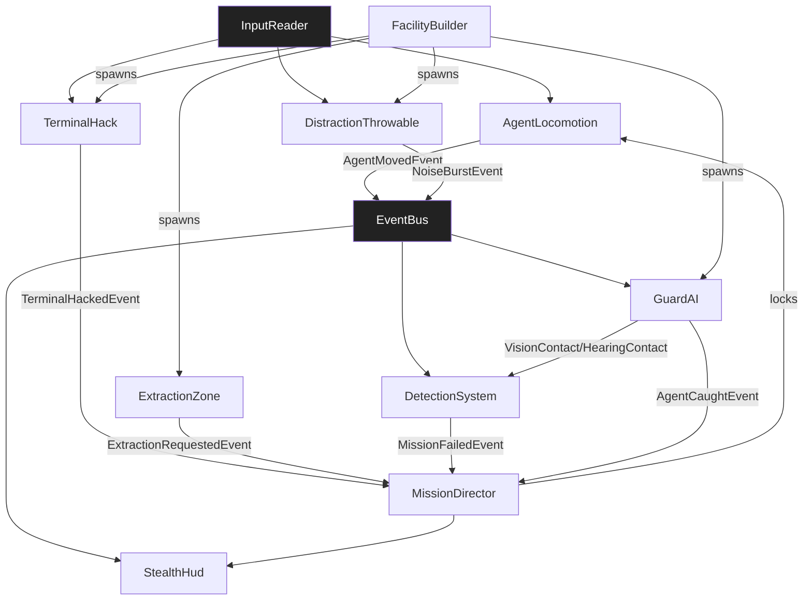

# TDD — Quiet Breach (Temporal / Pilot)

> **Purpose of this TDD:** temporal, gate-passing Technical Design Document for a **top-down 3D stealth infiltration** game on the V57 SDD pipeline. **Pilot scope:** single-player, 1 facility floor, 4 guards, 3 terminals to hack, 1 extraction zone, no combat kill loop — only distract / evade / extract. Completely distinct from kart racing. Amendments follow §0.3.

---

## 0.1 · Document Control

| Field | Value |
|---|---|
| **Game title** | Quiet Breach |
| **Studio** | V57 (pilot) |
| **Document** | Game Technical Design Document (TDD) |
| **Document version** | 1.0.0 |
| **Date** | 2026-08-13 |
| **Phase reached** | Production |
| **Intended use** | Pilot source of truth (design + engineering) |
| **Owner** | V57 pilot maintainer |

### Changelog

| Version | Date | Change summary | Sections touched | Author |
|---|---|---|---|---|
| `1.0.0` | 2026-08-13 | Initial gate-passing stealth pilot TDD | all | V57 pilot |

## 0.2 · Completeness Gate

| # | Item | Check | Status |
|---|---|---|---|
| **G-01** | §A required fields | All `[REQUIRED]` keys concrete; `save_model` / `multiplayer_model` explicit `N/A` | PASS |
| **G-02** | Engine pin | `Unity 6000.0.32f1`; `render_pipeline: URP 17.x`; `dimension: 3D` | PASS |
| **G-03** | Mechanic bar | 9/9 mechanics: quantified rules, I/O, deps, FSM or `N/A` | PASS |
| **G-04** | Acceptance criteria | 9/9 mechanics have ≥ 1 AC tagged EditMode/PlayMode (28 total) | PASS |
| **G-05** | §C parity | 9 §C specs ↔ 9 §B mechanics, names match 1:1 | PASS |
| **G-06** | No orphans | All §B-S ids resolve; all `dependencies[]` resolve to §B or §B-S | PASS |
| **G-07** | Zero pending | No `[PENDING]` markers in body; §14.2 registry empty | PASS |
| **G-08** | Consistency ledger | INV-01..INV-05 all PASS | PASS |
| **G-09** | Persistence coverage | All mechanics declare `none`; §11.4 session-only | PASS |
| **G-10** | Input coverage | All §B player inputs map to §11.3 actions with consumers | PASS |
| **G-11** | UI coverage | `UI_StealthHud`, `UI_AlertBanner`, `UI_Result` in §9.1, all consumed | PASS |
| **G-12** | Scene coverage | All PlayMode ACs map to `SCN_Facility_QuietBreach` or `SCN_Boot` | PASS |
| **G-13** | Performance budgets | PC 1080p/60 fps in §11.6 | PASS |
| **G-14** | Player agency & locomotion | `player-driven`; Move/Look/Crouch/Distract in §11.3; `AgentLocomotion` owns camera | PASS |
| **G-15** | Core loop trace | INFILTRATE→AgentLocomotion · EVADE→DetectionSystem+GuardAI · DISTRACT→DistractionThrowable · HACK→TerminalHack · EXTRACT→ExtractionZone+MissionDirector | PASS |
| **G-16** | Play space & bootstrap | `SCN_Facility_QuietBreach` world owner = `FacilityBuilder`; `SCN_Boot` bootstraps session | PASS |
| **G-17** | Content inventory | 1 floor, 4 guards, 3 terminals, 6 noise toys, 3 UI screens — §13.1 | PASS |
| **G-18** | Event graph closure | Every published event has ≥ 1 consumer or explicit `none (reason)`; §D closed | PASS |

## 0.3 · Living TDD

Amendments follow §0.3 workflow (edit §B/§C/§D → re-verify gate → `/tdd-to-context` → `/tdd-to-spec` → `/spec`).

---

# 1 · High Concept

- **One-liner.** Infiltrate a neon facility, hack three terminals without being seen, and extract before the alert locks the roof.
- **Elevator pitch.** Top-down 3D stealth: move, crouch, throw a distractor, slip past vision cones, hack terminals, reach the elevator. Getting spotted raises alert stages; max alert = mission fail.
- **Core fantasy.** "I was never here."
- **Pillars.** Readable threat · soft failure before hard fail · information as power.

# 2 · Game Overview

| Attribute | Value |
|---|---|
| **Genre / sub-genre** | Stealth / infiltration (top-down 3D) |
| **Setting** | Night-time corporate facility, single floor |
| **Primary platform** | PC (Windows) |
| **Target audience** | Stealth fans; V57 pipeline testers |
| **Price / model** | N/A (pilot) |

- **USP.** Pure stealth pilot: vision cones, alert ladder, distractors, hack mini-loop — zero racing/combat systems.
- **Positioning.** For V57 adopters who need a non-arcade prototype, Quiet Breach exercises AI perception and mission FSM.

# 3 · Core Gameplay

- **Core verbs.** move · crouch · throw · hack · extract.
- **Core loop.** Observe cones → move/crouch → (optional) throw distractor → hack terminal ×3 → reach extraction → WIN; alert stage 3 for 8 s → LOSE.
- **Win / lose conditions.** Win = `terminalsHacked == 3` AND player enters `ExtractionZone` while `AlertStage < 3`. Lose = `AlertStage == 3` sustained for `8.0 s` OR player HP reaches 0 (contact stun cascade).

# 4 · Mechanics & Systems (strategic summary)

- **AgentLocomotion** *(feature)* — Top-down WASD move + crouch speed; owns orthographic follow camera.
- **DetectionSystem** *(system)* — Aggregates vision/hearing hits into alert stage 0–3.
- **GuardAI** *(feature)* — Patrol → Suspect → Chase → Return; vision cone + hearing radius.
- **DistractionThrowable** *(feature)* — Throw noise toy; guards investigate for fixed duration.
- **TerminalHack** *(feature)* — Hold-to-hack progress bar; interrupted if spotted mid-hack.
- **ExtractionZone** *(feature)* — Trigger win when preconditions met.
- **FacilityBuilder** *(feature)* — World owner: spawns floor, 4 guards, 3 terminals, extraction, toys.
- **MissionDirector** *(system)* — Mission FSM: Briefing → Infiltrating → Extracting → Won/Lost.
- **StealthHud** *(feature)* — UI Toolkit: alert stage, terminals remaining, crouch indicator, result.

# 5 · Game Modes

- **Single Breach** — one facility run. Only mode in pilot.

# 6 · World & Level Design

- **Structure.** One rectangular floor ≈ 40×28 m, 3 rooms + corridor spine, cover crates.
- **Set-pieces.** Lobby (open cones), server room (tight corners), roof elevator (extraction).
- **Progression.** Static single floor; no unlocks.

# 7 · Narrative & Characters

- N/A — agent is nameless; guards are anonymous. No `narrativeRef:`.

# 8 · Art Direction & Visual Style

- **Style.** Low-poly neon night; cyan vision cones; amber alert fills.
- **Readability.** Cones always visible to player; alert stage fills top bar.
- **Scope coherence.** Primitives + URP; one night lighting setup.

# 9 · UI / UX

- **Principle.** "I always know how loud I am and how angry the floor is."
- **Accessibility.** `[RECOMMENDED]` Remappable keys; cone colour distinct under deuteranopia (`#00E5FF` vs floor `#1A1A2E`).

## 9.1 Screen registry

| Screen id | Purpose | Key states | Consumed by |
|---|---|---|---|
| `UI_StealthHud` | Alert stage, terminals left, crouch glyph | `Hidden`, `Visible` | `StealthHud` |
| `UI_AlertBanner` | Stage-up flash ("COMPROMISED") | `Hidden`, `Flash` | `DetectionSystem`, `StealthHud` |
| `UI_Result` | EXTRACTED / BURNED panels | `Hidden`, `Shown` | `MissionDirector`, `StealthHud` |

---

# 10 · Audio Direction

- Soft footsteps (crouch quieter); radio chirp on stage-up; terminal beep on hack complete. Built-in `AudioMixer`.

# 11 · Technical Design

## 11.1 Engine & rendering

| Area | Decision |
|---|---|
| **Engine** | Unity `6000.0.32f1` |
| **Render pipeline** | URP 17.x |
| **Dimension** | 3D (top-down camera) |
| **Architecture** | Component-based + EventBus |
| **AI** | Finite-state patrol/investigate/chase |

## 11.2 Data ownership

| Data class | Container | Runtime mutability | Persisted? |
|---|---|---|---|
| Tuning SOs | ScriptableObject | Read-only at runtime | No |
| Runtime state | Plain C# in owners | Yes | No |
| Save data | — | — | N/A |

## 11.3 Input map

- **Input system.** `new` — `Assets/Settings/QuietBreachInputActions.inputactions`.

| Action map | Action | Suggested binding | Consumed by |
|---|---|---|---|
| `Gameplay` | `Move` (Vector2) | WASD / LS | `AgentLocomotion` |
| `Gameplay` | `Crouch` (Button) | Left Ctrl / B | `AgentLocomotion` |
| `Gameplay` | `ThrowDistract` (Button) | Q / X | `DistractionThrowable` |
| `Gameplay` | `Interact` (Button) | E / A | `TerminalHack`, `ExtractionZone` |
| `Gameplay` | `CameraLook` (Vector2) | Mouse / RS | `AgentLocomotion` (optional pan offset ±2 m) |

## 11.4 Persistence spec

- **Save model.** `N/A` — session-only.

## 11.5 Movement & spatial model

| Topic | Decision |
|---|---|
| **Space** | 3D physics + CharacterController (capsule) |
| **Pathfinding** | NavMesh for guards only |
| **Control mode** | `player-driven` |
| **In-play camera** | Orthographic top-down owned by `AgentLocomotion` (`size=12`, follow lag 0.12 s) |
| **Depth / sorting** | Z-buffer |

## 11.6 Performance budgets

| Platform | Resolution | FPS target | Frame budget (ms) | Memory ceiling | Notes |
|---|---|---|---|---|---|
| PC (Windows) | 1080p | 60 | 16.6 | 1.5 GB | Max 8 vision cone raycasts × 4 guards @ 10 Hz |

## 11.7 Multiplayer

- **Model.** `N/A` — single-player.

---

# 12 · Business Model

- N/A (pilot).

---

# 13 · Content Scope & Scene Manifest

## 13.1 Content scope & inventory

| Category | First-pass count | Owner | Notes |
|---|---|---|---|
| Facility floors | 1 | Pilot | `SCN_Facility_QuietBreach` |
| Guards | 4 | Pilot | Patrol loops baked in scene |
| Terminals | 3 | Pilot | Must all be hacked |
| Distraction toys | 6 | Pilot | Pickup + throw; inventory max 2 held |
| Extraction zones | 1 | Pilot | Elevator pad |
| UI screens | 3 | Pilot | Matches §9.1 |
| Tuning assets | 4 SOs | Pilot | `AgentTuning`, `GuardConfig`, `DetectionConfig`, `MissionConfig` |

## 13.2 Scene manifest

| Scene id | Purpose | World owner | Systems present | PlayMode ACs |
|---|---|---|---|---|
| `SCN_Boot` | Boot | `MissionDirector` | EventBus, InputReader, MissionDirector | MD-PM1 |
| `SCN_Facility_QuietBreach` | Gameplay | `FacilityBuilder` | All §B + §B-S | AL-PM1, DET-PM1, GAI-PM1, DT-PM1, TH-PM1, EZ-PM1, HUD-PM1, FB-PM1 |

---

# 14 · Risks, Open Items & Consistency

## 14.1 Risks

| Risk | Severity | Mitigation |
|---|---|---|
| Vision cones feel unfair | 🟡 | Cones rendered diegetically; crouch reduces detection rate ×0.45 |
| NavMesh chase stuck | 🟡 | Guard returns to Suspect after 4 s without path |
| Hack interrupt rage | 🟡 | Progress retained at 50% of completed bar on interrupt |

## 14.2 Pending registry

*Empty.*

## 14.3 Consistency ledger

| Id | Invariant | Systems | Status |
|---|---|---|---|
| `INV-01` | Win requires exactly 3 terminals hacked + extraction enter | TerminalHack, ExtractionZone, MissionDirector | PASS |
| `INV-02` | Alert stages 0–3; stage 3 for ≥ 8.0 s → Lose | DetectionSystem, MissionDirector | PASS |
| `INV-03` | Guard vision: FOV 70°, range 9 m standing / 6 m crouch target; sample 10 Hz | GuardAI, DetectionSystem | PASS |
| `INV-04` | Distraction investigate radius 4.5 m, duration 5.0 s; max 2 toys held | DistractionThrowable, GuardAI | PASS |
| `INV-05` | Walk 4.2 m/s, crouch 2.0 m/s; crouch noise radius 1.5 m vs walk 4.0 m | AgentLocomotion, DetectionSystem | PASS |

---

# §A · Project Identity

```yaml
project_name: "Quiet Breach"
document_version: "1.0.0"
repo_kind: unity_game
engine: "Unity 6000.0.32f1"
render_pipeline: "URP 17.x"
dimension: "3D"
language: "C# (Unity 6000.0 scripting profile)"
pattern: "Component-based + EventBus"
target_platform: "PC (Windows)"
input_system: "new"
test_assembly_prefix: "QuietBreach"
genre: "Stealth / infiltration (top-down 3D)"
save_model: "N/A"
multiplayer_model: "N/A"
networking_tier: null
max_players: null
session_visibility: null
performance_targets:
  - platform: "PC (Windows)"
    resolution: "1080p"
    fps_target: 60
```

---

# §B · Production Mechanics

Nine mechanics. All `sliceScope: true`.

---

## Mechanic: Agent Locomotion

### Spec metadata
- **name:** `AgentLocomotion`
- **type:** feature
- **status:** active
- **version:** 0.1.0
- **One-line description:** Top-down player move/crouch with orthographic follow camera.

### Player-facing behavior
- **Goal / fantasy:** Slip through space quietly.
- **Loop:** Move → optional crouch → camera follows.
- **Feedback:** Footstep SFX quieter when crouched; crouch glyph on `UI_StealthHud`.

### Rules (quantified)
1. Walk speed `4.2 m/s`; crouch `2.0 m/s` while `Crouch` held.
2. CharacterController capsule `(r=0.35, h=1.6)`; crouch height `1.1`.
3. Camera: orthographic `size=12`, follow lag `0.12 s`, height `18 m`, look-at player.
4. Publishes `AgentMovedEvent { position, isCrouching, speed }` at 10 Hz when moved > 0.05 m.

### Inputs / outputs
- **Player inputs:** `Move`, `Crouch`, `CameraLook`.
- **Outputs:** `AgentMovedEvent` → DetectionSystem, StealthHud.

### Persistence
- `none`.

### Dependencies
| kind | id | Why |
|---|---|---|
| system | EventBus | Publish move |
| system | InputReader | Input |

### State machine
- **States:** `Standing`, `Crouching`.
- **Initial:** `Standing`.
- **Transitions:** toggle on `Crouch` press/release.

### Components
1. **AgentLocomotion** — `Assets/Scripts/Features/Agent/AgentLocomotion.cs`
2. **AgentTuning** (SO) — walk/crouch/camera fields. Asset `Assets/ScriptableObjects/Configs/AgentTuning.asset`.

### Acceptance criteria
- [ ] **AL-AC1 (EditMode):** Crouch held → speed == 2.0 ± 0.05.
- [ ] **AL-AC2 (EditMode):** Walk with no crouch → speed == 4.2 ± 0.05.
- [ ] **AL-PM1 (PlayMode):** Camera follows player within 0.3 m lag after 1 s move in `SCN_Facility_QuietBreach`.

---

## Mechanic: Detection System

### Spec metadata
- **name:** `DetectionSystem`
- **type:** system
- **status:** active
- **version:** 0.1.0
- **One-line description:** Aggregates vision/hearing into alert stages 0–3.

### Rules (quantified)
1. Stages: `0 Calm`, `1 Suspicious`, `2 Searching`, `3 Compromised`.
2. Vision hit while standing adds `+35` meter/s; crouching `+16` meter/s (meter 0–100).
3. Crossing thresholds 25 / 55 / 85 raises stage; decay `8 / s` when not observed.
4. Stage 3 sustained `8.0 s` → publish `MissionFailedEvent { reason: AlertLockdown }`.
5. Stage-up publishes `AlertStageChangedEvent { from, to }` → StealthHud + UI_AlertBanner.

### Inputs / outputs
- **System inputs:** `VisionContactEvent`, `HearingContactEvent` from GuardAI.
- **Outputs:** `AlertStageChangedEvent`, `MissionFailedEvent` (consumed by MissionDirector).

### Persistence
- `none`.

### Dependencies
| kind | id | Why |
|---|---|---|
| system | EventBus | Pub/sub |
| system | MissionDirector | Fail consumer |

### State machine
- N/A — continuous meter + discrete stage.

### Components
1. **DetectionSystem** — `Assets/Scripts/Systems/Stealth/DetectionSystem.cs`
2. **DetectionConfig** (SO) — thresholds, decay, stage3FailSeconds.

### Acceptance criteria
- [ ] **DET-AC1 (EditMode):** Meter ≥ 85 → stage 3.
- [ ] **DET-AC2 (EditMode):** Stage 3 for 8.0 s → MissionFailedEvent.
- [ ] **DET-PM1 (PlayMode):** Standing in cone raises stage within 3 s.

---

## Mechanic: Guard AI

### Spec metadata
- **name:** `GuardAI`
- **type:** feature
- **status:** active
- **version:** 0.1.0
- **One-line description:** Patrol/investigate/chase with vision cone and hearing.

### Rules (quantified)
1. Vision FOV `70°`, range `9 m` (target standing) / effective `6 m` if target crouching (INV-03).
2. Hearing radius `4.0 m` walk / `1.5 m` crouch / `4.5 m` distraction (INV-04/05).
3. Cone sampled at `10 Hz`, 7 rays.
4. States: Patrol → Suspect (3 s look) → Investigate (move to noise) → Chase → Return.
5. Chase speed `4.8 m/s`; contact within `0.8 m` publishes `AgentCaughtEvent`.

### Dependencies
| kind | id | Why |
|---|---|---|
| system | DetectionSystem | Report contacts |
| system | EventBus | Events |
| feature | DistractionThrowable | Investigate targets |

### State machine
- **States:** `Patrol`, `Suspect`, `Investigate`, `Chase`, `Return`.
- **Initial:** `Patrol`.

### Components
1. **GuardAI** — `Assets/Scripts/Features/Guards/GuardAI.cs`
2. **GuardConfig** (SO) — FOV, ranges, speeds.

### Acceptance criteria
- [ ] **GAI-AC1 (EditMode):** Target outside FOV → no VisionContactEvent.
- [ ] **GAI-PM1 (PlayMode):** Distraction within 4.5 m → Investigate for ≥ 4.5 s.

---

## Mechanic: Distraction Throwable

### Spec metadata
- **name:** `DistractionThrowable`
- **type:** feature
- **status:** active
- **version:** 0.1.0

### Rules (quantified)
1. Inventory max `2` toys; floor pickups = 6.
2. Throw arc: impulse `7 m/s` toward aim (camera forward projected XZ), lifetime `6 s` after land.
3. On land: publish `NoiseBurstEvent { position, radius: 4.5 }` once.
4. `ThrowDistract` with 0 inventory → no-op (SFX deny).

### Dependencies
| kind | id | Why |
|---|---|---|
| system | EventBus | NoiseBurstEvent → GuardAI |
| system | InputReader | ThrowDistract |
| feature | AgentLocomotion | Spawn origin |

### State machine
- N/A — inventory + one-shot throw.

### Acceptance criteria
- [ ] **DT-AC1 (EditMode):** Throw with count 0 → count stays 0, no event.
- [ ] **DT-PM1 (PlayMode):** Landed toy triggers ≥ 1 guard Investigate within 1 s.

---

## Mechanic: Terminal Hack

### Spec metadata
- **name:** `TerminalHack`
- **type:** feature
- **status:** active
- **version:** 0.1.0

### Rules (quantified)
1. Hold `Interact` within `1.2 m` for `2.5 s` continuous progress.
2. If `AlertStage >= 2` mid-hack → interrupt; retain `50%` of progress achieved.
3. On complete: publish `TerminalHackedEvent { terminalId }`; deactivate terminal.
4. Exactly 3 terminals; MissionDirector counts to 3.

### Dependencies
| kind | id | Why |
|---|---|---|
| system | DetectionSystem | Stage interrupt |
| system | EventBus | TerminalHackedEvent |
| system | MissionDirector | Progress count |

### State machine
- **States:** `Idle`, `Hacking`, `Hacked`.

### Acceptance criteria
- [ ] **TH-AC1 (EditMode):** 2.5 s hold uninterrupted → Hacked.
- [ ] **TH-PM1 (PlayMode):** Stage 2 interrupt retains ~50% progress.

---

## Mechanic: Extraction Zone

### Spec metadata
- **name:** `ExtractionZone`
- **type:** feature
- **status:** active
- **version:** 0.1.0

### Rules (quantified)
1. Trigger volume; `Interact` OR auto on enter if `terminalsHacked == 3` AND `AlertStage < 3`.
2. Publishes `ExtractionRequestedEvent` → MissionDirector resolves Win.

### Acceptance criteria
- [ ] **EZ-AC1 (EditMode):** Enter with 2 terminals → no ExtractionRequestedEvent.
- [ ] **EZ-PM1 (PlayMode):** Enter with 3 hacked + stage < 3 → Win panel.

---

## Mechanic: Facility Builder

### Spec metadata
- **name:** `FacilityBuilder`
- **type:** feature
- **status:** active
- **version:** 0.1.0
- **One-line description:** World owner — spawns floor content on load.

### Rules (quantified)
1. Spawns 4 guards, 3 terminals, 1 extraction, 6 toys, cover crates.
2. Validates INV-01 layout (extraction reachable without NavMesh cut).

### Acceptance criteria
- [ ] **FB-PM1 (PlayMode):** Load scene → counts match §13.1.

---

## Mechanic: Mission Director

### Spec metadata
- **name:** `MissionDirector`
- **type:** system
- **status:** active
- **version:** 0.1.0

### Rules (quantified)
1. States: `Briefing` (1.5 s) → `Infiltrating` → `Won` | `Lost`.
2. Win on `ExtractionRequestedEvent` valid; Lose on `MissionFailedEvent` or `AgentCaughtEvent` cascade (caught → stage 3 immediate).
3. Locks AgentLocomotion on Won/Lost.

### State machine
- **States:** `Briefing`, `Infiltrating`, `Won`, `Lost`.
- **Initial:** `Briefing`.

### Acceptance criteria
- [ ] **MD-AC1 (EditMode):** ExtractionRequested with 3 hacks → Won.
- [ ] **MD-PM1 (PlayMode):** Boot → Briefing → Infiltrating within 2 s.

---

## Mechanic: Stealth HUD

### Spec metadata
- **name:** `StealthHud`
- **type:** feature
- **status:** active
- **version:** 0.1.0

### Rules (quantified)
1. UI Toolkit; elements: `alert-fill`, `terminals-text`, `crouch-glyph`, `result-panel`.
2. Subscribes AlertStageChanged, TerminalHacked, AgentMoved (crouch), Mission state.

### Acceptance criteria
- [ ] **HUD-AC1 (EditMode):** SetTerminals(1,3) → text `"1/3"`.
- [ ] **HUD-PM1 (PlayMode):** Stage-up flashes `UI_AlertBanner` within 1 frame.

---

# §B-S · Support Systems Registry

| Id | Purpose | Public surface | Spec |
|---|---|---|---|
| `EventBus` | Pub/sub | `Publish<T>`, `Subscribe<T>` | table-only |
| `InputReader` | Input adapter | Move, Crouch, ThrowDistract, Interact | table-only |
| `NavMeshService` | Guard path queries | `SetDestination`, `HasPath` | table-only |
| `AudioMixer` | Audio routing | `PlayOneShot` | table-only |

---

# §C · Companion Specs (YAML)

```yaml
specVersion: "1.1"
name: AgentLocomotion
type: feature
description: Top-down player move/crouch with orthographic follow camera.
version: 0.1.0
dependencies:
  - { kind: system, id: EventBus }
  - { kind: system, id: InputReader }
acceptanceCriteria:
  - { id: AL-AC1, description: "Crouch speed 2.0 m/s", verification: EditMode }
  - { id: AL-PM1, description: "Camera follows within 0.3 m lag", verification: PlayMode }
specId: agent_locomotion
touches:
  scripts: [Assets/Scripts/Features/Agent/AgentLocomotion.cs]
  scenes: [Assets/Scenes/Facility_QuietBreach.unity]
```

```yaml
specVersion: "1.1"
name: DetectionSystem
type: system
description: Aggregates vision/hearing into alert stages 0-3; stage3 fail after 8s.
version: 0.1.0
dependencies:
  - { kind: system, id: EventBus }
  - { kind: system, id: MissionDirector }
acceptanceCriteria:
  - { id: DET-AC1, description: "Meter 85 raises stage 3", verification: EditMode }
  - { id: DET-AC2, description: "Stage3 for 8s publishes MissionFailedEvent", verification: EditMode }
  - { id: DET-PM1, description: "Standing in cone raises stage within 3s", verification: PlayMode }
specId: detection_system
```

```yaml
specVersion: "1.1"
name: GuardAI
type: feature
description: Patrol/investigate/chase with FOV 70deg and hearing radii.
version: 0.1.0
dependencies:
  - { kind: system, id: DetectionSystem }
  - { kind: system, id: EventBus }
  - { kind: feature, id: DistractionThrowable }
  - { kind: system, id: NavMeshService }
acceptanceCriteria:
  - { id: GAI-AC1, description: "Outside FOV no VisionContactEvent", verification: EditMode }
  - { id: GAI-PM1, description: "Distraction triggers Investigate", verification: PlayMode }
specId: guard_ai
```

```yaml
specVersion: "1.1"
name: DistractionThrowable
type: feature
description: Throw noise toys; max inventory 2; NoiseBurst radius 4.5m.
version: 0.1.0
dependencies:
  - { kind: system, id: EventBus }
  - { kind: system, id: InputReader }
  - { kind: feature, id: AgentLocomotion }
acceptanceCriteria:
  - { id: DT-AC1, description: "Throw with empty inventory no-ops", verification: EditMode }
  - { id: DT-PM1, description: "Landed toy triggers Investigate", verification: PlayMode }
specId: distraction_throwable
```

```yaml
specVersion: "1.1"
name: TerminalHack
type: feature
description: Hold-to-hack 2.5s; interrupt at alert stage >=2 retains 50% progress.
version: 0.1.0
dependencies:
  - { kind: system, id: DetectionSystem }
  - { kind: system, id: EventBus }
  - { kind: system, id: MissionDirector }
acceptanceCriteria:
  - { id: TH-AC1, description: "2.5s uninterrupted completes hack", verification: EditMode }
  - { id: TH-PM1, description: "Stage2 interrupt retains ~50% progress", verification: PlayMode }
specId: terminal_hack
```

```yaml
specVersion: "1.1"
name: ExtractionZone
type: feature
description: Win trigger when 3 terminals hacked and alert stage < 3.
version: 0.1.0
dependencies:
  - { kind: system, id: MissionDirector }
  - { kind: system, id: EventBus }
acceptanceCriteria:
  - { id: EZ-AC1, description: "2 terminals: no extract event", verification: EditMode }
  - { id: EZ-PM1, description: "3 hacked + stage<3 yields Win", verification: PlayMode }
specId: extraction_zone
```

```yaml
specVersion: "1.1"
name: FacilityBuilder
type: feature
description: World owner spawning guards, terminals, toys, extraction.
version: 0.1.0
dependencies:
  - { kind: feature, id: GuardAI }
  - { kind: feature, id: TerminalHack }
  - { kind: feature, id: ExtractionZone }
acceptanceCriteria:
  - { id: FB-PM1, description: "Scene counts match inventory", verification: PlayMode }
specId: facility_builder
```

```yaml
specVersion: "1.1"
name: MissionDirector
type: system
description: Mission FSM Briefing/Infiltrating/Won/Lost.
version: 0.1.0
dependencies:
  - { kind: system, id: EventBus }
  - { kind: feature, id: AgentLocomotion }
acceptanceCriteria:
  - { id: MD-AC1, description: "Valid extract -> Won", verification: EditMode }
  - { id: MD-PM1, description: "Boot reaches Infiltrating within 2s", verification: PlayMode }
specId: mission_director
```

```yaml
specVersion: "1.1"
name: StealthHud
type: feature
description: UI Toolkit stealth HUD for alert, terminals, result.
version: 0.1.0
dependencies:
  - { kind: system, id: EventBus }
  - { kind: system, id: DetectionSystem }
  - { kind: system, id: MissionDirector }
acceptanceCriteria:
  - { id: HUD-AC1, description: "terminals-text shows 1/3", verification: EditMode }
  - { id: HUD-PM1, description: "Stage-up flashes alert banner", verification: PlayMode }
specId: stealth_hud
ui:
  screens:
    - name: UI_StealthHud
      uxml: Assets/UI/QuietBreach_Hud.uxml
      elements:
        - { name: alert-fill, type: VisualElement }
        - { name: terminals-text, type: Label }
        - { name: crouch-glyph, type: VisualElement }
        - { name: result-panel, type: VisualElement }
```

---

# §D · Cross-mechanic dependency graph



- **Critical path:** `AgentLocomotion → (evade GuardAI/DetectionSystem) → TerminalHack ×3 → ExtractionZone → MissionDirector → StealthHud`
- **Event closure (G-18):** All listed events consumed; `AgentMovedEvent` also → `none (footstep audio optional — justified)`.

---

## Appendix · Section status

| Section | Status |
|---|---|
| §0.2 Gate | **PASS (18/18)** |
| §B mechanics | 9 complete |
| Genre contrast | Stealth ≠ kart racing |

---

*TDD v1.0.0 — `/tdd-to-spec V57/Test/TDD_QuietBreach.md --all --out-dir V57/specs/features`*
